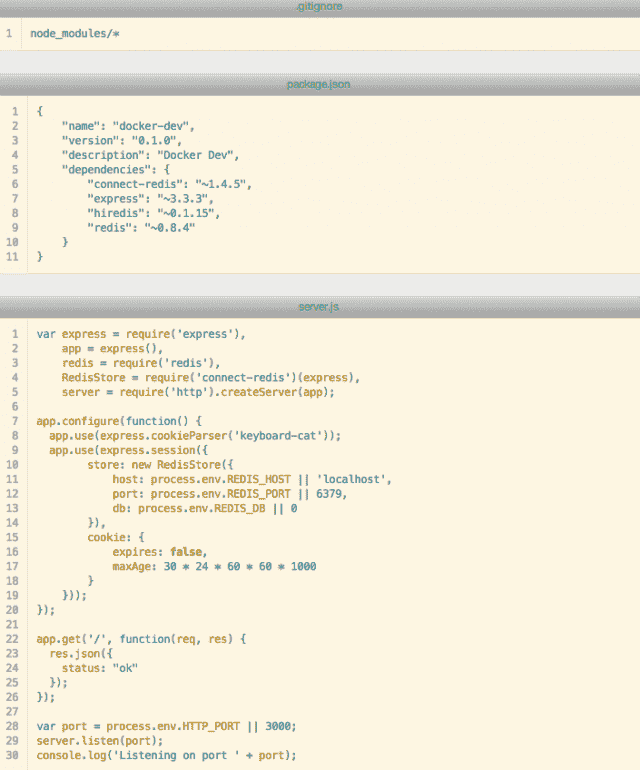
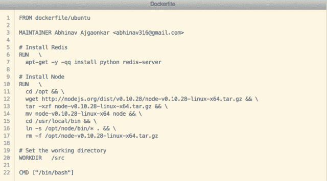
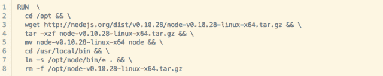

# 使用 Docker 构建 Node.js 应用程序的示例

> 原文：<https://thenewstack.io/examples-of-building-a-node-js-app-with-docker/>

Crowdriff 的首席技术官(CTO)让两个帖子中的第一个(T2 的第一个)与 Docker 一起创建一个应用程序。该帖子涵盖了 CTO Abhinav Ajgaonkar 如何使用 Docker 作为“在使用 [Express.js](http://expressjs.com/) 框架开发节点应用程序时[流浪者](http://www.vagrantup.com/)的替代品”它进一步详细说明了该应用程序是如何被设计成“使用 [connect-redis](https://github.com/visionmedia/connect-redis) 中间件在 Redis 中持久化会话信息”的在阅读了 Ajgaonkar 的帖子后，我四处寻找其他开发人员使用 Docker 构建 Node.js 应用程序的例子，我发现了几个，我将在这里简要强调一下。根据 Chris Dawson 的研究，Javascript 是 Docker 贡献者中最受欢迎的编程语言，新的栈将很快发布。客户端和服务器端 JavaScript 的使用之间的细分尚不清楚，但 Ajgaonkar 的工作表明了对 Node.js 应用程序开发和 Express.js 的兴趣，express . js 提供了一系列用于构建单页面、多页面和混合 web 应用程序的功能。Express 还可以用来构建基于 API 的服务器应用程序，默认情况下使用标准 HTTP 和 JSON。

道森在一封电子邮件中对我说，这个帖子也证明了人们正在从流浪汉转向码头工人，因为它简化了最后一步:部署。Dockerfiles 用更高层次的抽象来管理服务。例如，一个流浪者文件指定 IP 地址，其中 docker 文件使用的链接是特定 IP 之上的抽象。这使得部署更加通用和松散耦合。此外，浮动文件管理一个虚拟机，而 Dockerfiles 指定了一组松散的服务及其连接，这是一个更轻、更灵活的抽象。

Ajgaonkar 准备的应用程序有三个文件:一个`package.json`、`server.js`和一个`.gitignore`文件，他的设置如下:  这篇文章进一步解释了`server.js`如何获取依赖项并启动一个 express 应用程序，“它被配置为在 Redis 中存储会话信息，并公开一个以 JSON 形式返回状态消息的单个端点。”对于开发，他在同一个容器中运行 Node 和 Redis，并使用 Dockerfile 对其进行配置。  Ajgaonkar 用的是 Ubuntu，用 Docker 最常用的基图之一。他使用 apt-get 命令添加 Python 和 Redis-server。Redis 服务器存储会话信息，Python 用于构建 C 扩展。npm 需要 Python 来构建 C 扩展。  这篇文章除了解释 run 命令的工作原理之外，还解释了如何构建和运行一个容器。它涵盖了如何在容器本身中启动 Redis。Ajgaonkar 使用 [Nodemon](https://github.com/remy/nodemon) 来“监视项目文件中的变化，并根据需要重启服务器。”一旦用 server.js 启动了服务器，Nodemon 就检测到了变化并启动了服务器。Ajgaonkar 将这个过程与其他博客文章中描述的构建进行了比较。以下是一些评论:

*   Xebia 的 Mark van Holsteijn 本周早些时候写了一篇关于使用新的平台即服务 [Deis](http://deis.io/) 来构建最初用于 Cloud Foundry 的 Node.js 应用程序的帖子。
*   [Sean McGary](http://seanmcgary.com/posts/deploying-a-nodejs-application-using-docker) 有一个创建运行简单 NodeJS web 服务器的容器的教程。
*   路易斯·埃利宗多有一个关于 Docker、Node.js、MongoDB 和 Varnish 环境的帖子。

越来越多 Docker 用例开始浮出水面。Docker 因其功能和广泛的使用案例而备受赞誉。不过，人们感兴趣的是它的技术，以及为分布式工作负载提供更灵活、更轻量级的服务所需的转变。Docker 反映了这种转变，是更适合快速应用程序开发的新型服务的象征。

<svg xmlns:xlink="http://www.w3.org/1999/xlink" viewBox="0 0 68 31" version="1.1"><title>Group</title> <desc>Created with Sketch.</desc></svg>