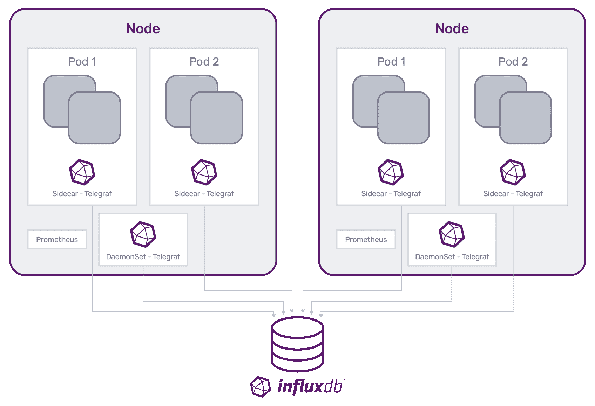

# 使用 Telegraf 操作员扩展 Kubernetes 监控

> 原文：<https://thenewstack.io/expand-kubernetes-monitoring-with-telegraf-operator/>

[](https://www.linkedin.com/in/wkocjan/)

[Wojciech KOC Jan](https://www.linkedin.com/in/wkocjan/)

[Wojciech 是 InfluxData 的软件工程师，专注于跨多个云和区域的 InfluxDB 云部署的自动化。他拥有大约 10 年的多种公共云经验。作为开发人员、团队领导和架构师，他在软件和开源领域工作了 10 多年。](https://www.linkedin.com/in/wkocjan/)

[](https://www.linkedin.com/in/wkocjan/)[](https://www.linkedin.com/in/wkocjan/)

监控是云计算的一个重要方面。在任何时候，您都需要知道什么是有效的，什么是无效的，并有能力对给定环境中发生的变化做出响应。有效的监控始于从整个生态系统中收集性能数据并以有用的方式呈现出来的能力。因此，管理整个生态系统的监控数据越容易，这些监控解决方案就越有效，生态系统就越高效。

Kubernetes 是云计算的主力，它提供的自动化改变了游戏规则。尽管如此，未经检查的自动化有可能产生问题，因此有必要监控这些自动化过程。针对 Kubernetes 环境的流行监控解决方案是 Prometheus。

然而，并不是所有的应用程序都只能在 Kubernetes 上运行。如果您想使用 Prometheus 从多个环境中收集指标数据，包括定制应用服务器、遗留系统和技术，那么您最终将需要编写大量定制代码来访问和获取这些指标。

进入 Telegraf 运营商，一个环境不可知的普罗米修斯替代品。

## 什么是电话接线员？

首先，我们应该区分 Telegraf 和 Telegraf 运营商。

[Telegraf](https://www.influxdata.com/time-series-platform/telegraf/?utm_source=vendor&utm_medium=referral&utm_campaign=2021-09-23_blog_telegraf-operator_tns&utm_content=tns) 是一款开源服务器代理，旨在从堆栈、传感器和系统中收集指标。

另一方面，Telegraf Operator 是一个应用程序，旨在创建和管理 Kubernetes 集群中的各个 Telegraf 实例。本质上，它作为一个控制平面来管理部署在 Kubernetes 集群中的各个 Telegraf 实例。Telegraf Operator 是一个独立的应用程序，与 Telegraf 分开部署。

## Telegraf 运营商考虑事项

在基本层面上，Telegraf 操作员从 Kubernetes 集群中具有公开端点的应用程序中获取指标。

部署监控代理有两种主要机制，DaemonSet 和 sidecar。根据您想要监控的具体内容，您应该使用不同的机制。对于 InfluxDB，我们建议:

*   节点、pod 和容器指标的 DaemonSet。
*   针对暴露大量指标的微服务的边车监控。

在 DaemonSet 场景中，Telegraf 运行在每个单独的节点上，并收集节点本身的基础设施指标。

相比之下，在 sidecar 部署中，Telegraf 的容器化实例与应用程序容器共享 pod，并从该应用程序的公开端点抓取数据。

### 边车部署

但是 sidecar Telegraf 集装箱从哪里来？这就是 Telegraf 运营商发挥作用的地方。

Telegraf 操作符在 pod 级别工作，因此您可以在 Kubernetes 环境中使用它来创建 pod 对象。当部署、StatefulSet、DaemonSet、Job 或 CronJob 发出创建新 pod 的请求时，Telegraf 操作员使用 Kubernetes 中的可变 webhooks 功能拦截该请求，并有机会对其进行更改。

Telegraf 操作员读取请求中的 [pod 注释](https://github.com/influxdata/telegraf-operator#pod-level-annotations)，如果注释要求添加 Telegraf 边车，则 Telegraf 操作员将该实例作为附加容器添加到 pod 中。换句话说，Telegraf 操作员查看新 pod 的容器列表，并根据注释的指示向列表中添加另一个容器。

一旦 Telegraf sidecar 容器就位，它就可以开始抓取数据并将指标推送到 InfluxDB 等数据库。



使用边车部署进行 Kubernetes 监控有几个优点。sidecar 监控代理允许您定义特定应用程序的自定义指标和监控，而不会影响其他工作负载共享的整体监控框架。这种方法保持了端点暴露的可控性。随着越来越多的端点暴露给应用程序，sidecar 方法促进了更好的可伸缩性，因为 Telegraf 实例仅在其 pod 中抓取应用程序的数据。

## Telegraf 运营商适合你吗？

这个问题的答案实际上取决于您的生态系统和您试图监控的内容。有许多不同的选择和可能性。我们在这里概述了一些。

### 取代普罗米修斯

Telegraf 可以充当 Prometheus 服务器，因此您也可以通过 Telegraf Operator 收集任何您想通过 Prometheus 收集的指标。因此，可以简单地用 Telegraf 操作员替换 Prometheus。在这种情况下，您可以用 Telegraf 边车集装箱替换 Prometheus exporters，将 Telegraf 操作员期望的注释添加到您的 pod 规格中，并将您的数据存储从 Prometheus 服务器切换到 InfluxDB。

然而，如果取消所有 Prometheus 监控的想法看起来太具破坏性，那么有许多方法可以使用 Telegraf 和 Telegraf 运营商来增强或补充您当前的 Prometheus 监控以及传统和定制的应用程序指标。

### 交换出普罗米修斯的一部分

如果您希望获得更大的灵活性和可访问性，可以选择将 Prometheus 服务器配置为直接写入 Telegraf。你可以通过 Prometheus Remote Write Telegraf 插件来实现。您可以配置该插件，将收集的指标发送到您想要的任何数据库，比如 InfluxDB。该设置允许您将指标从 Prometheus 服务器直接发送到 InfluxDB，或者，根据您的配置，您甚至可以将指标发送到多个位置。如果您想进行双重写入或为您的度量数据创建备份系统场景，这是很有帮助的。

Telegraf 还可以充当 Prometheus 服务器，所以另一个选择是用 Telegraf 替换您的 Prometheus 服务器。您可以保留您的普罗米修斯出口商，因为 Telegraf 能够接收这些数据。一旦 Telegraf 收集了这些数据，您就可以同样灵活地将其发送到任何您想发送的地方。

### 并行运行 Telegraf 和 Prometheus

还有一种选择是并行运行普罗米修斯和 Telegraf。这两个应用程序以相同的方式运行，抓取 Prometheus exporters 提供的数据。您可以配置这两个服务来抓取数据，然后在必要时对这些数据进行并行比较。

这种设置的另一种可能性是使用 Telegraf 实例从 Kubernetes 环境外部的某个地方写入数据，并使用 Prometheus 服务器满足您在 Kubernetes 环境中的任何需求。

### 宏观数据收集

除了这些 sidecar 用例之外，您还可以使用 Telegraf Operator 同时运行 DaemonSet 监控，这样您就可以获得实际机架和节点的指标。这样做可以将整个生态系统的指标数据保存在一个地方，为生态系统的每个方面提供集中监控。

如果 Kubernetes 只是您的系统运行的几个环境之一，Telegraf 操作器可能更适合。如上所述，如果您正在使用 Kubernetes，并且想要从非 Kubernetes 环境中收集指标，事情会变得更加复杂。您必须为每一种您想要度量的技术类型编写一个定制的导出器，然后对其进行配置，以便 Prometheus 服务器可以收集这些度量。

相比之下，Telegraf 有数百个可用插件，不仅从 Kubernetes 收集指标，还从外部环境收集指标。

## 在 Kubernetes 安装 Telegraf 操作员

`telegraf-operator`在其自己的名称空间中启动集群中的一个 pod。安装`telegraf-operator`非常简单，您可以通过 kubectl 来完成，如下所示:

```
kubectl apply  -f  telegraf-operator.yml

```

(你可以在[部署目录](https://github.com/influxdata/telegraf-operator/blob/master/deploy/dev.yml)中找到 yml 文件的例子。)

您也可以使用其他工具，如 [Helm](https://github.com/influxdata/helm-charts/tree/master/charts/telegraf-operator) 或 Jsonnet 来安装 telegraf-operator。

```
helm upgrade  --install my-release influxdata/telegraf-operator

```

安装完成后，Telegraf 操作员会观察配置有特定 [pod 注释](https://github.com/influxdata/telegraf-operator#pod-level-annotations)的 pod，如上所述。使用 Telegraf 操作符的优点是，在创建 pod 注释时，您只需为 Telegraf 定义输入插件配置。然后，Telegraf Operator 会为整个集群设置配置，因此您的用户在部署应用程序时无需担心配置指标目标。

## 开始收集指标

一旦您安装了 Telegraf Operator，您只需要注释应用程序容器的 pod，就可以开始抓取您的应用程序或指标端点。

下面是一个带有 Telegraf 配置数据的 DaemonSet 部署 YAML 文件的示例:

```
  apiVersion:  apps/v1
kind:  DaemonSet
metadata:
  name:  my-application
  namespace:  default
spec:
  selector:
 matchLabels:
 app:  my-application
  template:
 metadata:
 labels:
 app:  my-application
 annotations:
 telegraf.influxdata.com/class:  app
 telegraf.influxdata.com/port:  "8080"
 telegraf.influxdata.com/path:  /v1/metrics
 telegraf.influxdata.com/interval:  5s
 telegraf.influxdata.com/scheme:  http
 telegraf.influxdata.com/internal:  "true"
 spec:
 containers:
 -  name:  my-application
 image:  my-application:latest

```

这里有一个[Redis](https://github.com/influxdata/telegraf-operator/blob/master/examples/redis.yml)YAML 文件的 StatefulSet 部署示例，带有 Telegraf 配置数据:

```
  apiVersion:  apps/v1
kind:  StatefulSet
metadata:
  name:  redis
  namespace:  test
spec:
  selector:
 matchLabels:
 app:  redis
  serviceName:  redis
  template:
 metadata:
 labels:
 app:  redis
 annotations:
 telegraf.influxdata.com/inputs:  |+
 [[inputs.redis]]
 servers  =  ["tcp://localhost:6379"]
 telegraf.influxdata.com/class:  app
 spec:
 containers:
 -  name:  redis
 image:  redis:alpine

```

## 配置 Telegraf 操作员

如上所述，`telegraf-operator`读取 pod 注释以确定是否注入 Telegraf 边车以及应用何种配置。

使用`telegraf.influxdata.com/inputs`注释传递 telegraf 配置语句。您可以通过这种方式为 200 多个 Telegraf 插件中的任何一个传递配置。对于基于普罗米修斯的度量，添加`telegraf.influxdata.com/port` 和任何其他注释，例如`telegraf.influxdata.com/path`或`telegraf.influxdata.com/interval,`，telegraf-operator 为`inputs.prometheus`生成部分配置。

`telegraf.influxdata.com/class`注释指定了 pod 的监控等级。Kubernetes 的一个秘密定义了这些类，这些类由`telegraf-operator`读取，然后组合成 Telegraf 的最终配置。

类通常指定数据应该发送到哪里，例如:

```
apiVersion:  v1
kind:  Secret
...  
spec:
  stringData:
    app:  |+
      [[outputs.influxdb]]
        urls  =  ["http://influxdb.influxdb:8086"]
      [[outputs.file]]
        files  =  ["stdout"]
      [global_tags]
        hostname  =  "$HOSTNAME"
        nodename  =  "$NODENAME"
        type  =  "app"

```

[Pod 级注释文档](https://github.com/influxdata/telegraf-operator#pod-level-annotations)描述了所有支持的注释。[全局配置–类文档](https://github.com/influxdata/telegraf-operator#global-configuration---classes)定义了类。

从版本 1.3.0 开始，telegraf-operator 支持热重装配置。这也需要 Telegraf 版本 1.19。借助新功能，更改全局配置会触发所有 Telegraf 边车的配置由 telegraf 流程更新和重新加载，无需手动重启任何 pod。更多详情可在[热重装文件](https://github.com/influxdata/telegraf-operator#hot-reload)中找到。

## 贡献给 Telegraf 运营商

在 InfluxData，我们喜欢开源，所以如果你有兴趣为 Telegraf 运营商插件做贡献，我们很乐意收到你的来信。您可以通过 Slack 联系我们，或者查看我们的 [GitHub repos](https://github.com/influxdata/telegraf-operator) 了解更多信息。

<svg xmlns:xlink="http://www.w3.org/1999/xlink" viewBox="0 0 68 31" version="1.1"><title>Group</title> <desc>Created with Sketch.</desc></svg>