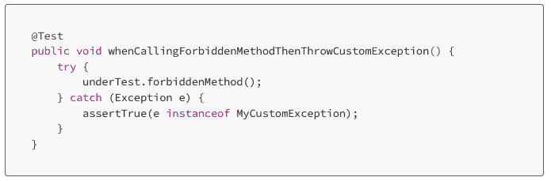
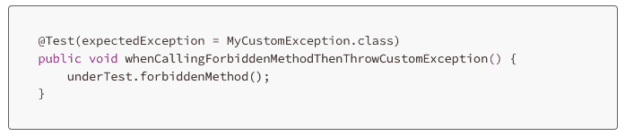
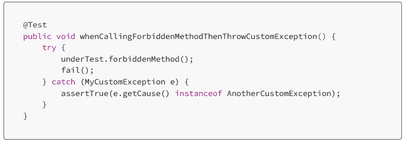
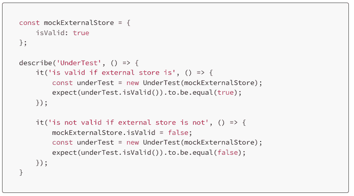
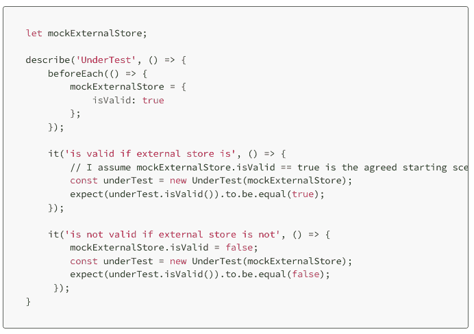
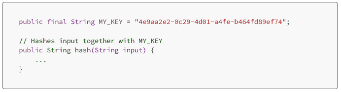
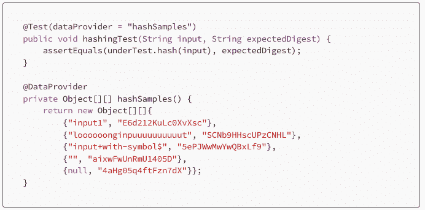
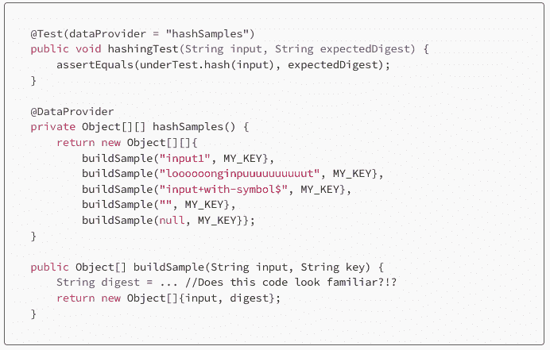

# Expedia:更有效的单元测试的 3 个技巧

> 原文：<https://thenewstack.io/expedia-3-tips-for-more-effective-unit-testing/>

如果没有正确地完成单元测试，那么进行单元测试是毫无意义的。Expedia 的高级软件工程师[Lorenzo Dell’arciprete](https://www.linkedin.com/in/lorenzodellarciprete/)最近写了一篇很有帮助的[博文](https://medium.com/expedia-group-tech/4-ways-to-make-unit-tests-more-effective-3615cc6ba4ec)，指出了导致一些无效的常见单元测试错误。

编写单元测试很可能是软件开发过程中最没意思的部分，除了当他们通过的时候松了一口气。有时候。因为不是所有的通过都是通过，也不是所有的失败都是失败。编写区分这两者的测试非常重要。

戴尔的 Arciprete 提供了三个让单元测试更有效的技巧:测试异常、使用单元测试模拟、使用测试数据而不是生产数据。请继续阅读，了解更多关于这些的信息。

## **异常测试**

乍一看，编写单元测试来检查特定的非法场景是否会引发特定的异常似乎很简单。

上面的例子确实检查了异常，这意味着如果抛出了除了*mycysmexception*之外的任何东西，它将失败。但是仍然缺少一些东西，因为如果 *forbiddenMethod* 根本不抛出，测试仍然会通过。在这种情况下，测试不是通过，测试只是稍微不完整。

Dell'Arciprete 提供了两种解决方案——使用一个框架(最初的帖子引用为 [JUnit](https://junit.org/junit5/) )为该实例专门设计功能，或者手动创建检查。

框架提供的功能看起来像这样:

对于手动检查，如果测试没有遵循预期的过程，测试应该会失败，如下所示:

## **重置模拟**

模拟通常用于在单元测试中模拟外部状态和/或行为。在编写这些测试时，将模拟环境作为一个整体来考虑，而不是每个特定的测试。考虑下面的例子:

按顺序运行测试，它们会通过，但不会反过来。测试的初始状态是*mockeexternalstore . is valid = = true*，但是因为第二个测试改变了状态，并且为将来的测试保持改变状态，所以第二个测试将通过，但是如果以相反的顺序运行，第一个测试将自动失败。

戴尔的 Arciprete 解释说，在每次测试之前编写一个函数来重置模拟可以解决这个问题。大多数框架都有一个设置功能，可能命名为类似于每个之前的*，以确保每个测试从相同的上下文开始。修改后的代码如下所示。*

## 在测试中使用测试数据

这个简单明了。不要在单元测试中使用生产数据，而是手动或通过数据提供者(@DataProvider)为测试提供常规和边缘情况参数。他写道，在测试中使用生产数据，“违背了测试本身的目的。”

考虑测试一个基于常量键的散列函数。生产中的函数如下所示:

意味着单元测试看起来像这样:

但是接下来的想法是，“如果有人更改了我的 _KEY，测试将会中断”，随之而来的是自动生成参数的诱惑。  戴尔的《建筑评论》警告说:

注意警告。这里的测试中的生产代码复制很清楚，虽然戴尔的 Arciprete 承认这是一个“极端”的例子，但他接着承认说，“它可以在较小的规模上发生，除非你注意这一点。”

## **结论**

虽然有用的测试和有点用的测试之间没有很大的差别，但是当正确执行时，单元测试还是非常强大的。Dell 的 Arciprete 提供了一些具体的例子，但是它们可以被更广泛地应用:仅仅一些简单的调整就可以使你的单元测试产生巨大的变化。

<svg xmlns:xlink="http://www.w3.org/1999/xlink" viewBox="0 0 68 31" version="1.1"><title>Group</title> <desc>Created with Sketch.</desc></svg>