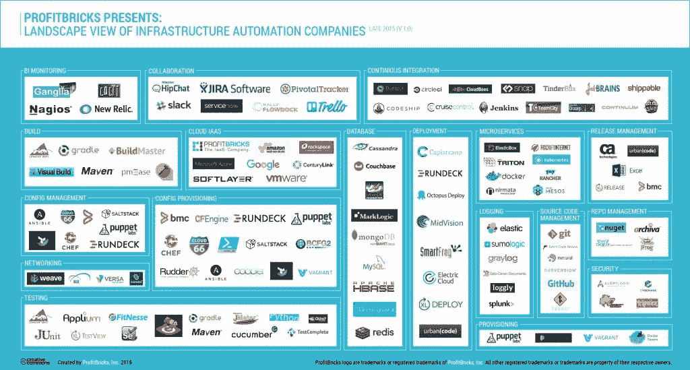

# 爆炸式增长的基础设施自动化堆栈及其生态系统

> 原文：<https://thenewstack.io/exploding-infrastructure-automation-stack-ecosystem/>

马特鲍德温

首席架构师 Matt Baldwin 负责 ProfitBricks DevOps 中央社区，以及通过 REST 和 SOAP APIs 加速使用 ProfitBricks 的库、SDK 和文档。当他不在 containers 和 Ansible 上乱搞的时候，他喜欢收集晦涩的异国情调和拉丁爵士乐唱片。

你已经听过一千遍了:

[software is eating the world](https://thenewstack.io/oped-software-not-just-eating-world-capitalism/)

。或者我应该说“作为代码的基础设施”或“基础设施自动化”正在接管世界？

软件正在取代基础设施，现在容器允许我们迁移到一个通过 web 服务无缝集成到互联网上的应用程序世界。像 Kubernetes 这样的解决方案可以帮助您保持应用程序在线并处于您想要的状态，而基础架构提供商则以越来越低的价格为这些集群提供计算资源以进行扩展和执行。

我们正在进入一个民主化计算的时代；基础设施已经成为应用。在这个时代，我们可以轻松地在不同的提供商之间部署和重新部署相同的足迹，将我们的应用程序从一个移动到另一个。我们可以根据价格、性能或两者之间的一些指标进行选择。这只是应用程序架构和其间的集成的问题，例如 CI/CD 解决方案、配置管理和其他工具，所有这些都支持爆炸式增长的基础架构自动化堆栈及其生态系统。

## 现代应用需要基础设施自动化

应用程序正在走向全球。过去在交付移动、社交和网络应用解决方案时依赖硬件，现在则依赖通过云计算交付的软件。这可以是平台或基础架构即服务。随着我们进入采用容器的时代，这条线只会越来越长。

> 在我 15 年的互联网基础设施开发生涯中，我从未见过人们对后端如此感兴趣。显然，风投们也没有。

我不会深入探讨为什么会发生这种情况——当然，云计算、容器和 DevOps 是其中的一大驱动因素。商业案例在这里为需求提供资金:大数据、复杂的现代 SaaS 应用程序、高度可用的全球化一切或应用程序、移动客户端等。业务部门看到了不断改进 IT 的强大趋势。这可以是公司提供的应用程序的 CI/CD，或者只是通过云消费和集成各种业务线应用程序。

请继续阅读，了解随着工作负载变得越来越复杂，堆栈是如何发展的，以及它如何适应应用程序的现代开发和交付。我们将从基础设施自动化开始，并触及几类软件和服务(您可以在漂亮的小信息图[这里](https://blog.profitbricks.com/infrastructure-automation-ecosystem-landscape/)中找到)，您可以使用它们将各种类型的工作负载交付到云计算中。

基础设施已经提供了一系列选择。云架构师需要在为公共云、混合云或容器提供自动化和部署选项的公司中进行选择。互联网已经成为不同 API 和初创公司的天下，它们能够利用这些 API 和初创公司来构建现代应用交付模型和现代基础设施。以下列表重点介绍了帮助构建应用和运营交付新未来的各类公司。

> 在这个列表中，我认为有些类别是团队成功的必备条件。像协作和问题跟踪工具这样的东西现在是基本需求。

直到你采用了一种围绕你正在开发的东西进行对话的方法，以及一种测试和跟踪问题的方法，你才能开始将软件交付到产品中。

理想情况下，在这一点上，当您开始构建您想要使用的堆栈时，容器是智能的，其中堆栈是本文中概述的工具和思想的混合物——但它们现在不是必需的。

## 协作工具是现代开发团队的筹码

最有效的团队利用和使用最强大的沟通工具。如今，开发团队的工具箱中有多个应用程序，允许他们与可能居住在国家或全球不同地方的队友和同事保持联系。这些不仅使他们彼此保持联系，有时还与他们应用程序周围的社区保持联系。

> 所有成功的应用和平台都以某种有意义的方式参与到他们的社区中。反过来，开发人员也参与到关于应用程序的对话中。

目前，开发人员协作空间正被少数几家公司所消费——所有这些公司都建立在为分布式团队提供服务的云基础架构之上，而这些团队自己又部署到云基础架构中。

### 属于这一领域的一些公司包括:

*   **Flowdock**
*   **HipChat**
*   **JIRA 软件**
*   **松弛**
*   **枢轴跟踪器**
*   **特雷罗**

团队变得越来越分散，开发人员和工程师可以住在他们想住的任何地方，公司，尤其是初创公司，可以接受这种要求。这在各种协作工具的使用中显而易见，其中我最喜欢的是 Slack。我们在内部使用 Slack，并且是忠实用户。很高兴看到提醒进入对话、帖子、文档共享，以及 Slack 管理对话的各种方式，所有这些都带来了很好的体验。

协作工具已经成为团队就其开发和操作环境的各个方面进行交流的重要方式。这些工具变得更加自动化，更好地集成到团队使用的系统中。

> 你也绝对需要某种软件票务追踪器。

你可以使用吉拉，安培拉或 GitHub。每种方法都有不同的优点和缺点。不管您的口味如何，它们都是任何现代开发团队所必需的。你为什么还不使用 Git？将其中一个连接到 Slack 也很好，这样您就可以收到所有的警报——读取提交消息，等等。这些现在都可以成为对话的一部分。我们用它来组织一个全球团队。

对话是协作空间的核心原则。这些应用程序中的每一个都有助于团队围绕正在构建和交付的内容展开对话。

## 微服务风靡一时，这是有原因的

微服务是一种软件架构模型，在这种模型中，您将应用程序组件化，并将每个组件作为自己的容器在一台或多台物理机或虚拟机上运行。这些容器可以由开发人员构建，然后通过连续交付交付到生产中。容器应该是可替换的。您应该能够运行一个或多个相同的容器，这取决于您需要多大程度地扩展您的应用程序。

公司继续涌入这一领域，其中最著名的是 Docker。看起来如果你在容器生态系统中工作，为你的创业和团队提供资金不会太难。
从网络到数据持久性，容器领域有大量的机会，许多公司都在试图解决这些问题。

### 以下是使用微服务的各种公司和项目列表:

*   **ClusterHQ** 及其卷管理解决方案 Flocker。
*   **CoreOS** ，专为容器打造的操作系统。
*   **码头工人**。
*   Google 的 Kubernetes 可以帮助你进行集群编排和容器到集群的调度。
*   **中间层**帮助你组织你的基础设施。
*   **牧场主**用他们的集装箱控制飞机进行私人集装箱集群。

集装箱将在未来几年“吃掉世界”。这个列表中的任何公司，如果不在容器领域工作或以某种方式解决这个问题，将在未来两到三年内这样做。对我来说，很简单:

> 开发人员和工程师选择采用的任何工具，只要不是强制工具，都将是成功的工具。

已经有领养者了。像易贝这样的公司正在使用 Kubernetes 的集装箱。随着开发人员越来越了解和意识到工具的存在，软件的交付将继续变得更加自动化。运营团队将开始专注于将底层基础设施作为一个应用程序来管理。

## IaaS 平台，现代软件的重要基础

在一切事物之下，甚至容器之下，都有云基础设施组件。如果没有这个类别的提供商，比如亚马逊的 AWS，整个“云”的概念就不会存在。很明显，AWS 不仅仅是云计算实例。AWS 是一个提供各种工具的平台，比如 Lambda，不幸的是，它将您锁定在 Amazon 上，并迫使您的团队学习一个提供者。想想 IBM 及其长期的锁定历史。

这就是为什么我们开始看到从在虚拟机中运行代码到更上一层并在适当的时候在容器中运行代码的转变。他们可以轻松地从开发人员的桌面转移到生产中，这是一个简单且有望无缝的工作流——他们跨越提供商，使用更高级别的解决方案，如 Kubernetes，来管理容器到计算节点集群的调度。

名单上的其他提供商，如谷歌，倾向于专注于引入他们熟知的工作负载；例如，大数据公司转向谷歌云以利用谷歌为处理大数据集而构建的平台并不少见。Google 在帮助在他们和其他人的平台上运行容器工作负载民主化方面也做得很好。

这个列表并不全面。其目的是强调一些常见的提供商以及其他专注于提供更好的性能或本地解决方案的提供商。

### 我们的云提供商名单包括:

*   亚马逊与 EC2、EBS、ELB 以及他们平台上的其他公司合作。亚马逊有各种各样的解决方案可供选择。我将把它留给另一篇文章来剖析目录中的一切。
*   **谷歌**用 GCE 作为他们的计算解决方案。
*   **微软 Azure** :另一个平台即服务，你可以消费传统计算或围绕微软的托管服务构建你的应用。
*   **ProfitBricks** :将基础设施作为纯粹的公用事业来提供，注重性能和灵活性。
*   **Rackspace** :托管云计算公司
*   **SoftLayer**:IBM 旗下，提供虚拟机、裸机等服务。
*   **VMware**:VMware 拥有最大的客户群，是本地云基础架构领域的领导者。

开发人员可以在不同的基础设施提供商中进行选择。但是，随着这些平台变得更加以平台为中心，较小的提供商开始在性能等方面进行区分。例如，ProfitBricks 专注于高性能，这使它们非常适合需要良好 I/O 的工作负载，而 Packet 等其他公司则专注于提供快速的裸机解决方案。随着开发人员从虚拟机转移到运行在虚拟机或 metal 上的容器，性能和差异化将变得非常重要。

## 数据库决策:变得更加棘手

似乎你打开一个技术博客，就会看到另一个数据库创业公司在现场展示他们自己对如何垂直化数据库服务的看法。我们看到云数据库不断涌现，解决垂直需求的数据库解决方案越来越多，超出了我们所能处理的 NoSQL——这个列表似乎还在不断增长。

对于一个开发人员来说，有很多东西可以玩，可以实验，可以工作。团队开始让数据库适应他们试图解决的问题，而不是带着使用哪个数据库解决方案的先入为主的想法进入项目；例如，您现在可以选择某种类型的时序优化数据库，如 InfluxDB，而不是选择 Microsoft SQL 来构建指标应用程序。

> 我们现在可以将数据库映射到问题，而不是被迫将问题映射到数据库。

### 目前使用的常见数据库解决方案包括:

*   **Apache HBase** :面向列的数据库管理解决方案。
*   Cassandra :一个混合的键值、面向列的数据库，设计用于处理分布在商用服务器上的大量数据。
*   另一个文档数据库。
*   **Firebase** :通过云交付的实时数据库服务，专注于保持您的应用程序同步——离线或在线。
*   **Maria db**:MySQL 的一个分支，确保它在甲骨文收购后保持免费。
*   MongoDB :你能找到的最普通的文档数据库。
*   **MySQL** :繁体，RDBM。

SQL 和 NoSQL 解决方案的美妙之处在于，一般来说，它们都是免费的。开发人员和创业团队不需要依赖企业协议来快速构建和交付数据库驱动的应用程序。

## 配置供应:自动化提高了速度和一致性

确保您的环境(开发、测试、试运行、生产等)完全相同非常重要。根据您的更新需求，能够在您的环境中批量或小部分地协调变更也很重要。这是技术领域的一个问题，也是为什么我们看到各种 IT 自动化工具和容器的兴起。

配置管理主要用于虚拟机基础设施，在这一点上，容器的管理方式略有不同。这实际上导致了一场关于是否需要像 Chef 这样的工具来管理环境的争论。随着 docker 文件变得越来越丰富，我们只需在容器中进行更改，然后容器就可以投入生产或推出容器的多个副本。

### 这一领域最常见的解决方案是:

*   Ansible :用 Python 构建的简单的无代理解决方案。Ansible 越来越流行，由于各种原因，我不会在这里深入讨论，它正在成为您将看到的使用中更常见的工具之一。
*   **OpsCode Chef** :最流行的解决方案之一，用 Ruby 构建，广泛支持 Linux 和 Windows 环境。
*   **木偶**:另一个非常流行的解决方案——同样是用 Ruby 构建的。
*   SaltStack :另一个易于使用的基于 Python 的解决方案。

您可能会发现一些不太常用的工具，如 CFEngine 和 Rudder。在测试和工作时，开发人员通常会使用像 vagger 这样的工具来构建他们自己的虚拟机环境。Hashicorp 还为我们提供了一些简洁的东西，如 Terraform，帮助我们确保拥有可重复的基础架构构建和配置管理。

所有这些工具都有助于您接受基础设施即代码的概念。使用上面的任何工具，您都可以对您的环境进行可重复的构建和更改。需要做出改变吗？在给定的工具中进行更改，然后指示将该更改反映到所有环境中。这允许您将环境视为只能通过配置管理修改的盒子。

> 管理员登录单个系统的时代早已过去。

## 持续集成工具:精炼开发和操作

随着团队采用持续集成，像 Shippable、Jenkins 和 TravisCI 这样的工具将变得越来越重要。它们允许开发人员轻松地发布代码，然后在签入时进行验证。如果你使用 Git，这些代码可以自动合并到 master 中——一旦一切(单元测试和集成测试)通过。开发人员可以提前注意到构建中的问题，并在它影响到产品回购之前修复它。一旦它们合并，系统会检查更改并向它们发出警报。

> CI 向它的自然结论迈进了一步:持续部署。

运营团队或开发人员自己(如果他们有权限的话)可以利用许多相同的系统来投入生产:一旦合并到股份回购中，就部署到生产中。CI/CD 允许以更高的质量和更快的速度将应用程序从开发交付到生产。

持续集成允许您的团队通过进行合并到 master 中的持续构建来及早发现问题。您甚至可以将它插入一个持续的交付系统，将其部署到生产中。

### 这一领域的公司包括:

*   **Buildbot**
*   **CircleCI**
*   **云蜂**
*   **代码船**
*   **连续统**
*   **巡航控制**
*   詹金斯
*   **JetBrains**
*   **可发货**
*   **卡扣**
*   团队城市
*   **火绒箱**
*   **特拉维斯奇**

显而易见，随着码头工人和集装箱作为一个目标继续上升，这个空间已经很拥挤了——还有更多人在上升。其中一些公司专注于利用容器作为他们的平台，而其他公司则让你测试你的代码，然后将容器发送到你选择的注册中心。

## 基础设施自动化生态系统总结

基础设施自动化将继续迅猛发展。集装箱正在升温。这将推动更多的投资进入这一领域。随着信息图的持续增长，我预计会有相当多的类别被突出显示。开发运维团队、流程和其他类型工具的采用率正在显著上升。只需将 Ansible 放入 Google Trends，看看红帽为什么会买它们。这一切都导致了该领域的爆炸式增长。

当然，未来仍有差距和粗糙的地方需要解决，但这只是更多创业公司出现的机会。遵循这个列表，因为我们希望随着生态系统的发展不断更新它。

*查看信息图并[推荐新公司加入或转移](https://blog.profitbricks.com/infrastructure-automation-ecosystem-landscape/)。我们将在 2016 年全年更新图片。*

<svg xmlns:xlink="http://www.w3.org/1999/xlink" viewBox="0 0 68 31" version="1.1"><title>Group</title> <desc>Created with Sketch.</desc></svg>