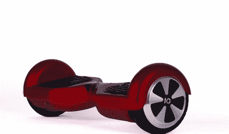

# 爆炸的小猫和其他我们暗暗希望得到的古怪礼物

> 原文：<https://thenewstack.io/exploding-kittens-geeky-gifts-secretly-wish-got/>

礼物都被拆开了——结果发现它们都是“通常的嫌疑人”:亚马逊最畅销的游戏似乎是 [*【辐射 4】*](https://www.amazon.com/Fallout-4-PlayStation/dp/B00YQ2KCWO/ref=sr_1_1?ie=UTF8&qid=1450976430&sr=8-1&keywords=Fallout+4)—为了赶上黑色星期五的购物热潮，在 11 月份方便地发布了——我们已经写了大量新的[《星球大战》玩具](https://thenewstack.io/stars-wars-launches-new-mega-explosion-marketing/)，以及 XKCD 漫画家兰道尔·门罗的时髦的新 [*事物解释者*书](https://thenewstack.io/xkcd-cartoonist-explains-all-the-things/)。但是在所有的蛋奶酒之后，当真相最终被告知…这是我们真正想要的假期。

## 孵化恐龙蜡烛

“融化蜡蛋，展示一只可爱的陶瓷猛禽，”这份不可抗拒的礼物的描述写道，它将点燃蜡烛的简单行为变成了你自己的侏罗纪公园。“给你的蜗居添加一点史前氛围”Firebox.com 蜡烛的页面上写道，一旦你的迅猛龙被挖掘出来，它就“准备好为你服务了”

事实上，迅猛龙是瓷器做的。创作者声称，嵌入的生物是“从努布拉岛冒泡的沼泽中挖掘出来的。”

与真正的史前迅猛龙不同，这只脸上可能有一些你燃烧的蜡烛芯留下的烟灰。但最重要的免责声明来自其网页上的小字，描述该设备为“可预订，预计 2016 年 2 月 8 日。”

所以它可能是情人节更好的礼物。

## 爆炸小猫

就在四个月前，这款流行的纸牌游戏在 Kickstarter 上创造了新的记录，219，382 名支持者承诺为其创作提供 8，783，571 美元的资金——到圣诞节时，它已经成为亚马逊最畅销的五大玩具之一。这成为了 Kickstarter 历史上最受支持的项目，也是其前十大筹款人之一，8 月份第一批卡片终于开始发货。现在圣诞节到了，更多好奇的极客终于有机会玩它了。

"你怎么能不喜欢用爆炸的小猫杀死朋友的游戏呢？"一位评论家在亚马逊上写道，将它比作俄罗斯轮盘游戏。“它很短，但很棒。”

## 【T2

“玩家抽卡，直到有人抽到了一只爆炸的小猫，这时他们就会爆炸，”该游戏的官方网站解释道，“除非那个玩家有一张解除卡，可以用激光笔、揉肚子和猫薄荷三明治之类的东西来解除小猫的危险。”

游戏的大部分乐趣来自马修·因曼(又名燕麦片)的极客友好插图，他还创作了一部受欢迎的在线漫画[和一本书](http://theoatmeal.com/)“如何判断你的猫是否打算杀你”脸书上有数百万粉丝，他帮助这款游戏在 8 分钟内达到了第一个筹款目标——剩下的就是历史了。

CNN [描述](http://www.cnn.com/2015/01/20/homepage4/feat-exploding-kittens-viral-kickstarter/)这个新游戏，他将其描述为“像 UNO 一样，除了有山羊、魔法玉米卷饼和可以杀死你的小猫”。

## iNecklace

“世故。优雅。开源……专为赞美艺术、科学、工程和伟大设计的女性打造。”

售价 75 美元的 iNecklace 配备了一个微妙的脉冲 LED，模仿苹果 Mac 电脑、MacBooks 和 iMac 上的 LED 的“呼吸”效果——但它的源代码、原理图、电路板和 CAD 文件都发布在 GitHub 上。“修改和破解！”在 Adafruit.com 推广产品页面[。](https://www.adafruit.com/products/440)“固件和 PCB 文件与[I cufflinks](https://www.adafruit.com/icufflinks)完全相同，”项链的 README.txt 文件解释道，该文件链接到 Adafruit 的另一款可破解珠宝产品，它们看起来都像是可以修补的有趣“项目”。

11 月，OpenSource.com 甚至将 iNecklace 列入了他们的 [14 份令人惊叹的开源节日礼物](https://opensource.com/community/15/11/2015-open-source-holiday-gift-guide)。到周三晚上，库存只剩下 12 台。

iNecklace 于 2011 年首次发布，几个月后就有人在博客上写道[“我攻击了 iNecklace”，这让我们很嫉妒修补匠发现了一种改变 LED 显示屏颜色的简单方法——只需在组件前面插入一块彩色塑料。事实证明，一个简单的毡尖标记足以将透明塑料变成完美的彩色漫射体。“我选择了紫色，因为这是我妻子最喜欢的颜色，”补锅匠说。当你刚砍下一件昂贵的珠宝时，一定会有一种独特的兴奋感。](http://makezine.com/projects/ihacked-the-inecklace/)

## 支持蓝牙的悬浮滑板

IO Hawk 将其未来派的自平衡两轮踏板车称为“我们移动方式的下一次进化”这只是几家销售时尚新款悬浮滑板的制造商之一，Wired*Wired*[将](http://www.wired.com/2015/06/the-weird-story-of-the-viral-chinese-scooter-phunkeeduck-io-hawk/)描述为“有点像赛格威——但没有把手。”

2015 年春天，有趣的新设备突然进入公众意识，从[贾斯汀比伯的 Instagram 账户](https://www.instagram.com/p/2re8N0AvmJ/)到[杰米·福克斯的超现实视频片段滚动到*今夜秀*](https://youtu.be/I1Dxxdcidx0) 的舞台上。现在，这些“个人机动运输车”中的一些甚至具有蓝牙功能，所以你可以将智能手机中的音乐直接传输到你脚下的扬声器中！

不幸的是，也有报道说它们很危险。美国消费者产品安全委员会正在调查“至少 10 起”悬浮滑板突然起火的投诉，这也促使*消费者报告*展开调查。“找到测试对象并不难。该出版物指出:“人们通常会放下手头的工作，来看看运行中的电路板。”。

尽管它们在纽约被禁，而且大多被亚马逊和 Overstock.com 网站拒之门外，但每个人都对这种新潮的新玩具着迷。杂志的结论？“永远、永远、永远戴上头盔……无法预测你会在什么时候或以什么方式摔倒，它发生得如此之快，以至于你没有时间做出反应。”读者也被提醒“这些不是名牌产品…它们几乎不受监管。”

当然，下一个很酷的东西似乎是悬浮滑板，它实际上可以[在空中悬浮长达六分钟](http://www.theverge.com/2015/12/24/10663228/arcaspace-arcaboard-hoverboard-skateboard)。

## 火焰——开掌火球射手

当然，有很多不错的圣诞礼物——但只有一个能让你感觉像钢铁侠。

Pyro“开掌火球射手”可能是有史以来最危险的玩具。呃，算了吧。“烟火不是玩具，”DudeIWantThat.com 的一篇文章警告说。“您必须年满 18 岁才能购买它，并且同意在将它用作您的下一个派对技巧或角色扮演比赛的才艺部分之前完整观看 Pyro 教学视频…”

听起来确实如此。舞台魔术师亚当·威尔伯(Adam Wilber)花了两年时间设计了“一种高科技专业工具，当他们从手掌中释放出真正的滚动火焰时，它会将训练过的对象变成漫威超级英雄或火海魔。”

该装置有四个“腔室”，它们绑在一个手腕上。你用藏在另一只手里的遥控器小心翼翼地触发火球。你甚至可以在 30 英尺外触发火球的发射，威尔伯在他产品的宣传视频中解释道。“控制元素…！很圆滑！是黑色的！它可以藏在你的袖子里而不被发现。

"并且可以让你在任何时候随心所欲地发射火球."

[https://www.youtube.com/embed/BNVG0dFaC50?feature=oembed](https://www.youtube.com/embed/BNVG0dFaC50?feature=oembed)

视频

* * *

# WebReduce

<svg xmlns:xlink="http://www.w3.org/1999/xlink" viewBox="0 0 68 31" version="1.1"><title>Group</title> <desc>Created with Sketch.</desc></svg>