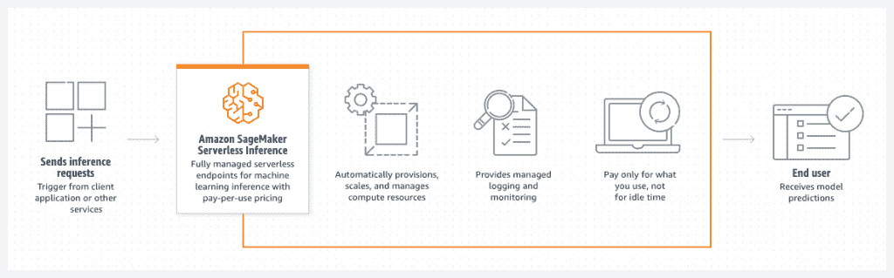

# 探索 Amazon SageMaker 部署 ML 模型的无服务器推理

> 原文：<https://thenewstack.io/explore-amazon-sagemaker-serverless-inference-for-deploying-ml-models/>

本月早些时候在该公司的 re:Invent 2021 用户大会上推出的[亚马逊网络服务](https://aws.amazon.com/?utm_content=inline-mention)’[亚马逊 SageMaker 无服务器推理](https://aws.amazon.com/about-aws/whats-new/2021/12/amazon-sagemaker-serverless-inference/)是一种新的推理选项，可以在不配置和管理计算基础设施的情况下部署机器学习模型。它带来了无服务器计算的一些属性，例如规模为零和基于消费的定价。

通过[无服务器](https://thenewstack.io/category/serverless/)推理，SageMaker 决定基于现有计算资源的并发性和利用率启动额外的实例。其他机制和无服务器推理之间的根本区别在于如何调配、扩展和管理计算基础架构。您甚至不需要选择实例类型或定义最小和最大容量。

Amazon SageMaker 无服务器推理加入了现有的部署机制，包括实时推理、弹性推理和异步推理。

## 在 SageMaker 中部署模型的工作流程

概括地说，在 SageMaker 中部署模型包括四个步骤。让我们来看看它们。

**1)创建模型**–无论您是在 SageMaker 中训练模型，还是带来外部预训练模型，第一步都是向平台注册。亚马逊 SageMaker 预计模型藏在一个 S3 桶里。工件是 TensorFlow 保存的模型、Keras HDF5、PyTorch `.pth`文件或 ONNX 模型的 tarball。然后，工件与具有预先配置的推理代码的容器图像合并。SageMaker 为一些最常见的机器学习框架(如 Apache MXNet、TensorFlow、PyTorch 和 Chainer)提供了内置算法和预构建 Docker 映像的容器。当创建一个模型时，tarball 被解压缩，模型工件被复制到`/opt/ml/model`目录，这是推理代码所期望的。这个容器映像成为推理部署的基本单元。

**2)定义端点配置** —一旦向 SageMaker 注册了模型，下一步就是将它与通过端点配置定义的托管环境相关联。它充当端点的蓝图，可以选择支持自动扩展。可以把 SageMaker 端点配置看作 Amazon EC2 自动伸缩组的启动配置。端点配置标识模型和相关基础设施，包括模型变体、GPU 加速器类型(如 ml.eia1.medium 和 ml.eia2.xlarge)、实例类型(如 ml.t2.medium 和 ml.c5.4xlarge)以及实例的初始数量。

**3)创建端点** —如果上一步将模型与计算资源(容器和实例类型)相关联，那么这一步将创建用于调用模型的实际 HTTP(S)端点。创建端点非常简单，只需分配一个标识符并将其指向上一步中定义的端点配置。

**4)调用端点** —一旦端点发布，就可以使用 Python SDK 或 AWS CLI 调用它。它还可以轻松地与 AWS Lambda 和 Amazon API Gateway 集成，以标准 REST API 的形式提供给客户端使用。

## 无服务器推理的变化

幸运的是，当在传统的实时推理端点和新的无服务器推理端点之间切换时，工作流不会改变。关键的区别在于工作流的第二步，我们在这一步定义端点配置。

我们将让 SageMaker 为我们挑选最佳的计算资源，而不是手动选择实例类型。这种实例类型选择基于端点配置中提到的最小内存量。无服务器端点的最小内存大小为 1024 MB (1 GB)，最大内存大小为 6144 MB (6 GB)。内存大小可以是 1024 MB、2048 MB、3072 MB、4096 MB、5120 MB 或 6144 MB。无服务器推理自动分配与您选择的内存成比例的计算资源。内存越大，分配给容器/实例的 vCPUs 就越多。

您可以根据模型大小选择端点的内存大小。经验法则是，内存大小应该至少与您的型号一样大。

另一个显著影响计算资源分配的参数是并发性。无服务器端点对可以同时处理的并发调用数量有一个配额。如果端点在处理第一个请求之前被调用，它将同时处理第二个请求。

像其他无服务器环境一样，SageMaker 推断端点也遭受冷启动带来的延迟。如果一个无服务器的推断端点在一段时间内没有收到流量，然后突然收到新的请求，SageMaker 将加速计算资源来处理传入的请求。由于无服务器端点按需提供计算资源，因此端点可能会经历冷启动。如果并发请求超过当前并发请求使用量，也可能会发生冷启动。冷启动时间取决于模型大小、下载模型需要多长时间以及带有推理代码的容器的启动时间。

在预览期间，SageMaker 无服务器推理端点不能通过 Amazon SageMaker Python SDK 进行编程访问。但是，您可以使用 Jupyter Notebooks 的 AWS SDK for Python (Boto3)来自动创建端点。

SageMaker 无服务器推理在美国东部(北弗吉尼亚)、美国东部(俄亥俄州)、美国西部(俄勒冈州)、欧洲(爱尔兰)、亚太地区(东京)和亚太地区(悉尼)的 preview 中可用。

在本系列的下一部分中，我们将研究为 TensorFlow 模型发布 SageMaker 无服务器推理端点所涉及的步骤。明天继续收听下一期节目。

<svg xmlns:xlink="http://www.w3.org/1999/xlink" viewBox="0 0 68 31" version="1.1"><title>Group</title> <desc>Created with Sketch.</desc></svg>