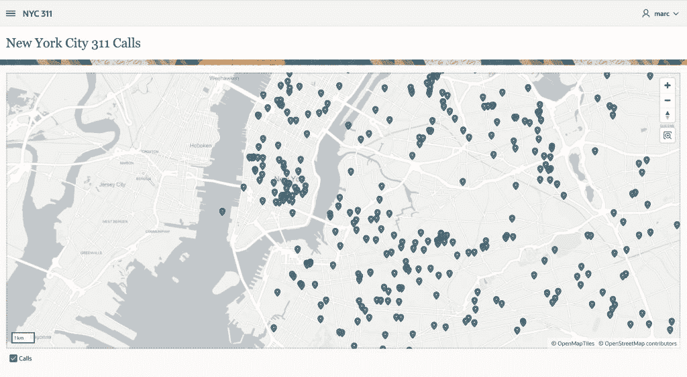
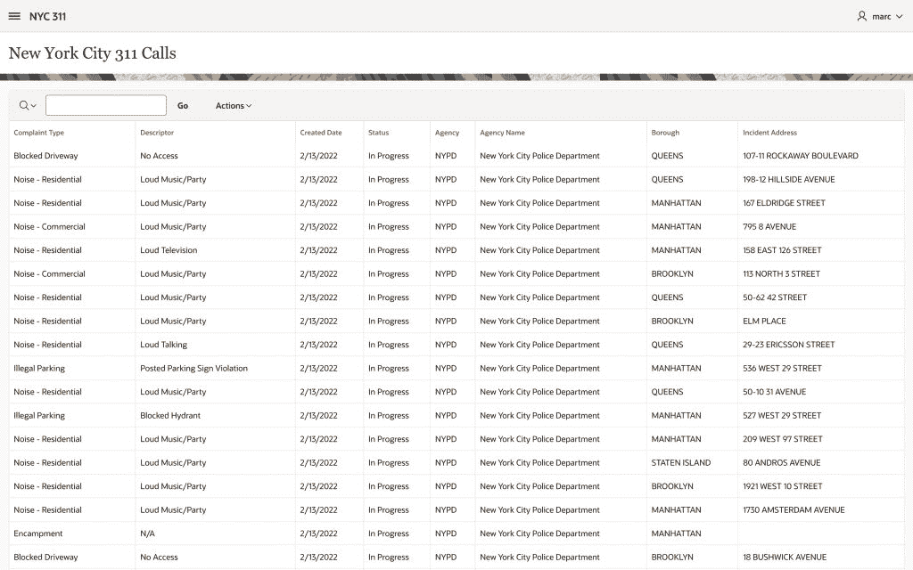
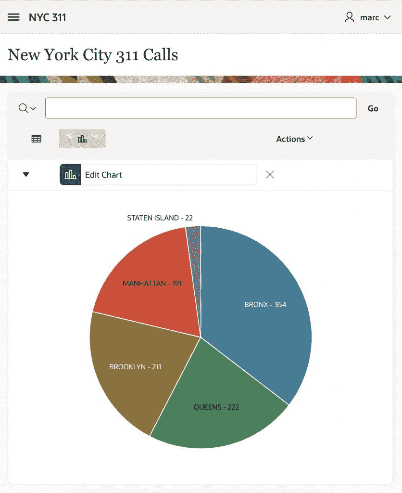

# 用低代码工具探索和使用免费的政府数据

> 原文：<https://thenewstack.io/explore-and-use-free-government-data-with-low-code-tools/>

美国各城市、州和联邦政府机构在 21 世纪初开始与公众分享他们收集的数据，他们一直在不断改进访问这些数据的资源。这些开放的数据涵盖了从税收到健康趋势到警察呼叫到环境科学的所有内容，可以用来改进你的研究或在应用程序中投入使用。因为数据是免费的，你需要的只是好奇心和用它做些事情的技能。

低代码平台非常适合利用这些数据资源，因为您只需指向一个 API 端点，就可以开始构建应用程序。然后，您可以使用声明性向导来构建您自己的解决方案以及所有可用数据集和服务的混搭。

## **查找并访问开放数据**

 [马克·休兹

Marc 是甲骨文公司的软件开发总监。他负责 Oracle APEX 的开发和交付，并管理着一个由软件开发人员和产品经理组成的全球团队。他在德国汉堡的甲骨文咨询公司工作后加入了 APEX 团队；纽约；华盛顿特区和芝加哥。Marc 拥有德国 Wedel 应用科学大学的计算机科学硕士学位。](https://www.linkedin.com/in/msewtz) 

在我们开始使用我们的低代码平台构建应用程序之前，在本例中， [Oracle APEX](https://apex.oracle.com/en/?source=:ex:pw:::::TNS_A&SC=:ex:pw:::::TNS_A&pcode=) ，让我们看看开放数据的一些基础知识。

数百个城市、州、联邦机构、非营利组织和非政府组织提供数据集。这些数据集价值的关键在于它们作为基于标准的 REST APIs 的可用性。作为背景，REST 是使用 HTTP 获取 XML 和 JSON 等格式的数据集的系统之间的接口。大多数开放数据 API 都是基于 REST 的。

[Socrata 开放数据 API (SODA)](https://dev.socrata.com/) 为全球政府、非营利组织和非政府组织托管数百个不同的数据目录，是最广泛采用的政府开放数据解决方案。另一个是[开放数据网络](https://www.opendatanetwork.com/)，它提供了一个开放数据集的全局目录，也可以通过编程方式集成，并使用全局目录 API 从其他系统进行查询。

要与开放的数据资源交互并将其与其他系统集成，需要一个端点。SODA API 的端点是代表一个对象或对象集合的唯一 URL。每个 Socrata 数据集和每个单独的数据记录都有自己的端点。

## 使用案例:纽约市紧急电话

我们将使用的数据来自纽约市，该市于 2012 年颁布了第一部开放数据法。该市的[open data . cityofnewyork . us](https://opendata.cityofnewyork.us/)网站可以让你按机构或类别发现和使用数百个数据集。

[这里是纽约市 311 服务请求的一个端点示例。](https://data.cityofnewyork.us/resource/erm2-nwe9.json)

[可在此处找到该终点(NYC 311 API)的完整文档。](https://data.cityofnewyork.us/Social-Services/311-Service-Requests-from-2010-to-Present/erm2-nwe9)

请注意，所有资源都是通过/resource/的公共基本路径以及唯一的数据集标识符来访问的——八个字母数字字符被一个破折号分成两个四字符短语。可以使用任何网络浏览器或各种工具打开该 URL，例如 [Paw](https://paw.cloud/) 或 [Postman](https://www.getpostman.com/) REST 客户端浏览器插件。

为了请求特定的数据集，或者查询和操作结果，可以向端点 URL 添加简单的过滤器和 SoQL ( [Socrata 查询语言](https://dev.socrata.com/docs/queries/))参数。

SODA APIs 是自描述的，这意味着数据集本身的模式和内容决定了它们如何被查询。数据中的任何字段都可以用作过滤器，只需将它作为 GET 参数附加到 API 端点即可。为了过滤前面的示例，使其仅包含位于布鲁克林的 311 个服务请求，可以添加纽约市行政区作为参数，后跟行政区名称:

[https://data.cityofnewyork.us/resource/fhrw-4uyv.json?博罗=布鲁克林](https://data.cityofnewyork.us/resource/fhrw-4uyv.json?borough=BROOKLYN)

SoQL 是一种简单的类似 SQL 的查询语言，旨在简化 web 上的数据处理。与标准 SQL 一样，开发人员可以选择特定的列，使用 where 子句过滤结果，对结果进行排序和分组，以及应用某些聚合函数。

地图按位置显示 1，000 个最近的 311 呼叫

考虑到许多数据集非常大，有几千甚至几十万行，在将数据下载到客户端应用程序之前对其进行聚合是至关重要的。只加载所需的数据和聚合，而不是下载完整的数据集，可以提高性能，并且在许多情况下，使客户端应用程序可行，因为在许多情况下，每次打算运行应用程序或生成报告时都下载所有数据是不实际的。

下面概述了可用的 URL 参数及其功能:

为了进一步筛选和聚合上一个示例中的 311 个数据，以下 URL 只选择投诉类型，以及布鲁克林区的投诉总数，按降序排列:

## **为什么代码低**

低代码应用程序开发完全是为了提高生产率:像 APEX 这样的工具可以用少得多的工作量为您提供更多的功能。低代码工具允许应用程序开发人员专注于解决业务问题，在重复的低级别编码上花费更少的时间。

同时，没有软件开发经验的用户可以使用低代码工具来自动化业务流程，并快速开发单点解决方案。如果使用得当，低代码工具可以为广泛的用例提供卓越的生产力。

报告显示最近拨打的 311 电话列表。

## **用 APEX 一步步开放数据**

如上所述，纽约市和许多其他政府的开放数据门户使用 SODA API，它通过 http 以 JSON 和 CSV 格式提供数据。低代码平台让开发人员只需插入相应的 SODA URL，然后使用声明性向导来构建使用数据的强大组件，如报告、图表和日历，而无需编写大量代码或任何代码。许多低代码平台还提供用于报告、数据可视化和表单控制的组件。

对于这个例子，我们使用 APEX，它可以应用于各种各样的[用例](https://apex.oracle.com/en/solutions/use-cases/?source=:ex:pw:::::TNS_B&SC=:ex:pw:::::TNS_B&pcode=)，从简单的电子表格替换到[任务关键型企业系统](https://apex.oracle.com/en/solutions/success-stories/?source=:ex:pw:::::TNS_C&SC=:ex:pw:::::TNS_C&pcode=)。

要开始使用 APEX 构建应用程序，您有不同的选择。您可以注册一个 [Oracle Cloud Free Tier](https://cloud.oracle.com/free?source=:ex:pw:::::TNS_D&SC=:ex:pw:::::TNS_D&pcode=) 帐户，然后创建一个[永远免费的 APEX 服务](https://www.oracle.com/application-development/apex/?source=:ex:pw:::::TNS_E&SC=:ex:pw:::::TNS_E&pcode=)或供应一个[永远免费版本的 Oracle 自治数据库](https://apex.oracle.com/en/platform/autonomous/?source=:ex:pw:::::TNS_F&SC=:ex:pw:::::TNS_F&pcode=)。你可以在[apex.oracle.com](https://apex.oracle.com/en/?source=:ex:pw:::::TNS_A&SC=:ex:pw:::::TNS_A&pcode=)上申请一个免费的工作空间。当然，你也可以在本地建立自己的 [APEX 实例](https://apex.oracle.com/en/learn/getting-started/?source=:ex:pw:::::TNS_G&SC=:ex:pw:::::TNS_G&pcode=)。

一旦服务可用，您将需要创建 APEX 工作区，然后可以使用声明性的创建应用程序向导开始构建应用程序。

1.  对于这个例子，用一个空白页构建一个应用程序就足够了。构建应用程序后，您需要创建对 REST API 的引用。这是在“共享组件”中使用一个名为“REST 数据源”的组件完成的。创建新的 REST 数据源需要 API 的 URL 端点、REST 数据源的名称以及 REST 数据源类型和 HTTP 数据传输方法的信息。您可以通过 http 和 https 访问 SODA APIs。APEX 会将端点 URL 分成特定于服务器和特定于服务的部分。对于特定于服务器的部分，APEX 将创建一个新的远程服务器对象，这允许您对指向同一服务器的 REST 端点进行分组。如果服务器改变了位置，只需调整远程服务器对象，整个 REST 端点集合将继续工作。
2.  接下来，将提示您输入身份验证信息。对于 SODA APIs，不需要认证；但是，开发人员可以使用高级属性包含应用程序令牌。您可以使用可选的模块参数定义 SODA 过滤器和 SoQL 查询。要在 URL 中包含参数，请选择参数类型“查询字符串”您可以在运行时动态更改参数。
3.  REST 数据源创建的最后一步是“发现”，它向 API 端点发出 HTTP 请求。结果以 JSON 格式返回。APEX 分析 JSON 结构并创建一个数据配置文件，其中包括所有可用的列以及发现的数据类型。声明性组件稍后将使用 REST 数据源和数据配置文件在 APEX 中创建向导，类似于 APEX 通常使用数据库数据字典读取本地表上的表和列信息的方式。

创建 REST 数据源后，APEX 中的许多标准组件(如交互式报表、经典报表、图表和日历)允许您直接连接到 REST API。要使用 REST 数据源，只需遍历相应的创建页面向导，并选择“REST 数据源”作为数据源。然后，您可以选择要包括在报表中的列，或者对于图表或日历页面，选择要用作显示和值列的列。

下面显示了使用 NYC 311 服务调用 API 创建的应用程序。在本例中，开发人员使用 APEX 交互式网格，从数据集中为报表选择最相关的列。使用内置的图表功能，开发人员添加了一个 Oracle JET 图表，显示纽约五个区(布鲁克林、曼哈顿、皇后区、斯塔滕岛和布朗克斯)中哪个区拨打了最多的 311 电话。

图表显示了纽约市最近的 1000 个 311 电话。

一旦数据在你的 APEX 应用中，它可以很容易地扩展到包括[地图](https://apex.oracle.com/en/platform/features/whats-new-211/?source=:ex:pw:::::TNS_H&SC=:ex:pw:::::TNS_H&pcode=)、[智能过滤器和搜索](https://apex.oracle.com/en/platform/features/?source=:ex:pw:::::TNS_J&SC=:ex:pw:::::TNS_J&pcode=#smart_filters_and_search)。这是一个低代码平台如何帮助您围绕所有免费可用的市政数据快速构建应用程序的例子。本文中的开放数据信息应该可以帮助您使用自己选择的低代码应用程序找到和访问这些数据。

<svg xmlns:xlink="http://www.w3.org/1999/xlink" viewBox="0 0 68 31" version="1.1"><title>Group</title> <desc>Created with Sketch.</desc></svg>