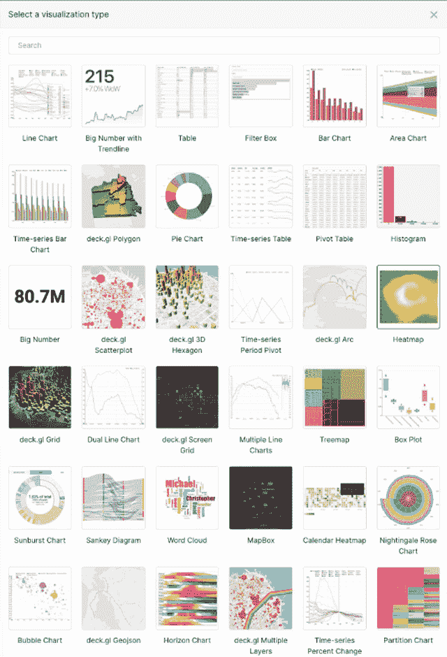
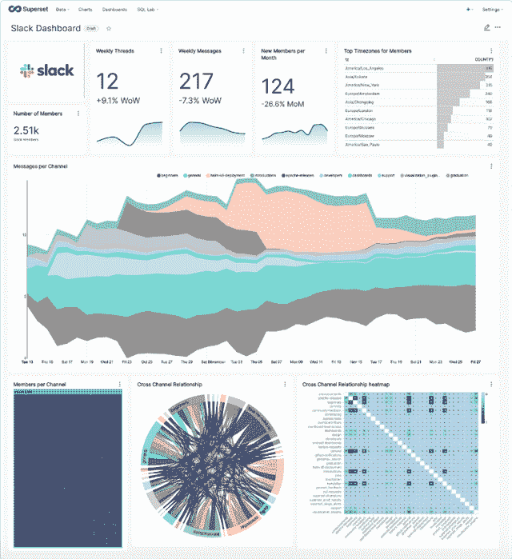
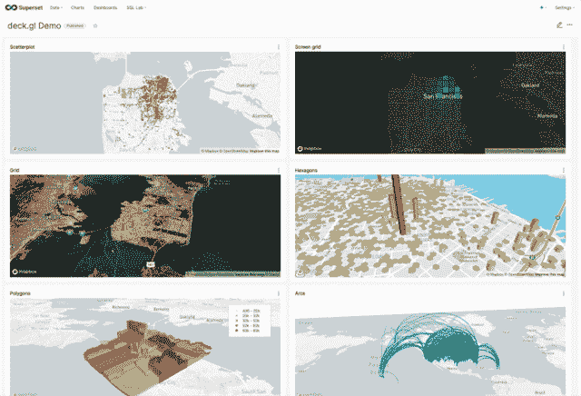

# 以 Apache 超集的方式探索和可视化数据

> 原文：<https://thenewstack.io/explore-and-visualize-data-the-apache-superset-way/>

对于那些在 Apache 软件基金会的新顶级项目[超集](https://superset.apache.org/)工作的人来说，从孵化器中毕业并不是他们脑海中最重要的事情。

“对我们来说，这是一条相当长的路，”该项目的副总裁[马克西姆·博彻明](https://github.com/mistercrunch)说，这是一个商业智能工具，于 2017 年进入阿帕奇孵化器。“毕业并不一定是项目成员的首要任务。目标实际上是推动项目向前发展。我们还希望它保持在 1.0 之前的阶段，我们仍在积极开发软件。”

“我认为我们真的为软件和社区以及社区的治理奠定了非常坚实的基础，”Beauchemin 补充道。

超集使用户能够使用无代码可视化构建器和 SQL 编辑器来探索数据和构建可视化。它与 [Tableau](https://www.tableau.com/) 、 [Looker](https://looker.com/) 、 [Chartio](https://chartio.com/) 等工具竞争。

Superset 诞生于 2016 年在 Airbnb 举行的为期三天的黑客马拉松上，作为为 [Apache Druid](https://druid.apache.org/) 数据库构建前端的挑战。Beauchemin 说，Druid 是一个实时的内存数据库，速度非常快，但他很快意识到超集需要使用 SQL。如今，Superset 支持一系列[数据库](https://superset.apache.org/docs/databases/installing-database-drivers)，包括 MySQL、Presto、Hive、Postgres、Dremio、Snowflake、Teradata 等 Pb 级的数据源。

Beauchemin 当时在 Airbnb 工作，他说他在一个周末扩展了 SQL 支持。

“这打开了各种新的连接器，”他说。“由于超集后端是用 Python 编写的——它本质上是 Python 后端的一个 [Flask](https://palletsprojects.com/p/flask/) 应用程序……Python 中有许多对所有数据库的驱动程序支持。所以我们利用了这一点。”

超集特性包括:

*   用于可视化数据集和制作交互式仪表板的直观界面。
*   用于准备可视化数据的 SQL IDE，包括一个丰富的元数据浏览器。
*   轻量级语义层，支持数据分析师快速定义自定义维度和指标。
*   无缝的内存异步缓存和查询。
*   一个可扩展的安全模型，允许配置非常复杂的规则，规定谁可以访问哪些产品功能和数据集。
*   用于程序定制的 API。
*   专为扩展而设计的云原生架构。
*   通知警报和预设报告

它包括一个可视化选择器，允许用户单击一种类型的可视化，然后只需单击它就可以轻松地切换到不同的可视化。

您可以链接到这个特定可视化背后的数据集。您可以添加不同的列和指标。在查询面板中，您可以定义搜索参数，按照不同的指标或不同的时间粒度分解数据。

“我们感兴趣的是让人们能够轻松快速地到达仪表板。所以我们真的很关心衡量标准，比如人们开发产品和创建他们的第一个仪表板需要多长时间，”Beauchemin 说。“所以我们花了很多时间来思考价值实现的时间，以及如何最大限度地提供通用功能，而不会让人们对 Tableau 等产品中可能存在的所有功能的长尾感到困惑。”

该项目还关注该工具的不同用户。

“我认为，从产品的角度来看，我们理念的一部分是提供全系列产品，以满足数据团队不同层次的需求。因此，如果你是一家企业，如果你是一名高管，也许你只是在看仪表盘。如果您是一名业务分析师，可能会对使用切片和骰子以及无代码数据浏览器感兴趣。如果您是数据科学家或数据分析师，也许您会写一点 SQL，并且您对使用 SQL IDE 感兴趣。所以我们试图迎合整个数据团队，提供一套全面的工具，”他说。

这个项目有很多子项目。对于其[路线图](https://superset.apache.org/docs/roadmap)，Beauchemin 说，“实际上，这个想法是推动不同的垂直行业向前发展。例如，在 SQL IDE 中，我们希望人们能够更容易地从上下文中进行可视化，我们添加了许多关于拖放的功能，以及我们现有的切片资源管理器的可用性。围绕仪表板，只是理顺了许多常见的用户流，使人们更容易创建和更新仪表板。”

Superset 的用户包括美国运通、Dropbox、Lyft、网飞、尼尔森、Twitter 和 Udemy 等。

Beauchemin 说，他认为开源是开发和分发软件的更好方式，他认为这是其相对于竞争对手的主要优势。

尼尔森媒体应用框架小组软件团队负责人 Amit Miran 表示:“在 Superset 之前，我们一直在购买拼凑的专有工具，在定制图表和仪表盘时，我们不断遇到限制。“一旦超集项目支持添加自定义可视化，这就是我们尼尔森开始在大型项目中采用超集的转折点。我们对原生仪表板过滤器和未来对交叉过滤的支持感到非常兴奋，这将使我们的 viz 插件更加强大。”

“Apache Superset 帮助 Airbnb 实现数据洞察的民主化，并做出基于数据的决策，”[Airbnb 产品负责人、Apache Superset 项目管理委员会成员杰夫·冯](https://www.linkedin.com/in/jeffreytfeng/)说。“Superset 独特地将 SQL 分析与每周数千名员工的数据探索联系起来。它还是一个灵活可靠的可视化指标平台，帮助高管和知识工作者查看和理解数据。”

<svg xmlns:xlink="http://www.w3.org/1999/xlink" viewBox="0 0 68 31" version="1.1"><title>Group</title> <desc>Created with Sketch.</desc></svg>