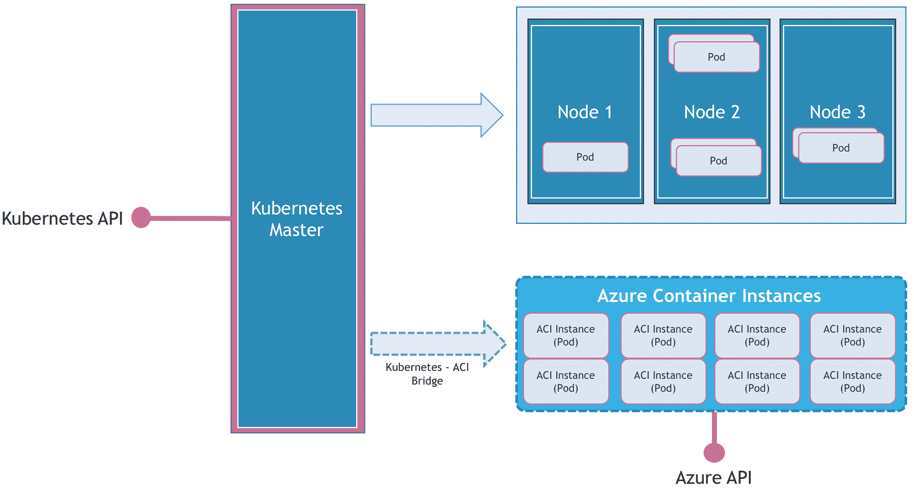
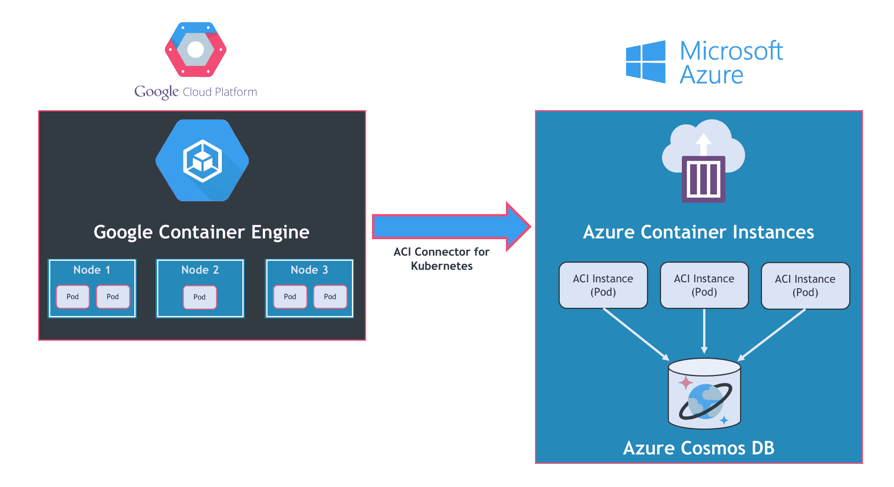
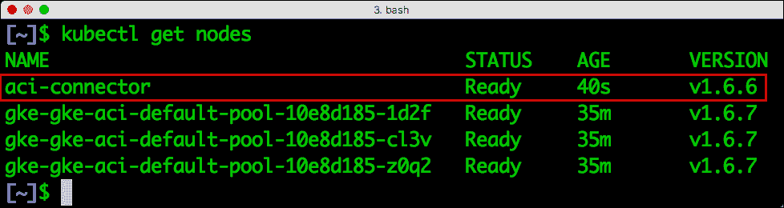
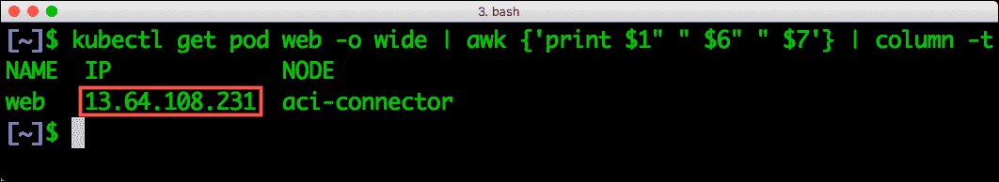

# 利用微软的 ACI Connector for Kubernetes 探索多云部署

> 原文：<https://thenewstack.io/explore-multicloud-deployments-aci-connector-kubernetes/>

在我们研究 Azure Container Instances (ACI)的最后一部分，我们将部署一个跨谷歌云平台(GCP)和微软 Azure 的微服务应用程序。这种多云架构基于 Kubernetes 的 ACI 连接器，它在成熟的编排引擎(Kubernetes)和无服务器容器(ACI)之间架起了一座桥梁。

Azure Container Instances 被设计成一个轻量级[无服务器](/category/serverless/)环境，用于运行单个容器的工作负载。管理一个由多个容器组成的[微服务](/category/microservices/)应用的工作最好由一个编排引擎来处理，如 [Kubernetes](/category/kubernetes/) 、Mesosphere DC/OS 或 Swarm 模式下的 Docker。一个成熟的容器编制器可以处理包括调度、服务发现、伸缩、健康监控、日志记录等任务。它提供微服务的端到端生命周期管理。

ACI 一次处理一个实例的生命周期。它不具备处理微服务所需的高级调度功能和其他功能。通过在 container orchestrator 和 ACI 之间架起一座桥梁，客户可以两全其美。为了证明这一点，微软已经为 Kubernetes 构建了 ACI 连接器作为参考实现。可以为其他容器管理平台构建类似的连接器。



当我遇到这个项目时，我首先想到的是运行在 Google Cloud 中的 Kubernetes 集群与 Azure 容器实例的集成。本教程向您展示了使用 ACI Connector for Kubernetes 的可能性。请注意，这个项目是实验性的，不适合生产环境。

我们将在美国西部地区建立一个跨越谷歌云平台和微软 Azure 的测试平台。在 GCP 方面，我们将有一个三节点 Kubernetes 集群。将在 Azure 中创建保存 ACI 实例的资源组。



我们部署的微服务应用在[之前的文章](https://thenewstack.io/tutorial-building-deploying-microservices-application-azure-container-instances/)中有详细介绍。它是一个基于 Node.js 的 web 应用程序，可以与 Azure Cosmos DB 对话。

在继续下一步之前，请确保您拥有 GCP 和 Microsoft Azure 的有效帐户。你需要在你的机器上下载并配置最新版本的 [kubectl](https://kubernetes.io/docs/tasks/tools/install-kubectl/) 、 [gcloud](https://cloud.google.com/sdk/gcloud/) 和 [az](https://docs.microsoft.com/en-us/cli/azure/install-azure-cli) 命令行工具。

我将整个脚本作为 GitHub Gist[提供给大家。](https://gist.github.com/janakiramm/b9f4dc15cc68e3fb2ce4a7aea3527424)

## 配置 Google 容器引擎

让我们在 GKE 创建一个标准的三节点集群。确保它部署在 us-west1-a 区域:

```
$  gcloud container clusters create gke-aci  --zone us-west1-a

```

有了 Kubernetes 集群，让我们将 kubectl 指向 GKE:

```
$  gcloud container clusters get-credentials gke-aci  --zone us-west1-a

```

使用以下命令验证设置。它应该显示 GKE 的三个节点:

## 正在配置 Microsoft Azure

在 Azure 中，我们将创建一个资源组，保存我们为此项目提供的所有资源。这个资源组将保存容器实例和 Cosmos DB。我们还需要创建一个 Active Directory 服务主体，以便能够对来自 Kubernetes 的 ACI 进行身份验证。

让我们从资源组开始。请注意，它也是在美国西部地区创建的，以减少延迟:

```
$  az group create  --name gke-aci  --location westus

```

我们现在将创建一个带有 MongoDB API 端点的 Azure Cosmos DB 实例，它将作为应用程序的数据库后端。用**list-connection-strings**命令显示的实际值替换连接字符串占位符:

```
$   export DB=tododb$RANDOM

$  az cosmosdb create  --name  $DB  --kind MongoDB   -g  gke-aci

$  az cosmosdb list-connection-strings  -g  gke-aci  --name  $DB

$  export CONNSTR=&lt;Connection_String&gt;

```

最后，让我们创建一个服务主体，使 GKE 能够在 Azure 中创建容器实例。

使用以下命令获取您的 Azure 订阅 ID:

```
$  az account list  -o  table

```

在用上面输出中的订阅 ID 替换占位符后运行命令:

```
$  az ad sp create-for-rbac  --role=Contributor  \

--scopes  /subscriptions/&lt;subscriptionId&gt;/resourceGroups/gke-aci

```

从这个命令的输出中获取 appID、密码和租户。我们需要它来填充 ACI 连接器。

最后，确保为 ARM 注册了容器实例资源。

```
$  az provider register  -n  Microsoft.ContainerInstance

```

## 向 GKE 注册 Kubernetes 的 ACI 连接器

两个云平台都配置好了，现在是我们连接它们的时候了。为此，我们将在 GKE 部署一个特殊的 pod，它将成为指向 ACI 的虚拟节点。

克隆 GitHub repo 并填充 aci-connector.yaml 文件:

```
$  git clone https://github.com/Azure/aci-connector-k8s.git

```

使用从服务主体获得的值编辑 examples/aci-connector.yaml 和输入环境变量:

```
AZURE_CLIENT_ID:  insert appId

AZURE_CLIENT_KEY:  insert password

AZURE_TENANT_ID:  insert tenant

AZURE_SUBSCRIPTION_ID:  insert subscriptionId

ACI_RESOURCE_GROUP:  gke-aci

```

继续使用下面的命令部署吊舱:

```
$  kubectl create  -f  examples/aci-connector.yaml

```

大约一分钟后，使用*ku bectl*get nodes 命令检查 ACI 虚拟节点的可用性。



## 部署微服务应用程序

最后一步是创建部署到 ACI 的 pod。我们将通过创建以下保存为 web.yaml 的文件来实现这一点。YAML 的文件可以在 GitHub 上找到。

```
apiVersion:  v1

kind:  Pod

metadata:

 name:  web

 labels:

   name:  web

   app:  todoapp

```

```
spec:

 containers:

   -  image:  janakiramm/todo

     imagePullPolicy:  Always

     name:  web

     env:

       -  name:  "DB"

         value:  "COSMOS_DB_CONN_STR"

       -  name:  "PORT"

         value:  "80"

```

Docker image，janakiramm/todo 包含简单的 Node.js Todo web 应用程序。

注意 pod 定义中的附加参数 nodeName，它强制 Kubernetes scheduler 在名为 aci-connector 的节点中调度它。由于这个参数，Kubernetes 将把调度过程委托给 ACI，ACI 将接管创建容器实例的工作。

使用以下命令部署 pod:

```
$  kubectl create  -f  web-pod.yml

```

让我们检查一下 pod 的创建。为了简洁，我们将省略输出中的一些列:

```
$  kubectl get pod web  -o  wide  |  awk  {'print $1" " $6" " $7'}  |  column  -t

```

这确认了 pod 是在节点 aci 连接器上创建的。记下 IP 地址。



现在，让我们在 Azure 中验证同样的情况。我们将使用以下命令来描述 ACI 实例:

```
$  az container list  --query  [*].name


```

有趣的是，Azure CLI 也显示了 Kubernetes CLI 报告的相同 IP 地址:

```
$  az container show  --name web  -g  gke-aci  --query ipAddress.ip


```

让我们继续在浏览器中访问应用程序。

您可以通过创建复制控制器和负载平衡器来轻松扩展这种部署。尝试从复制控制器定义中删除 NodeName 污点，并观察 Kubernetes 如何在包括 ACI 在内的所有节点上分布 pods。

特征图像由[斯蒂夫·约翰森](https://www.flickr.com/photos/artbystevejohnson/4647538238/in/photolist-a7Cuks-a7Cw75-KGegz-85FRcC-KGegv-KGegr-8Mddeg-9pfRKY-g9MbQ4-WirGgu-a7CwXL-a7Crpj-a7Cyru-a7zCmg-a7zAt4-a7Cziq-a7zF1i-7dYsr-6YDjQD-UfgrBf-9J9GeW-8Mggwf-85FRa5-8Cv7Yr-6mpVs7-XpSY1W-XCeXgp-DCtiHK-D9CUhj-TDtTiZ-85CG8H-oHw4m2-85FR9J-aiGr6m-86UzZT-e9yyNo-cErTL-afT1fJ-9wD9zV-85FR8h-85FR9s-pft2KU-X9MH6q-79y2W4-85FRaq-85CG6V-9rBDiv-cErMV-b8RY2F-4msYrv8ea89c82-4647538238_acbf629884_z.jpg)制作，由 2.0 在 [CC 下授权。](https://creativecommons.org/licenses/by/2.0/)

<svg xmlns:xlink="http://www.w3.org/1999/xlink" viewBox="0 0 68 31" version="1.1"><title>Group</title> <desc>Created with Sketch.</desc></svg>