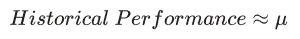
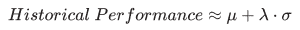
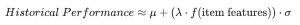
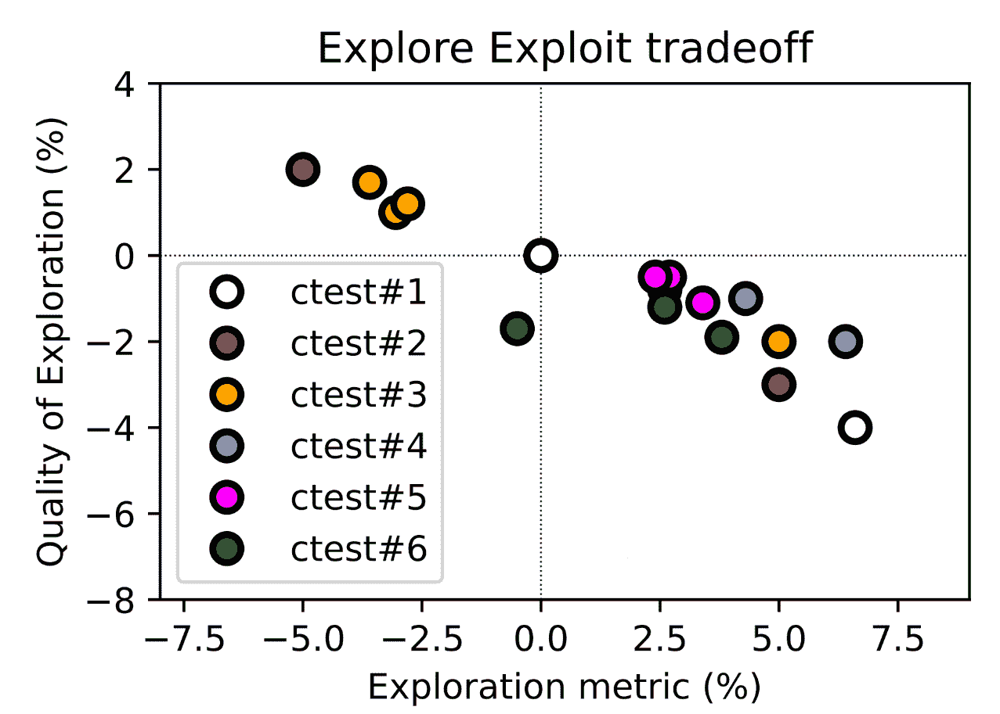

# 探索还是剥削？Trivago 的 ML 用于新的推荐

> 原文：<https://thenewstack.io/explore-or-exploit-trivagos-ml-for-new-recommendations/>

一个永无止境的问题:你是继续“利用”已经奏效的东西，还是“探索”广阔的未知领域以寻找更好的东西？在数据科学中，这个问题被称为多臂强盗。多臂强盗是吃角子老虎机(即“独臂强盗”)，挑战在于通过一系列选择找出如何选择最有利可图的结果。

在线旅游网站 Trivago 建立了一个机器学习算法，以解决其住宿排名模型中的探索-利用困境。Trivago 数据科学家 [Aida Orujova](https://www.linkedin.com/in/aidaorujova/) 写了一篇[的博客文章](https://tech.trivago.com/post/2022-11-04-explore-exploit-dilemma-in-ranking-model/)解释了原因。

Trivago 已经在大量的住宿设施中列出了表现最好的住宿设施。但它希望创建一种机器学习算法，引入新的库存，这些库存有可能受到用户的欢迎，同时继续显示与用户匹配的住宿。

经过六个月的测试，Trivago 在产品中添加了一种算法，在看不见的住宿上偏向于受欢迎的用户功能，然后可以添加到搜索排名中。

在 Trivago 的例子中，“强盗”是搜索算法，而“七”和“樱桃”是住宿排名。继续展示历史上表现最好的住宿设施是一种开发，而不是探索未知的新的或以前未见过的住宿设施，希望找到新的最佳表现者。

## **为什么要探索而不仅仅是坚持有效的方法呢？**

通过这种方法，用户可以受益于从长远来看总体上更好的库存。广告客户的出价将通过向他们发送来自更广泛的库存的用户数据来优化。

探索数以百万计的住宿的最佳方式是什么，以便找到最好的，并将其带到排名的前面？在构建算法时，有三件事情需要考虑。

*   探索的程度:增加以前没有曝光的住宿的点击份额
*   成本:顶线用户和收入指标
*   质量:以前没有印象的库存的历史表现

数据科学工程师在六个月的时间里并行运行了多次迭代 A/B 测试，并使用输出和分析结果来推荐下一个测试设置。模型和工程的复杂性，交叉测试的相互作用，以及其他因素进行了审查。下面的细节将集中在一种测试方法上。

## **基线**

排名模型中的一个特征是使用一组天内库存表现的历史信息来计算的。特征值分布遵循贝塔二项式模型。Trivago 目前正在导出这个分布的均值作为后验，也就是条件概率分布。此默认值设置探索级别。

这种方案的一个潜在问题是它过于贪婪，纯粹利用模型中表现良好的住宿条件。

## **第一步天真的方法**

“我们知道的越少，住宿的潜力就越大”是这一理论的基础。住宿的数据越多，偏离数据的程度就越小。

该算法是均值加上后验标准差的一部分。此步骤有利于低印象的项目，因为它们具有较大的标准偏差。添加了一个 lambda (λ)参数来控制探索的强度。

该算法称之为“[天真](https://blogs.cornell.edu/info2040/2019/11/24/heres-some-naive-ml-for-you-guys/)”，因为它取决于住宿在过去获得的点击和印象数量。

## **第 2 步…第 N 步**

随机循环通过所有未知的住宿点(天真的方法)不一定是最好的方法，因为 Trivago 有大量关于用户住宿偏好的数据，所以有一些看不见的住宿点会比其他住宿点更有优势。这就是第 N 步背后的思想，一种“基于模型的方法”

Trivago 工程师使用具有项目特征的高印象库存的历史表现来训练模型，然后使用低印象库存的项目特征来使用预测来获得 f(项目特征)。具有高模型分数但低/没有历史印象的项目将从该方案中受益最多。

探索性数据分析(EDA)、特征工程、数据预处理(清除和争论丢失的特征值)、模型输出的标准化/规范化等是在行动过程中使用的一些数据挖掘技术。

## **结果**

上图说明了实验中探索的范围和质量之间的权衡。

*   相同颜色的测试变量说明相同测试的不同水平。
*   点的理想位置是右上象限。
*   如果连接到 Pareto 前沿，线上的测试变量代表最佳可能的折衷，而线下的测试提供次优的折衷。

## 一些其他的教训

**在没有短期收入成本的情况下，通过展示更高份额的优质未开发库存，增加了用户价值。**Explore-Exploit 困境的代价是以用户和合作伙伴的成本来影响未开发的库存，但 Trivago 在追求优化所有价值的过程中实现了“中庸之道”。

**Lambda 是控制勘探程度的一个很好的参数。**控制探索水平很重要，lambda 参数允许 Trivago 测量探索水平和背线指标之间的 Pareto 前沿。

可调参数有助于设置用于测试新 A/B 实验的伪控制变量。

**模特并不总是做你期望她们做的事情。**向黑盒模型中注入一组功能，我们只能期待这么多。理解模型的输出如何转化为度量标准是非常重要的，尽管这并不能保证比天真的探索有更好的结果。

**由于探索机制，合作伙伴点击份额没有显著变化。**探索低印象库存不会将点击转移到某个特定的合作伙伴。

## **现状和下一步措施**

探索机制已经在 Trivago 的住宿排名模型中投入运行。记录了从 A/B 实验中获得的经验，并改进了火花线性和辅助工具的代码库。

为了随时掌握模型中探索级别的趋势，创建了监控仪表板。有些图表包括对以下内容的监控:

*   **模型中使用的特征值分布是什么样子。**
***   **勘探期间成本指标的变化。*****   **探索过程中质量指标的变化。******

 ******当公司决定更详细地解决勘探问题时，这些信息只是一个起点。

<svg xmlns:xlink="http://www.w3.org/1999/xlink" viewBox="0 0 68 31" version="1.1"><title>Group</title> <desc>Created with Sketch.</desc></svg>******