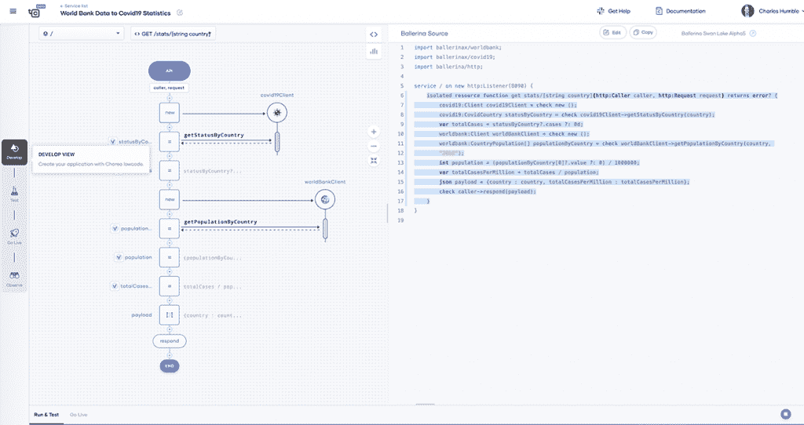
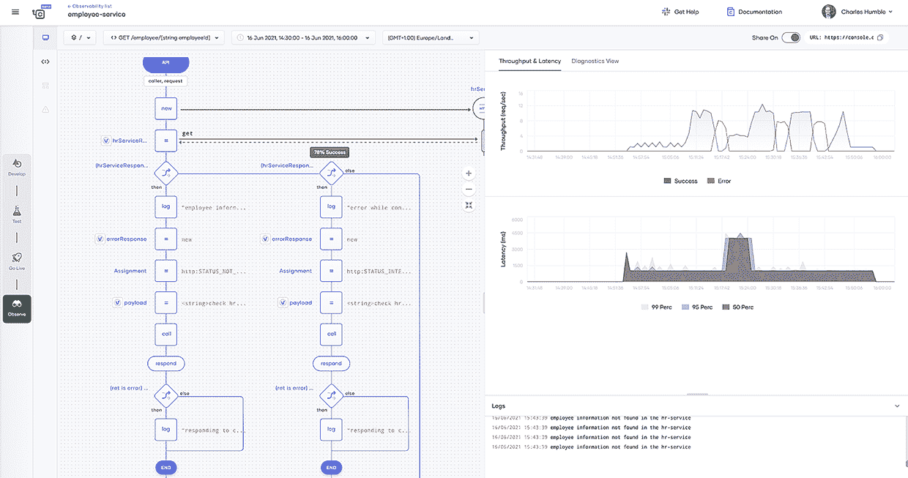

# Choreo，WSO2 的新款 iPaaS 基于芭蕾舞演员打造

> 原文：<https://thenewstack.io/exploring-choreo-wso2s-new-ipaas-built-on-top-of-ballerina/>

在云计算出现之前，企业集成项目要么是内部的，通过内部中间件平台提供服务，要么是外部的企业对企业(B2B)项目，通常通过电子数据交换网关提供服务。然而，越来越多的企业需要集成来自更广泛来源的数据，包括物联网设备和移动应用，这导致开发人员需要使用的 API 激增。

此外，现代云架构和 Kubernetes，尤其是与 Heroku 等早期 PaaS 模型相比，面临着日益增长的复杂性，这促使许多公司开发自己的内部开发平台。

与此同时，[缺乏](https://thenewstack.io/how-to-make-tech-interviews-suck-less/)[熟练程序员](https://thenewstack.io/how-to-close-the-devops-skills-gap/)意味着企业正在努力招募专业程序员来支持更加雄心勃勃的项目。这种情况阻碍了 IT 领导者以快速可靠的方式交付业务自动化的能力。

iPaaS 提供的功能有助于集成云和内部端点的任意组合，包括 API 和物联网设备。该领域的主要供应商包括 [Boomi](https://boomi.com/) 、 [Informatica](https://www.informatica.com/gb/) 、 [Jitterbit](https://www.jitterbit.com) 、[微软](https://www.microsoft.com/)([Azure Integration Services](https://azure.microsoft.com/en-gb/resources/videos/azure-friday-an-overview-of-azure-integration-services/))、 [MuleSoft](https://www.mulesoft.com) 、 [SnapLogic](https://www.snaplogic.com) 和 [Workato。](https://www.workato.com)

6 月，一个新的集成平台进入该领域，其功能旨在帮助弥合低代码和有经验的开发人员之间的差距: [WSO2](https://wso2.com) 已经[宣布](https://thenewstack.io/wso2s-choreo-offers-low-code-for-kubernetes/) [Choreo，](https://wso2.com/choreo?utm_source=TNS&utm_medium=paid&utm_campaign=TNS_paid_choreo_210715)目前处于公开测试阶段，这是一个面向 Kubernetes 的低代码 iPaaS，基于该公司的开源编程语言 [Ballerina](https://ballerina.io) 。

## 低位代码和高位代码之间的往返

越来越多的低代码应用程序平台(LCAPs)试图为没有强大编程技能的商业用户提供工具来帮助创建应用程序。这个想法是为了帮助公司更快地创新，让熟练的开发人员有时间做只有他们能做的事情。最近的一份 Gartner 报告称，到 2023 年，“超过 50%的大中型企业将采用 LCAP 作为其战略应用平台之一。”

低代码平台的一个长期存在的问题是，虽然他们可以允许非程序员构建应用程序，但他们往往是一个特别惊人的例子，即[栈溢出](https://stackoverflow.com/)创始人[乔尔·斯波尔斯基](https://www.linkedin.com/in/joelspolsky/)所称的“[泄漏抽象](https://www.joelonsoftware.com/2002/11/11/the-law-of-leaky-abstractions/)”，这意味着实现细节往往会泄漏。

这样做的结果是，在某些时候，专业开发人员必须修补工具生成的代码才能修复它。熟练的开发人员有他们自己的工具，不一定想要学习新的工具来帮助修复商业用户编写的东西。因此，可视化低代码环境必须能够反映和处理对底层应用程序代码所做的更改。如果不能，低代码环境中的后续更改将撤销对底层源代码所做的更改，或者可能将错误引入服务。

“这个低代码软件时代与之前的尝试(4GL、拉德等)之间的区别。)是业务用户和软件开发人员可以共同为解决方案做出贡献，”[托管功能](https://www.managedfunctions.com)的首席执行官 Doug Hudgeon 和一位低代码专家在给新堆栈的消息中写道。

为了支持这种协作，能够在可视化开发环境和底层源代码之间轻松往返是 Choreo 设计的核心。为了实现它，Choreo 使用了 Ballerina，它的语言是为编写网络分布式应用程序而设计的。

“我是芭蕾舞迷，”Hudgeon 告诉新堆栈。“它处于最佳状态，既可供业务用户使用，又适合标准的企业软件部署工作流。”

当然，芭蕾舞演员仍然是一种年轻的语言，随着 2019 年 9 月 [1.0 版本](https://blog.ballerina.io/posts/annoucing-1.0.0/)的到来。自 1.0 版本发布以来，又有一个主要版本——芭蕾舞演员[天鹅湖](https://ballerina.io/downloads/swan-lake-release-notes/swan-lake-beta1/#overview-of-ballerina-swan-lake-beta1)——目前处于测试阶段。这是 Choreo 在引擎盖下使用的版本。

毫不奇怪，鉴于其年轻的芭蕾舞演员采用仍然相当有限。“我们的 Slack 频道有 1200 名用户，超过 500 个 GitHub repos 实际上在代码中使用了芭蕾舞演员，”WSO2 的活动专家 Samudra Weerasinghe 说。

Choreo 的低代码编辑器中的图形表示使用序列图和流程图的语义来表示程序代码。为了实现往返工作，它使用了实际芭蕾舞演员语法树的图形表示，这意味着在可视化和平台上运行的代码之间没有转换。这使得熟悉 Ballerina 的开发人员可以对代码进行修改，而不会给不了解编程模型的低级代码编辑人员带来问题。

渲染是通过[语言服务器协议](https://microsoft.github.io/language-server-protocol/)处理的，这是一个开放的、基于 JSON-RPC 的协议，最初由微软开发，用于标准化语言工具并为其提供所需的额外元数据。在 Choreo 中，低代码编辑器和基于文本的“pro-code”编辑器使用 LSP 与芭蕾舞演员语言服务器持续通信，基于两端发生的编辑来呈现图表或生成代码。

WSO2 高级副总裁兼首席架构师 Srinath Perera 表示:“这种渲染之所以成为可能，是因为这种语言中的每个芭蕾舞演员都有一种视觉表现形式。

此外，添加到 Choreo 的扩展将自动得到低代码编辑器的支持。例如，使用 Ballerina 开发并使用 [OpenAPIs](https://www.openapis.org) 公开的连接器无需对编辑器进行任何用户界面更改即可呈现。

## 部署

Choreo 平台将生成的源文件存储在与用户帐户相关联的私有 Git repo 中。用户可以克隆 repo，使用 [Microsoft VS Code](https://code.visualstudio.com) 编辑 Ballerina 代码，提交他们的更改，并合并到同一个 repo。Choreo 将获取更新的代码，在图形和文本编辑器中显示它，并将其用于构建管道。

无论使用低代码、全代码还是两者的组合，Choreo 都向 Kubernetes 提供了一键部署方法。

目前，完整的 DevOps 体验尚未公开，但“我们运行完整的 CI/CD 管道，我们的目标是通过管道提供完整的 DevOps 体验，”Perera 说。

## 监视

默认情况下，Choreo 收集遥测数据，开发人员无需添加任何工具，包括应用程序和容器级别的日志，以及来自 Kubernetes pods 和运行应用程序的机器的 CPU、内存和其他指标。芭蕾舞语言还具有内置的跟踪和遥测收集功能，可以在声明级别提供活动和性能数据。

生成的数据通过 [OpenTelemetry](https://thenewstack.io/getting-started-with-opentelemetry-for-java/) spec 兼容的基于 GRPC 的协议推送到消息队列，然后保存到 NoSQL 数据库。

observability 视图显示了 Choreo 应用程序的低代码图，并带有关于系统中不同路径的成功率和不同语句所用时间的注释。另一个面板显示了吞吐量、延迟数据和日志的详细信息。

与任何分布式系统一样，对监控的支持尤其重要。正如一位要求匿名的 API 分析师所写的，“这些 LCAP 工具的危险在于失去可见性(它们通常不适合现有的 monitor/perf 生态系统)。LCAPs 有可能成为新的‘影子 IT’，这是一个很大的危险。”

虽然在幕后使用 OpenTelemetry 理论上应该可以将数据发送到支持新兴标准的企业标准监控工具，如 [Dynatrace](https://www.dynatrace.com/?utm_content=logo-sponsorpage&utm_source=thenewstack&utm_medium=website&utm_campaign=platform) 、[蜂巢](https://www.honeycomb.io/?utm_content=logo-sponsorpage&utm_source=thenewstack&utm_medium=website&utm_campaign=platform)、 [Lightstep](https://lightstep.com/?utm_content=logo-sponsorpage&utm_source=thenewstack&utm_medium=website&utm_campaign=platform) 、微软(Azure Monitor)、 [New Relic](https://newrelic.com/?utm_content=logo-sponsorpage&utm_source=thenewstack&utm_medium=website&utm_campaign=platform) 和 [Splunk](https://www.splunk.com/) ，但这种做法的用途尚不清楚。佩雷拉说，“你会有一些有趣的数据，但不是很多细节。”

Choreo 目前在 Azure 上处于测试阶段，预计今年晚些时候将全面推出并支持其他云平台。

<svg xmlns:xlink="http://www.w3.org/1999/xlink" viewBox="0 0 68 31" version="1.1"><title>Group</title> <desc>Created with Sketch.</desc></svg>