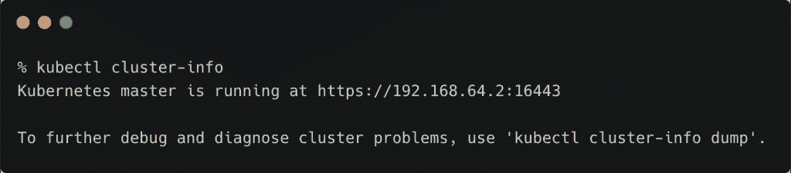
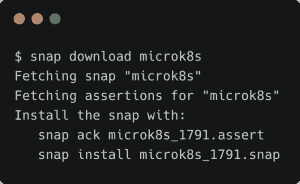
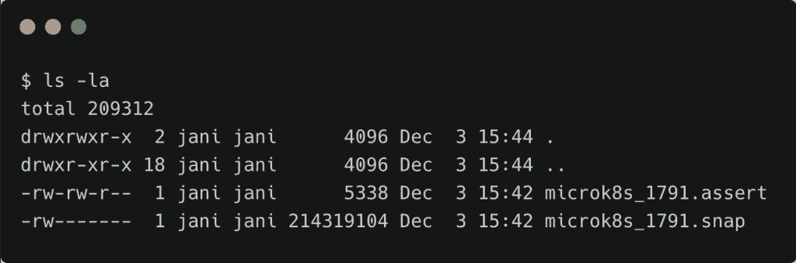

# 探索来自 Canonical 的轻量级 Kubernetes 发行版 Microk8s

> 原文：<https://thenewstack.io/exploring-microk8s-the-lightweight-kubernetes-distribution-from-canonical/>

Microk8s 是来自 Canonical 的小型、轻量级、完全符合 Kubernetes 的发行版。这是一个极简的分布，侧重于简单性和性能。鉴于其占地面积，Microk8s 可以轻松部署在物联网和边缘设备中。

Canonical 已经将 [Microk8s](https://microk8s.io/) 打包成 snap，该公司用于 Linux 的包管理器。snap 是一个应用程序及其依赖项的捆绑包，无需修改即可跨许多不同的 Linux 发行版工作。快照是独立、自包含的应用程序，运行在沙盒中，通过中介访问主机系统。快照已经作为标准的替代物出现。基于 Debian 的发行版中通常使用的 deb 包。打包成 snap 的应用程序可以轻松安装和卸载。

除了最新版本的 Ubuntu，snaps 可以部署在各种平台上，包括 Linux Mint、Raspberry Pi OS 和 Arch Linux。

由于 Microk8s 基于 snap，因此可以通过一个命令轻松部署。例如，在 Ubuntu 18.04 上，`sudo snap install microk8s --classic`安装一个全功能的单节点 Kubernetes 集群。安装过程与任何运行`snapd`的平台相同，它是 snap 软件包管理器的守护程序:



也可以通过下载并安装 snap，在有空隙的离线环境中安装 Microk8s。自包含快照文件的大小约为 200MB:





## 在 macOS 上运行 Microk8s

Microk8s 可以通过 Multipass(Canonical 的虚拟机管理器)安装在 macOS 和 Microsoft Windows 上。Multipass 利用底层管理程序，如 Windows 中的 Hyper-V 和 macOS 中的 hyperkit。

Microk8s CLI 抽象了创建虚拟机和安装快照所涉及的命令。安装了 Homebrew 后，下面的命令在 macOS 上启动单节点 micro k8s:

```
brew install ubuntu/microk8s/microk8s

```

如果您想了解相关的工作流程，请尝试使用下面的命令安装 Multipass 和 micro k8:

```
brew cask install multipass

```

```
multipass launch  --name microk8s  --mem  4G  --disk  40G

```

等待虚拟机创建完成，然后 SSH 进入:

继续安装 Microk8s:

```
sudo snap install microk8s  --classic
sudo iptables  -P  FORWARD ACCEPT

```

配置虚拟机并生成`kubeconfig`文件:

```
sudo usermod  -a  -G  microk8s ubuntu

```

```
sudo chown  -f  -R  ubuntu  ~/.kube

```

```
su  -  $USER
sudo iptables  -P  FORWARD ACCEPT

```

```
microk8s config  &gt;  ./kube/config

```

要从主机访问单节点集群，让我们复制`kubeconfig`文件:

```
multipass transfer microk8s:/home/ubuntu/.kube/config  ~/.kube/microk8s-config

```

```
export KUBECONFIG=~/.kube/microk8s-config

```

你现在可以用`kubectl`从 macOS 上访问 Microk8s 了。

[](https://cdn.thenewstack.io/media/2020/12/2268272a-mk-2.png)

## 用插件扩展 Microk8s 的功能

为了保持较小的部署规模，Microk8s 附带了与控制面板相关的最基本的组件。这意味着默认安装没有存储和网络插件、DNS、Kubernetes dashboard 和其他预期的组件。

Canonical 已经添加了许多组件作为 Microk8s 的可选附件。它们可以通过`microk8s enable/disable`命令启用和禁用。

例如，只需一个命令就可以添加 Kubernetes 仪表板。如果您在多通道 VM 中运行 Microk8s，从 shell 中运行下面的命令:

```
microk8s enable dashboard

```

获取与服务帐户关联的默认令牌以访问仪表板:

```
token=$(kubectl  -n  kube-system get secret  |  grep default-token  |  cut  -d  " "  -f1)
kubectl  -n  kube-system describe secret  $token

```

从主机使用以下命令访问仪表板:

```
kubectl port-forward  -n  kube-system service/kubernetes-dashboard  9443:443

```

## 配置和部署高可用性 Microk8s 集群

最近，Canonical 为 Microk8s 添加了高可用性，使其可以投入生产。当部署了至少三个节点时，Microk8s 会自动扩展控制平面，以便在多个节点上运行 API 服务。

在典型的高可用性(HA)部署场景中，etcd 被用作维护集群状态的键/值数据库。Microk8s 使用分布式版本 Dqlite 和高可用性版本 SQLite。

HA MicroK8s 所需要的只是集群中的三个或更多节点，此时 Dqlite 将自动高度可用。如果群集有三个以上的节点，则额外的节点将成为数据存储区的备用候选节点，并且在数据存储区失去其中一个节点时会自动升级。备用节点自动提升到 Dqlite 的投票集群中，这使得 MicroK8s HA 自治，并确保即使不采取管理操作也能维持仲裁。

在本教程的下一部分，我将向您介绍在裸机环境中部署高可用性 Microk8s 集群的步骤。我们将探讨运行有状态工作负载的存储和网络配置。

我还打算对市场上的轻量级 Kubernetes 发行版——micro k8s、K3s 和 K0s——做一个详细的比较。敬请期待！

贾纳奇拉姆·MSV 的网络研讨会系列“机器智能和现代基础设施(MI2)”提供了涵盖前沿技术的信息丰富、见解深刻的会议。在 [http://mi2.live](http://mi2.live) 注册即将到来的 MI2 网络研讨会。

<svg xmlns:xlink="http://www.w3.org/1999/xlink" viewBox="0 0 68 31" version="1.1"><title>Group</title> <desc>Created with Sketch.</desc></svg>