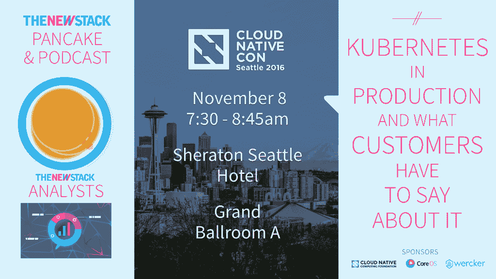

# 普罗米修斯和关于“推”与“拉”监控的争论

> 原文：<https://thenewstack.io/exploring-prometheus-use-cases-brian-brazil/>

Prometheus 拥有强大的扩展能力，这使得它非常适合于关注高容量分布式应用程序，尽管围绕这个开源监控工具仍然存在许多误解。

“当人们第一次看到普罗米修斯时，有一些常见的反应。人们会想，‘为什么它不是一个日志处理系统？’另一个常见的问题是，“这不是推，怎么可能行得通呢？”普罗米修斯的创造者和基础设施工程师[布莱恩·巴西](https://ie.linkedin.com/in/brianbrazil)在今天的[新烟囱制造商](https://thenewstack.io/podcasts/makers/)播客中说道。

[探索普罗米修斯用例与布莱恩巴西](https://thenewstack.simplecast.com/episodes/exploring-prometheus-use-cases-with-brian-brazil)

“监控系统通常分为两类，”Boxever tech 网站上的一页解释道。“一种是服务*将*指标推送到监控系统，另一种是监控系统*从服务中提取*指标。这可能是一个令人惊讶的有争议的问题。”(强调我们的)

普罗米修斯，现在是云本地计算基金会的一个项目，主要属于“拉”的类别，显然，在一些系统架构师中，这是一个不受欢迎的选择。巴西和他的同事朱利叶斯·沃尔茨都写了很多关于这个话题的文章，沃尔茨揭穿了围绕这场辩论流传的一些常见的神话。

“这是‘拉不可伸缩’，‘推不可伸缩’，或者‘它们都有安全问题’，这取决于具体情况，”布雷泽指出。“从工程的角度来看，事实上，推和拉的问题并不重要。无论哪种情况，都有优点和缺点，通过工程努力，您可以解决这两种情况。我认为，拉力要稍微好一点。”

接下来是组建普罗米修斯特工队的任务，在巴西看来，这项工作值得努力。他指出，编写代理需要关注细节，这最终将使管理员和随叫随到的操作团队成员在一个系统中使用多个代理时，整个监控过程更加顺畅。

“您为其编写代理的系统可能是该系统中需要监控的 40-50 个对象之一，而收到页面或警报的人可能只是模糊地注意到您的系统的存在。问问你自己，“我应该如何命名指标，以便他们可以更好地了解他们需要什么，”你会在任何地方遇到有时间或延迟的指标，他们没有提到单位。这有点烦人，尤其是在紧急情况下。”

许多希望将 Prometheus 作为其监控解决方案的一部分来实施的团队都在考虑可扩展性和易用性。在一些用例中，巴西指出，工程师们努力正确标记他们的指标，这给操作和系统管理员带来了进一步的问题。这是 Prometheus 的扩展能力，同时允许开发人员定义和标记他们的警报阈值，使大规模数据处理更加简单。

“这方面一个有趣的问题是，当你开始时，每个人都有相同的警报阈值。你如何定制它？另一种方法是，你可以让其他一些服务器 Prometheus scrapes 暴露所有阈值，然后你可以将它们结合在一起，这有助于操作，”巴西说。

你可以在 2016 年 11 月 8 日至 9 日在西雅图举行的今年 KubeCon/CloudNativeCon 期间举行的[普罗米修斯日](https://www.cncf.io/blog/2016/11/17/cloudnativeconkubecon-2016-wrap/)了解更多关于这项技术的信息。

【T2

<svg xmlns:xlink="http://www.w3.org/1999/xlink" viewBox="0 0 68 31" version="1.1"><title>Group</title> <desc>Created with Sketch.</desc></svg>