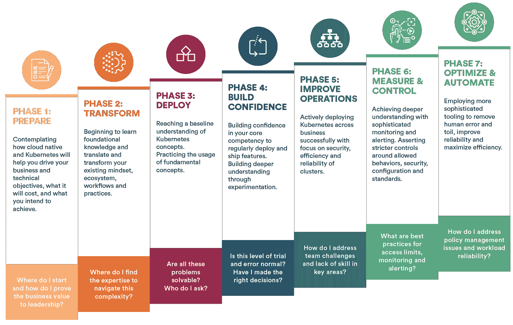

# 探索新的 Kubernetes 成熟度模型

> 原文：<https://thenewstack.io/exploring-the-new-kubernetes-maturity-model/>

 [丹妮尔·库克

丹妮尔是 Fairwinds 公司的营销副总裁。](https://www.linkedin.com/in/danielle-cook-93047810/) 

无论您是刚刚开始探索 Kubernetes，还是已经有了在 Kubernetes 中部署的经验，您现在都知道这是一个复杂的过程，需要新的技能和调整您对部署应用程序的思考方式。

最初由 [Google](https://cloud.google.com/learn/what-is-kubernetes) 设计，现在由[云本地计算基金会(CNCF)](https://www.cncf.io/) 维护，Kubernetes(通常也称为 K8s)使用一系列容器工具，并在集群中运行容器。无论你使用哪种工具，学习和采用 Kubernetes 和相关的生态系统都需要时间。所以拥有一套最佳实践是很有帮助的，比如 Kubernetes 成熟度模型。

Kubernetes 成熟度模型回顾了整个端到端的旅程，确定了您所经历的七个阶段中的每一个阶段，以及从入门到学习如何执行策略、提高可靠性和最大化效率，您需要在每个阶段学习的技能和活动。根据测试和管理数百个 K8s 生产实例的经验(侧重于安全、可靠和可扩展的环境)，Fairwinds 的一组站点可靠性工程师(SREs)构建了这一模型来帮助 Kubernetes 用户。目标是帮助您自我识别您所处的阶段，了解您环境中的差距，并深入了解如何增强和改进您的 Kubernetes 堆栈。

## Kubernetes 不是一条单行道

重要的是要记住，仅仅因为你完成了模型的一个或多个阶段，并不意味着你永远不会再次访问它们。此外，请记住，Kubernetes 的成熟是一个过程。这不是一天或一周的事。由于 Kubernetes 生态系统不断成熟，您将继续学习并与他人分享您的经验，无论这是与第一阶段还是第七阶段相关。使用 Kubernetes 成熟度模型来帮助你了解你现在需要将注意力集中在哪里，何时寻求帮助，以及你的下一步是什么。这是您的云原生之旅，虽然它可能会有一些动荡，但您会发现您独特的道路将有利于您和您的团队。

下面是 Kubernetes 成熟度模型每个阶段的简要总结。

## Kubernetes 成熟度模型阶段 1:准备

在此阶段，您将考虑 cloud native 和 Kubernetes 如何帮助您实现业务和技术目标，实现这一转变的成本，以及您打算在您的组织中实现的目标。

## Kubernetes 成熟度模型第 2 阶段:转型

您可以从设置 Kubernetes 基础设施和学习如何将工作负载转移到平台开始。现在是您熟悉 Kubernetes 术语并熟悉将现有技术映射到云原生环境的时候了。

## Kubernetes 成熟度模型阶段 3:部署

在对 Kubernetes 概念有了基本了解的基础上，您将通过练习开发、部署、管理和故障排除技能来实践基本概念。您还将通过 CI/CD(持续集成/持续部署)实现构建和部署流程，使开发人员能够自助服务，并引入有限的监控和可观察性。

## Kubernetes 成熟度模型第 4 阶段:建立信心

您正处于这个成熟度模型的中间，正在对您的核心能力建立信心，以便成功地定期部署和发布特性。您对 Kubernetes 的深入了解使您能够在整个组织中进行定制、试验和部署，并开始使用监控工具来帮助您了解服务挑战。

## Kubernetes 成熟度模型阶段 5:改善运营

现在，您正积极地在整个企业中成功部署 Kubernetes。通过花时间使用 Kubernetes 集群配置，您正在努力提高安全性、效率和可靠性。您面临的挑战可能更加复杂，需要 Kubernetes 公司外部的专业知识。

## Kubernetes 成熟度模型阶段 6:测量和控制

您正在使用复杂的监控和警报来更深入地了解您的工作负载。你对允许的行为、安全性、配置和标准提出了更强烈的意见和更严格的控制。您还将探索网络策略、工作负载身份和服务网格，以锁定工作负载能力。

## Kubernetes 成熟度模型第 7 阶段:优化和自动化

在这个最后阶段，您将使用复杂的工具来帮助您消除人为错误和工作，同时提高可靠性和最大化效率。您正在通过容器和 Kubernetes 的策略驱动的配置验证来实施合规性。

## 云原生之旅

重要的是要记住，成熟度模型并不能确保您组织的改进或改变——它是您的组织衡量其在采用 Kubernetes 过程中所处位置的一种方式。请记住，采用云原生技术的组织正在经历一个转型过程，这需要时间，并且需要您的团队进行大量学习。随着 Kubernetes 的不断发展，享受学习新的最佳实践和技术的乐趣。

<svg xmlns:xlink="http://www.w3.org/1999/xlink" viewBox="0 0 68 31" version="1.1"><title>Group</title> <desc>Created with Sketch.</desc></svg>