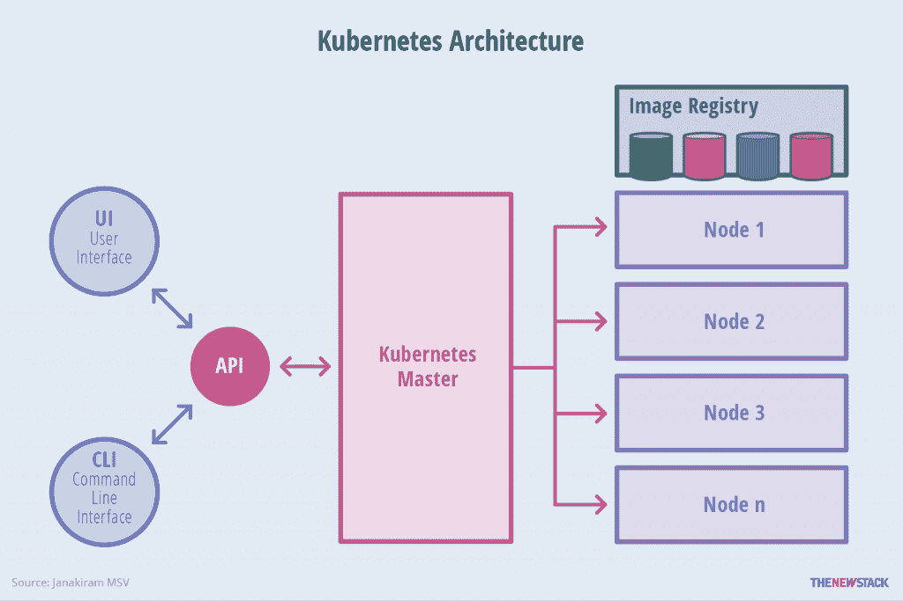

# 用自定义资源扩展 Kubernetes 1.7

> 原文：<https://thenewstack.io/extend-kubernetes-1-7-custom-resources/>

[](http://iguaz.io/blog/)

 [亚龙 Haviv

作为 Iguazio 的 CTO 和创始人，亚龙是一位连续创业者，在大数据、云、存储和网络等领域拥有深厚的技术经验。在加入 Iguazio 之前，Haviv 是 Mellanox 的数据中心解决方案副总裁，负责技术创新、软件开发和解决方案集成。Haviv 是领先的数据库和存储供应商、企业组织、云和 Web 2.0 客户的开源计划和新解决方案的主要驱动力。在 Mellanox 之前，Haviv 是 Voltaire 的首席技术官兼研发副总裁，Voltaire 是一家高性能、计算、IO 和网络公司。Haviv 经常在大数据和云技术活动上发言。他在推特上写道@ yaronhaviv。](http://iguaz.io/blog/) [](http://iguaz.io/blog/)

让我们假设您想要构建一个集群应用程序或软件即服务产品。在开始编写一行应用程序代码之前，您必须解决大量的架构问题，包括安全性、多租户、API 网关、CLI、配置管理和日志记录。

如果您可以利用 Kubernetes 的所有基础设施，节省几年的开发时间，并专注于实现您独特的服务，会怎么样？

最新的 [Kubernetes 1.7](https://thenewstack.io/google-container-engine-now-speaks-kubernetes-1-7/) 增加了一个名为[customresourcediefinitions(CRD)](https://kubernetes.io/docs/tasks/access-kubernetes-api/extend-api-custom-resource-definitions/)的重要特性，它支持插入您自己的托管对象和应用程序，就像它是一个原生的 Kubernetes 组件一样。这样，您可以利用 Kubernetes CLI、API 服务、安全性和集群管理框架，而无需修改 Kubernetes 或了解其内部。我们在这里的 [Iguazio](http://www.iguazio.com/) 使用它来无缝集成 Kubernetes 与我们新的实时“无服务器”项目和数据平台对象。

我喜欢 Kubernetes 的部分原因是它的可扩展性。现在，您可以构建自己的定制应用程序资源，并使用 Kubernetes RBAC 和认证机制来提供安全性、访问控制、认证和多租户。这些定制资源将存储在集成的 [etcd](https://github.com/coreos/etcd) 存储库中，具有复制和适当的生命周期管理。他们还将利用 Kubernetes 标配的所有内置集群管理特性。

## 了解 Kubernetes 管理模式



Gabriel HD 的新堆栈图。

Kubernetes 拥有 API 服务，接受来自 CLI 或 API 客户端的调用。这些调用被认证、授权和验证。资源存储在存储库中或者从存储库中取出( **etcd** )。各种控制器监视 **etcd** 的更新，并试图使期望的状态或配置(资源规格)与实际状态相一致。这种控制回路方法非常健壮，可以处理各种故障情况和弹性伸缩。

Kubernetes 有许多内置资源。有些是分层部署，如副本集、单元和容器。它们有模式，存储在存储库中，并且有唯一的 API 端点。有些资源有控制器，例如，部署控制器将接受 pod 规范和所需的副本数量，根据规范自动部署 pod，并确保活动副本的数量与规范相匹配。

对于任何新资源，您都遵循相同的方法:

1.  定义资源架构；
2.  向 API 服务注册资源并提供适当的 API；
3.  实现一个控制器，它将监视资源规格的变化，并确保您的应用程序符合所需的状态。

## CRD 概述

Kubernetes 的 CRD 是一个名为第三方资源的老功能的演变。TPR 遭受了一系列限制，这些限制在 1.7 版本中得到解决，最明显的是它无法验证新的/更新的资源(这些资源将被存储，就像在 **etcd** 中一样，即使它们是畸形的)。还有其他一些早期的努力，通过[自定义 API 服务](https://github.com/kubernetes/apiserver)(有或没有 CRD)来扩展 Kubernetes，但它们也仍然是一项正在进行的工作。

CRD 的全部源代码可以在这里找到。由于它的一些依赖库(如 **k8io** api、 **apiextensions** 和 **client-go** )仍在发展，我们“出售”了所有这些库(在 GitHub 上的 **/vendor** 目录下)，使您能够从一个工作示例开始。您将要看到的代码是用 Kubernetes 1.7.0 测试的，并且基于**[API extensions-API server](https://github.com/kubernetes/apiextensions-apiserver)**示例。

代码分为以下几个部分:

*   **crd** — CRD 类和初始化逻辑。
*   **客户端** —自定义客户端库来访问我们的对象( **get** ， **set** ， **del** 等)。).
*   **kube-crd** —连接到 Kubernetes、初始化和使用 crd 的主要逻辑。

我们将从定义 CRD 类并注册它开始。一旦完成，我们就可以通过 Kubernetes CLI ( **kubectl** )来解决这个问题。为此，我们创建了一个*扩展客户端接口*，它知道新的模式。

## 创造一个 CRD

我们将定义一个名为**示例**的新对象类型，以及它的列表**示例列表**的一个实例。注意，我们必须嵌入一些基本的 Kubernetes 元数据类。为了符合标准的 Kubernetes 风格，您将在下面的代码中看到，我们用这些组件声明了对象结构:

*   元数据(例如，**类型元**，**对象元** ) —标准的 Kubernetes 属性，如名称、命名空间、标签等。
*   **规格** —所需的资源配置
*   **状态**——通常由控制器填充以响应**规格**更新

```

// Definition of our CRD Example class
type Example struct {
      meta_v1.TypeMeta   <code>json:&quot;,inline&quot;</code>
      meta_v1.ObjectMeta <code>json:&quot;metadata&quot;</code>
      Spec               ExampleSpec   <code>json:&quot;spec&quot;</code>
      Status             ExampleStatus <code>json:&quot;status,omitempty&quot;</code>
}

type ExampleSpec struct {
      Foo string <code>json:&quot;foo&quot;</code>
      Bar bool   <code>json:&quot;bar&quot;</code>
      Baz int    <code>json:&quot;baz,omitempty&quot;</code>
}

type ExampleStatus struct {
      State   string <code>json:&quot;state,omitempty&quot;</code>
      Message string <code>json:&quot;message,omitempty&quot;</code>
}

type ExampleList struct {
      meta_v1.TypeMeta <code>json:&quot;,inline&quot;</code>
      meta_v1.ListMeta <code>json:&quot;metadata&quot;</code>
      Items            []Example <code>json:&quot;items&quot;</code>
}

```

现在我们已经创建了一个 CRD 对象，我们可以写一个函数来注册这个新的资源类型。CRD 名称(FullCRDName)和复数定义了它在层次结构中的位置，以及如何在 CLI 或 API 中引用它。组和版本定义 API 端点。我们添加了逻辑来考虑可能的错误:

```

const (
      CRDPlural      string = "examples"
      CRDGroup       string = "myorg.io"
      CRDVersion     string = "v1"
      FullCRDName    string = CRDPlural + "." + CRDGroup
)

// Create the CRD resource, ignore error if it already exists
func CreateCRD(clientset apiextcs.Interface) error {
      crd := &apiextv1beta1.CustomResourceDefinition{
             ObjectMeta: meta_v1.ObjectMeta{Name: FullCRDName},
             Spec: apiextv1beta1.CustomResourceDefinitionSpec{
                    Group:   CRDGroup,
                    Version: CRDVersion,
                    Scope:   apiextv1beta1.NamespaceScoped,
                    Names:   apiextv1beta1.CustomResourceDefinitionNames{
                           Plural: CRDPlural,
                           Kind:   reflect.TypeOf(Example{}).Name(),
                    },
             },
      }

      _, err := clientset.ApiextensionsV1beta1().CustomResourceDefinitions().Create(crd)
      if err != nil && apierrors.IsAlreadyExists(err) {
             return nil
      }
      return err

      // Note the original apiextensions example adds logic to wait for
      //  creation and exception handling
}

```

在创建 CRD 的最后一步中，我们编写了一个函数来创建一个自定义客户端，它知道我们的新资源模式。我们将在后面的主要部分使用这个函数。

```

// Create a  Rest client with the new CRD Schema
var SchemeGroupVersion = schema.GroupVersion{Group: CRDGroup, Version: CRDVersion}

func addKnownTypes(scheme *runtime.Scheme) error {
      scheme.AddKnownTypes(SchemeGroupVersion,
             &Example{},
             &ExampleList{},
      )
      meta_v1.AddToGroupVersion(scheme, SchemeGroupVersion)
      return nil
}

func NewClient(cfg *rest.Config) (*rest.RESTClient, *runtime.Scheme, error) {
      scheme := runtime.NewScheme()
      SchemeBuilder := runtime.NewSchemeBuilder(addKnownTypes)
      if err := SchemeBuilder.AddToScheme(scheme); err != nil {
             return nil, nil, err
      }
      config := *cfg
      config.GroupVersion = &SchemeGroupVersion
      config.APIPath = "/apis"
      config.ContentType = runtime.ContentTypeJSON
      config.NegotiatedSerializer = serializer.DirectCodecFactory{
             CodecFactory: serializer.NewCodecFactory(scheme)}

      client, err := rest.RESTClientFor(&config)
      if err != nil {
             return nil, nil, err
      }
      return client, scheme, nil
}

```

## 构建自定义客户端库

一旦我们创建了 CRD，我们就可以从 CLI 访问它。为了从 Go API 访问它——为了构建控制器或定制功能——我们需要创建一组 CRUD 函数来访问我们的对象。对于这个对象，这些功能实现为**创建**、**更新**、**删除**、**获取**、**列表**。这五个函数都使用 REST 客户机，构建相关的请求，并反序列化响应。

```

// This file implement the (CRUD) client methods we need to access our TPR object

func CrdClient(cl *rest.RESTClient, namespace string) *crdclient {
      return &crdclient{cl: cl, ns: namespace, plural: crd.CRDPlural}
}

type crdclient struct {
      cl     *rest.RESTClient
      ns     string
      plural string
}

func (f *crdclient) Create(obj *crd.Example) (*crd.Example, error) {
      var result crd.Example
      err := f.cl.Post().
             Namespace(f.ns).Resource(f.plural).
             Body(obj).Do().Into(&result)
      return &result, err
}

func (f *crdclient) Update(obj *crd.Example) (*crd.Example, error) {
      var result crd.Example
      err := f.cl.Put().
             Namespace(f.ns).Resource(f.plural).
             Body(obj).Do().Into(&result)
      return &result, err
}

func (f *crdclient) Delete(name string, options *meta_v1.DeleteOptions) error {
      return f.cl.Delete().
             Namespace(f.ns).Resource(f.plural).
             Name(name).Body(options).Do().
             Error()
}

func (f *crdclient) Get(name string) (*crd.Example, error) {
      var result crd.Example
      err := f.cl.Get().
             Namespace(f.ns).Resource(f.plural).
             Name(name).Do().Into(&result)
      return &result, err
}

func (f *crdclient) List() (*crd.ExampleList, error) {
      var result crd.ExampleList
      err := f.cl.Get().
             Namespace(f.ns).Resource(f.plural).
             Do().Into(&result)
      return &result, err
}

// Create a new List watch for our TPR
func (f *crdclient) NewListWatch() *cache.ListWatch {
      return cache.NewListWatchFromClient(f.cl, f.plural, f.ns, fields.Everything())
}

```

注意最后一个函数 **NewListWatch()** 定义了一个监听器(Watch)供我们在构建事件驱动控制器时使用，如下例所示。

## 使用我们的 CRD(主)

现在，我们已经为使用新的 CRD 做好了一切准备，我们将实现一个客户端，它:

1.  连接到库伯内特星团。
2.  如果不存在，则创建新的 CRD。
3.  创建新的自定义客户端。
4.  使用我们创建的客户端库创建一个新的**示例**对象。
5.  创建一个侦听与新资源关联的事件的控制器。

第一部分将使用 Kube 配置文件，它保存了关于我们集群的信息(例如，IP 凭证)。通常可以在**/etc/kubernetes/admin . conf**中找到。您还可以在完整代码中找到一个可选的集群内配置(当您的代码在 pod 中运行时)。

下一个组件从**配置**中创建一个**客户端集**。 **clientset** 允许我们对所有内置资源进行操作。我们将不得不为我们的**示例** CRD 资源创建另一个**客户端集**。

```

kubeconf := "admin.conf" // Full path to Kube config
config, err := GetClientConfig(kubeconf)
if err != nil {
      panic(err.Error())
}

// create clientset and create our CRD, this only need to run once
clientset, err := apiextcs.NewForConfig(config)
if err != nil {
      panic(err.Error())
}

// note: if the CRD exist our CreateCRD function is set to exit without an error
err = crd.CreateCRD(clientset)
if err != nil {
      panic(err)
}

```

现在，让我们尝试一下 CLI，看看我们的 CRD 是否创建正确。

```

$ kubectl get crd
NAME                KIND
examples.myorg.io   CustomResourceDefinition.v1beta1.apiextensions.k8s.io

```

接下来，我们将创建一个定制的**客户端集**，并使用它来创建一个**示例**资源:

```

// Create a new clientset which include our CRD schema
crdcs, _, err := crd.NewClient(config)
if err != nil {
      panic(err)
}

// Create a CRD client interface
crdclient := client.CrdClient(crdcs, "default")

// Create a new Example object and write to k8s
example := &amp;amp;crd.Example{
      ObjectMeta: meta_v1.ObjectMeta{
             Name:   "example123",
             Labels: map[string]string{"mylabel": "test"},
      },
      Spec: crd.ExampleSpec{
             Foo: "example-text",
             Bar: true,
      },
      Status: crd.ExampleStatus{
             State:   "created",
             Message: "Created, not processed yet",
      },
}

result, err := crdclient.Create(example)
if err == nil {
      fmt.Printf("CREATED: %#v\n", result)
} else if apierrors.IsAlreadyExists(err) {
      fmt.Printf("ALREADY EXISTS: %#v\n", result)
} else {
      panic(err)
}

```

现在我们可以看到 **kubectl** 中是否有**示例**资源。请注意如何使用名称、组和版本来构建 API 端点:

```

$ kubectl get examples -o yaml
apiVersion: v1
items:
- apiVersion: myorg.io/v1
  kind: Example
  metadata:
    clusterName: ""
    creationTimestamp: 2017-07-09T17:59:22Z
    deletionGracePeriodSeconds: null
    deletionTimestamp: null
    labels:
      mylabel: test
    name: example123
    namespace: default
    resourceVersion: "364838"
    selfLink: /apis/myorg.io/v1/namespaces/default/examples/example123
    uid: 56415ab7-64d0-11e7-a07f-0e764b57bad0
  spec:
    bar: true
    foo: example-text
  status:
    message: Created, not processed yet
    state: created
kind: List
metadata:
  resourceVersion: ""
  selfLink: ""

```

现在让我们构建一个小型控制器。我们创建一个缓存通知器，每当我们的资源发生变化时，它将调用我们的 **Add** 、 **Delete** 和 **Update** 函数。只需将 **Printf** 方法替换为对代码的一些定制逻辑的调用:

```

// Example Controller
// Watch for changes in Example objects and fire Add, Delete, Update callbacks
_, controller := cache.NewInformer(
      crdclient.NewListWatch(),
      &amp;crd.Example{},
      time.Minute*10,
      cache.ResourceEventHandlerFuncs{
             AddFunc: func(obj interface{}) {
                    fmt.Printf("add: %s \n", obj)
             },
             DeleteFunc: func(obj interface{}) {
                    fmt.Printf("delete: %s \n", obj)
             },
             UpdateFunc: func(oldObj, newObj interface{}) {
                    fmt.Printf("Update old: %s \n      New: %s\n", oldObj, newObj)
             },
      },
)

stop := make(chan struct{})
go controller.Run(stop)

// Wait forever
select {}

```

GitHub 有一个页面向您展示了如何构建 Kubernetes 控制器。

就是这样！这是如何扩展 Kubernetes，以及如何在相同的 Kubernetes 数据库、API 和身份验证框架下处理自己的资源的分步演练。虽然这些功能可能还没有完全成熟，但它们确实凸显了 Kubernetes 作为一个开放平台的强大力量，并适当强调了分层和集成。

<svg xmlns:xlink="http://www.w3.org/1999/xlink" viewBox="0 0 68 31" version="1.1"><title>Group</title> <desc>Created with Sketch.</desc></svg>