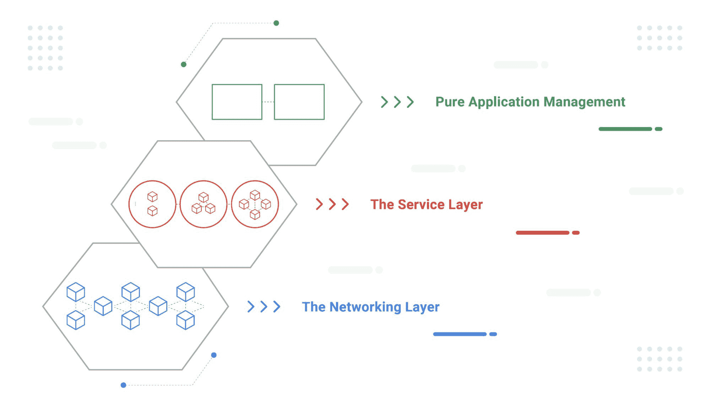
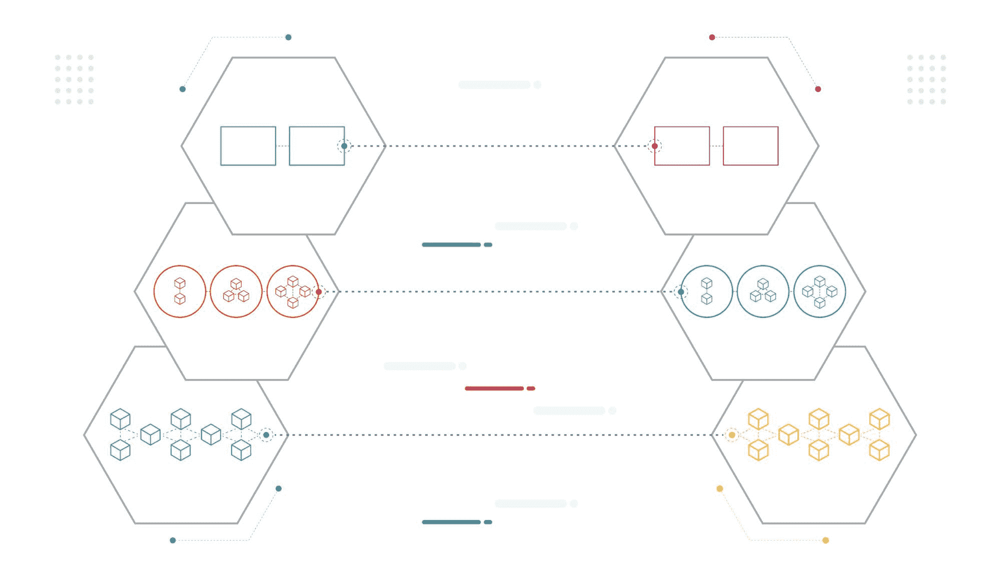
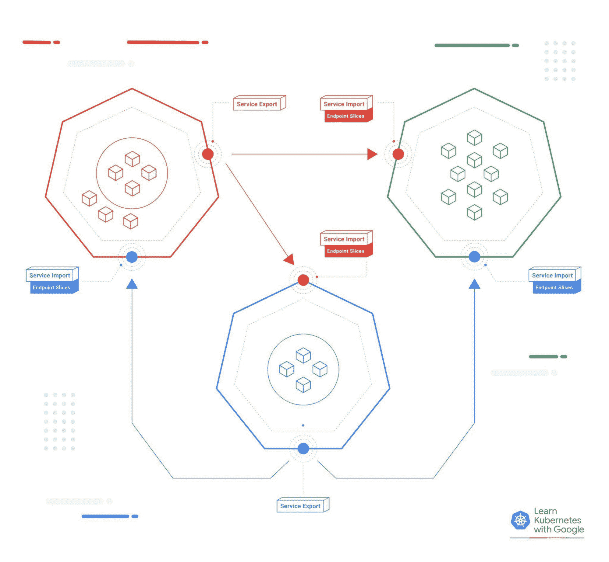

# 用多集群服务 API 扩展 Kubernetes 服务

> 原文：<https://thenewstack.io/extending-kubernetes-services-with-multi-cluster-services-api/>

编者按:这篇文章于 2022 年 5 月 12 日更新，以纳入新的信息，鉴于 KubeCon+CloudNativeCon 2022 EU。

 [劳拉·洛伦茨

劳拉·洛伦茨是谷歌的一名软件工程师，负责谷歌 Kubernetes 引擎，尤其是 GKE 的 MCS API 托管服务。她是 Kubernetes 特别兴趣小组 SIG-Multicluster 的活跃成员。](https://www.linkedin.com/in/lalorenz/) 

这么说吧:Kubernetes 在构建时并没有考虑到多集群。集群的概念没有出现在核心的 Kubernetes API 中；就控制平面或任何 API 对象而言，集群边界是已知领域的边缘。Kubernetes 引入了跨单个集群内的虚拟机或节点边界调度工作负载的能力，这是对大规模工作负载和配置管理的重大改进。现在，随着数据和计算管辖权问题的演变、组织复杂性的增加以及多租户应用程序的趋势(以及其他原因)，全球规模的企业正在将目光投向单个集群之外。请继续阅读，了解如何考虑这一功能。

 [杰里米·奥姆斯特德·汤普森

Jeremy 是一名软件工程师，从事 Google Kubernetes 引擎的工作。他的主要关注点是简化 Kubernetes 体验，尽可能轻松地在使用 GKE 自动驾驶仪的集群内和使用多集群解决方案的集群间部署和维护应用程序。](https://www.linkedin.com/in/jeremyot/) 

虽然您可以将集群扩展到数千个节点，但用户发现他们需要多个集群，而不是一个大型集群。他们可能想要:

*   通过一系列区域性节点拓扑提供全局可用性。
*   由于数据严重性或延迟问题，将工作负载延伸到远程位置。
*   出于性能或安全性和隐私原因，在工作负载之间创建硬隔离。
*   抑制群集中任何一个应用程序或基础架构问题的爆炸半径，因为它自然是独立的、可独立观察的。

在许多情况下，它是有机发生的。新的集群是为一个新的团队或项目提供的，并且最终需要绑定在一起。

在多集群世界中，我们发现有两组用户对这种情况有非常不同的看法:平台团队，他们试图让可能有数百个集群的灯亮着；应用程序团队，他们只想让他们的应用程序在某个地方运行，并访问它需要的所有其他服务。对于这些应用程序团队来说，集群之间的硬边界可能会成为障碍。理想情况下，应用程序开发人员不需要梳理——甚至不需要知道——平台团队的 Terraform 计划来推测一些特殊的多集群拓扑，让他们完成工作。

## 了解应用程序连接

我们可以将应用程序连接分为三个抽象层:

**顶级:纯应用管理**

将一个应用程序连接到另一个应用程序，无论它位于何处，这正是应用程序开发人员所需要的。

**中间:服务层**

在这里，您对组成应用程序的后端进行分组和定义，它们是如何公开的，以及允许谁与它们对话。

**底部:网络层**

每个单独的计算节点实际上是如何连接在一起的。

您的普通 Kubernetes 安装会为您处理网络层，并提供服务对象原语来配置单个集群中的服务层。当谈到跨集群的飞跃时，前进的道路不再那么清晰。

在当今的多集群部署中，平台管理员正在以各种方式解决跨集群服务发现问题，有些采用 Istio 等服务网格及其受管兄弟，如谷歌云平台的 Anthos 服务网格、OpenShift 的服务网格或 VMWare 的 Tanzu，有些则采用自主开发的解决方案。

虽然服务网格非常强大，但并不总是很清楚您需要它们提供的一切，而且取决于组织的工程带宽，这可能是一个挑战。如果平台管理员希望将其无状态工作负载拆分到另一个集群上，以不同于有状态工作负载的方式对其进行扩展和升级，那么只需要在两者之间进行一些最小的服务发现。如果应用程序开发人员希望集中一些公共服务以减少开发冗余，但同时保持团队在他们自己的集群上，那么在集群之间共享一些服务对象就可以了。

好消息！对服务 API 的 Kubernetes-native 扩展是可用的，为您提供了一种以熟悉的方式将多个集群连接在一起的方法。

## 简介:多集群服务 API

在 [KEP-1645](https://github.com/kubernetes/enhancements/tree/master/keps/sig-multicluster/1645-multi-cluster-services-api) 中定义的多集群服务 API 描述了集群集的最小属性，即两个或更多 Kubernetes 集群连接在一起的集合，其核心是两个新的 API 对象:“ServiceExport”和“ServiceImport”。用户创建一个映射到他们想要共享的“服务”的“服务导出”,这允许他们选择只发布他们想要的服务。监视“ServiceExport”对象的控制器在集群集的其余部分创建相应的“ServiceImport”对象，为消费者工作负载传输相关信息。

该设计非常简单，只引入了弥补现有核心 Kubernetes 网络原语之间差距所需的最小新 API 资源集:生产集群中的“服务”本身和消费集群中的“端点切片”。控制器负责处理可能从多个集群同时导出的服务定义之间的任何冲突，并创建和维护保存来自每个导出集群的后端 IP 的“端点切片”。MCS API 包括一个 DNS 规范，该规范扩展了大家已经熟悉的 Kubernetes DNS 范例，添加了以服务和名称空间命名的可预测记录，但以 DNS 区域结尾。集群**集合**。本地”。

这意味着应用程序开发人员可以留在顶级，继续以他们一贯的方式构建应用程序。只需添加几个 ServiceExports 并将应用程序配置切换为引用以“. clusterset.local”而不是“. cluster.local”结尾的 DNS，就大功告成了。Kubernetes 服务魔力在集群间传播，您可以无缝地使用多集群服务！如果您需要将另一个集群中的特定粘性或有状态端点作为目标，您也可以将 ServiceExports 添加到您的 headless 服务中，使各个后端可以跨集群集寻址。

这一新的 API 是 SIG-Multicluster 两年多工作的顶点，体现了 Google、Red Hat 和其他公司的思想领导力。它现在可用于 GKE 和 OpenShift 上的托管产品，或使用名为 Submariner.io 的开源实现进行自托管。它还可以作为一个统一的 API，可以扩展到 Kubernetes 生态系统的其余部分:网关 API 支持入口路由的 ServiceImport 后端，Istio 正在遵循一个多阶段集成计划，最终在 istiod 中实现一个全功能的 MCS 控制器，允许以最少的努力直接采用。扩展到多集群现在非常容易:从 MCS API 这样熟悉且轻量级的东西开始，当您的需求增加时，为其他配置和功能铺平道路。(要了解更多信息，请在 Kubernetes MCS API 上观看这三个短视频:[简介](https://youtu.be/5gmVd-T6O_I)、[概念](https://youtu.be/hVuerVBXf5I)、 [DNS 和 Headless](https://youtu.be/MJ0LSvovKqk) ，并订阅[谷歌开源 YouTube 频道](https://www.youtube.com/c/GoogleOpenSource)，以便在我们发布关于该主题的下两集时获得通知。)

## 多集群入门

多集群不是未来的事情，它正在发生。有了 MCS API 来弥补集群之间的服务发现差距，应用程序团队可以继续在应用程序级别工作，而不必担心他们的服务存在于许多底层集群中的哪一个上。同时，平台团队可以灵活地按照自己的方式配置基础设施，根据需要添加更多集群，以应对高可用性、服务弹性和集中式共享服务等使用情形。您不再需要将集群的边缘视为硬边界。

事实上，甚至集群本身也最终加入进来:就在 Kubecon EU 之前，SIG-Multicluster 发布了 alpha 版本的 [About API](https://github.com/kubernetes-sigs/about-api) ，这是一个灵活的 CRD，用于以易于使用的集群本地方式存储任意集群元数据。众所周知的属性，如集群的 ID 或集群集成员关系，在 [KEP-2149](https://github.com/kubernetes/enhancements/tree/master/keps/sig-multicluster/2149-clusterid) 中有明确的定义，但是 CRD 有空间添加其他集群范围的属性，这些属性需要在 Kubernetes API 中有一个集中的位置。集群现在第一次有了自我意识。

想自己试一试吗？很简单！如果你想马上开始制作你自己的服务导出，你可以启动几个集群，然后打开 GKE 的多集群服务 API 的托管实现。如果你想自己主持，尝试使用他们的快速入门指南部署 [Submariner.io，用于 kind、k3s、GKE、Rancher 或 OpenShift。](https://submariner.io/getting-started/quickstart/)

<svg xmlns:xlink="http://www.w3.org/1999/xlink" viewBox="0 0 68 31" version="1.1"><title>Group</title> <desc>Created with Sketch.</desc></svg>