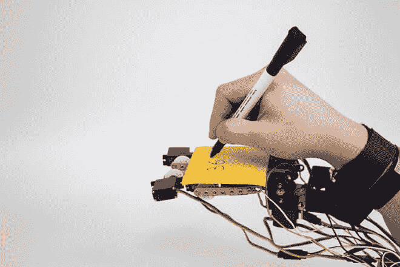
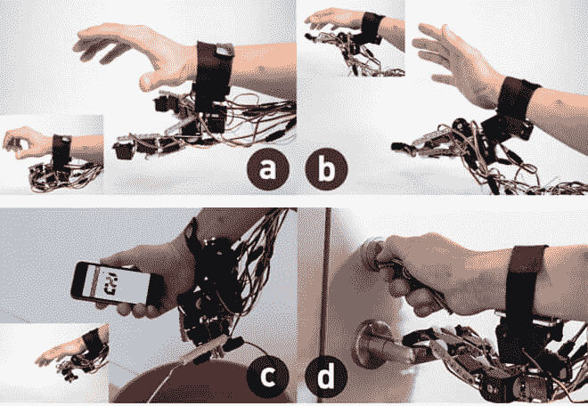
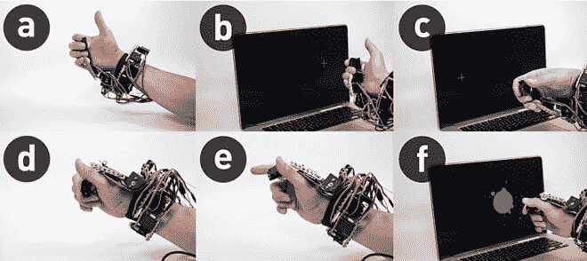
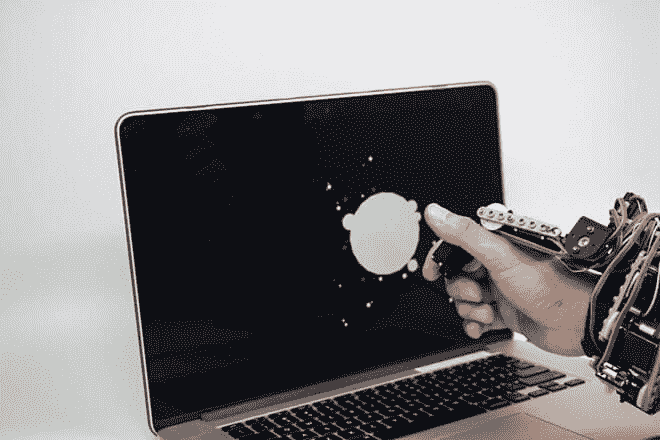

# 如果有一个额外的可编程手指，你会做什么？

> 原文：<https://thenewstack.io/extra-programmable-finger/>

对生拇指的进化是现代智人发展的一个重要里程碑。虽然下一轮重大的进化变化会是什么样子还有待观察，但很有可能有一天我们中的一些人会以某种方式得到机器人的增强，在人和机器的逐渐融合中。

从这个意义上说，无缝集成并增强人类能力的可穿戴设备可能是下一个前沿领域。麻省理工学院的[流体界面](http://fluid.media.mit.edu/)研究小组正在探索这一点，提出了一种机器人，关节装置，可以充当额外的手指或拇指，甚至是另一只完整的手。

该原型被命名为[机器人共生体](http://fluid.media.mit.edu/projects/robotic-symbionts)，并被描述为“身体集成可编程关节接口”它戴在手腕上，有 11 个马达——当然是用乐高连接在一起——让各个部分协调工作。电机由前臂的肱桡肌发出的电信号控制，因此，可以通过以不同方式弯曲前臂，与人的实际手分开控制。此外，这种机器人延伸也不像你的普通人类手指那样移动；每个部分都有高达 180 度的运动范围。观看它的运行:

该设备的创造者，博士生 Sang-won Leigh 在项目页面上解释说，他设想未来人类进化是机器驱动和可编程的。他的机器人关节充当额外的手指——下一个进化的抓握肢体，如果你愿意的话——这将允许一个人执行“三手”任务。

“具有驱动能力的物理接口使增强人类身体能力的可穿戴设备的设计成为可能，”Leigh 在项目论文[中写道。“集成到我们生物体内的额外机器关节可能允许我们通过关节的编程重新配置来获得额外的技能。为此，我们提出了一种可穿戴多关节界面，通过提供额外的手指、结构支撑和物理用户界面来提供“协同交互”。机器关节的运动可以通过与我们肌肉信号的接口来控制，这是我们身体的直接延伸。”](http://delivery.acm.org/10.1145/2860000/2858538/p6053-leigh.pdf?ip=192.222.143.165&id=2858538&acc=OPEN&key=4D4702B0C3E38B35%2E4D4702B0C3E38B35%2E4D4702B0C3E38B35%2E6D218144511F3437&CFID=621059408&CFTOKEN=32189916&__acm__=1464291746_b6c10d2f2581b3506f4e660adf8a7d6c)

## 看，马，(几乎)没有手

那么额外的、可编程的机器关节能做什么呢？对于初学者来说，它可以作为一个从你的手腕伸出的方便的额外抓手，能够抓住和抓住重达 1 千克(2.2 磅)的物体。它还可以作为一个补充表面，让你只用一只手就可以在记事本上写字或拍摄相机。机器人关节也可以与你的手协同移动和工作，例如，你的手转动钥匙开门，而你的机器人关节操作门把手。

但这还不是全部:机器人关节还可以作为触觉用户界面进行动态编程，允许它对用于在不同主动模式之间切换的复杂手势做出反应。它也可以被编程并稍加修改，作为一个方便地连接到你手腕上的操纵杆控制器，或者作为一个可以提供力反馈的“枪触发型界面”——点击后，设备“弹回”到原来的位置。

该系统还可以被编程以变换其形状来对应不同的“状态”；在枪扳机应用程序的情况下，当弹药耗尽时，扳机可以锁定并改变形状，一旦玩家重新加载，则解锁。

我们可以看到原型的一个主要特点是它的多功能性。这些身体集成的机器关节可以被编程以服务于各种目的，在广泛的潜在应用中根据需要变形，从手的机械增强到便携式用户界面。机器人共生体的多用途概念将允许用户避免对多种设备和界面的需求。

随着进一步的改进，我们可能很快就会有一天看到一体化、可编程和可穿戴设备，这些设备不仅可以扩展我们身体的身体能力，还可能允许我们无线控制或随意与物体交互——这是一个非常令人兴奋的前景，如果不是令人难以置信的话。

图片:麻省理工学院

<svg xmlns:xlink="http://www.w3.org/1999/xlink" viewBox="0 0 68 31" version="1.1"><title>Group</title> <desc>Created with Sketch.</desc></svg>