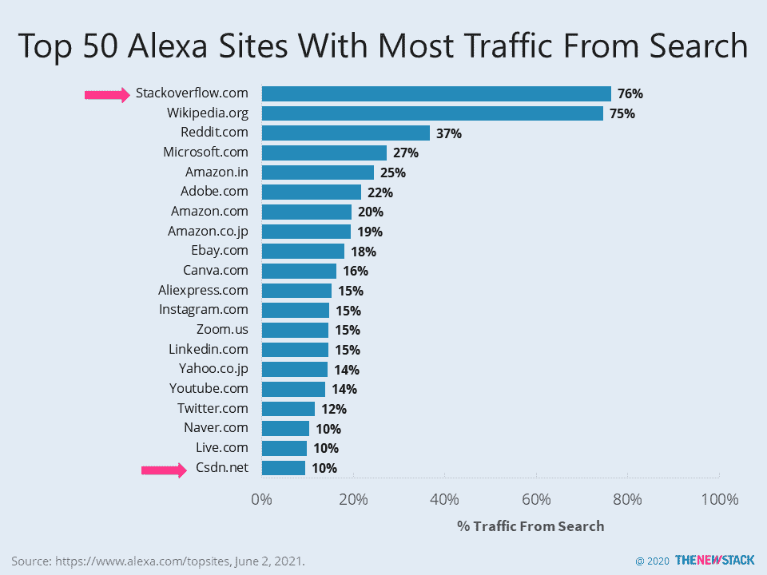

# 眼球，培训，中国:堆栈溢出收购的原因

> 原文：<https://thenewstack.io/eyeballs-training-china-reasons-for-the-stack-overflow-acquisition/>

你从未听说过的最大科技公司 Prosus,[本周宣布以 18 亿美元收购 Stack Overflow 的意向](https://www.prosus.com/news/prosus-to-acquire-stack-overflow-for-us18-billion/)。这家总部位于荷兰的科技投资公司拥有腾讯 29%的股份，以及一系列消费互联网公司的股份。收购 Stack Overflow 将为中国的市场开发人员、培训内容和机会提供巨大的基础。

根据 Alexa.com 网站排名服务公司[亚马逊网络服务](https://aws.amazon.com/?utm_content=inline-mention)’，[Stackoverflow.com](https://stackoverflow.com/)是世界上访问量排名第 48 位的网站，投资者多次试图从中获利。然而，其 76%的流量来自搜索，这与维基百科是竞争对手——一个每年呼吁慈善的网站。

这两个网站吸引流量是因为它们的用户生成内容，而不是主要因为它们各自的品牌名称。Stack Overflow 希望成为一个目的地网站，就像 Amazon.com 是购物之都一样，注册用户可以提问和回答问题。在 StackOverflow 自己的社区[调查](https://insights.stackoverflow.com/survey/2020#community)中，83%的参与者说他们是注册用户，85%的人至少每周访问该网站。听起来这是一个非常强大的社区，但是 66%的人说他们不参加问答活动，或者最多一个月不超过一次。这是不到 5%的受访者访问过 Stack Overflow for Teams 页面的原因之一，该页面于两年前推出，被认为是该公司新的盈利努力的基石。

Prosus 将 Stack Overflow 添加到其技术教育投资组合中，其中还包括 Udemy、 [Codeacademy](https://www.codecademy.com/) 和一家即将成为[的](https://finance.yahoo.com/news/edtech-investor-prosus-skillsoft-incoming-163511855.html)合并的 [Skillsoft](https://www.skillsoft.com) 和 [Global Knowledge](https://www.globalknowledge.com/) 。即使没有 Q & A 网站，这些公司也准备好与 [Pluralsight](https://www.pluralsight.com/) 和 [LinkedIn Learning](https://www.linkedin.com/learning/) 竞争培训企业技术劳动力。假设使用堆栈溢出的用户是自学者，因此他们已经是在线培训工具的合格的潜在用户。一个很大的警告是，用户的需求是否能在不侵犯隐私的情况下与潜在的产品相匹配。如果您正试图调试一个 Java 应用程序，您是否希望在接下来的六个月里被 Java 类的广告轰炸？

隐私问题和广告可能分散了追求者对堆栈溢出的关注。它的开发者用户群很可能会反对干涉性的政策。出于这个原因，宣布的收购也可能是为了进一步推进其在中国的发展。腾讯对开发者市场觊觎已久。作为其最大的股东，如果 Prosus 正在进行战略投资，以帮助腾讯在这个最重要的领域取得进展，会怎么样？让我们解释一下。

腾讯是微信和世界第四大访问量网站 QQ.com 的幕后公司。它也是中国第四个[最活跃的](https://thenewstack.io/alibaba-github-repos-most-active-in-china/)开源贡献者。中国政府和大公司支持 Gitee，这是产业政策的一部分，目的是培育一个在线社区来对抗 GitHub。腾讯的竞争对手百度和华为提供了资金，并通过 OSChina 推动这项工作。中国最大的在线开发者社区的头衔可能属于 [CSDN](https://www.csdn.net/) ，其创始人[称其在 2020 年拥有 3100 万用户。根据 Alexa 的数据，CSDN 也是中国访问量第 15 大的网站，其受众分布与 Stack Overflow、腾讯和另一个热门网站](https://www.prnewswire.com/news-releases/csdn-launches-bitcoin-sv-developer-zone-in-partnership-with-bitcoin-association-301097881.html)[CNblogs.com](https://www.cnblogs.com/)重叠。

我们期待看到新的堆栈溢出是否像过去一样努力成为开发人员和技术社区的好公民。

<svg xmlns:xlink="http://www.w3.org/1999/xlink" viewBox="0 0 68 31" version="1.1"><title>Group</title> <desc>Created with Sketch.</desc></svg>