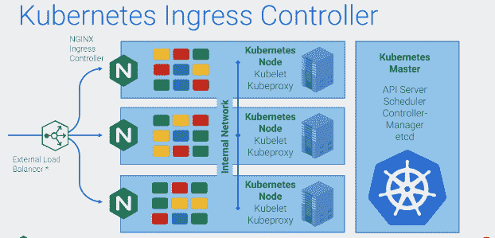
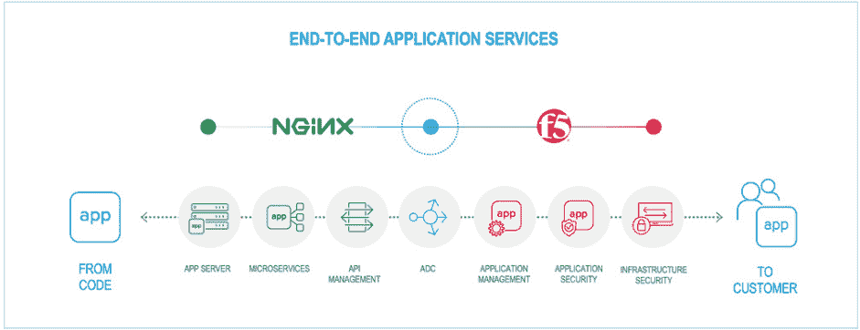

# F5 和 NGINX:与 Kubernetes 一起前进

> 原文：<https://thenewstack.io/f5-and-nginx-going-forward-with-kubernetes/>

随着 [F5 Networks](https://www.f5.com/) 致力于整合其对 [NGINX](https://www.nginx.com/) 的收购，它已经承诺[对 Kubernetes](https://www.f5.com/company/blog/f5--nginx--and-our-commitment-to-the-kubernetes-community) 的承诺，不仅仅是整合 orchestrator，而是全面参与开源项目。

2018 年下半年发布的一项云本地计算基金会调查[发现 NGINX 是 Kubernetes 使用最广泛的入口提供商。](https://www.cncf.io/blog/2018/08/29/cncf-survey-use-of-cloud-native-technologies-in-production-has-grown-over-200-percent/)

对于总部位于西雅图的应用控制器交付软件提供商来说，一笔 6.7 亿美元的收购提供了一个成熟的用户群和[成熟的技术](https://thenewstack.io/why-f5-networks-bought-nginx-containers-and-existing-user-base/)，使其处于[微服务架构](https://thenewstack.io/nginx-smoothes-the-path-to-microservices/)的中心。

今年早些时候，[当 F5 收购 NGINX](https://thenewstack.io/f5-to-buy-nginx-to-enhance-cloud-native-and-multicloud-capabilities/) 时，它表示计划用 F5 自己的安全技术以及一套“云原生创新”来增强负载平衡，从而增强开源 web 服务器/负载平衡器和反向代理软件。

在 9 月举行的 [NGINX Conf 2019](https://www.nginx.com/nginxconf/2019/) 上，[F5 Networks 总裁兼首席执行官 Fran ois Locoh-Donou](https://www.linkedin.com/in/fldonou/)指出，已为客户带来回报的技术收购是那些被收购公司的技术对收购公司的战略至关重要的技术。

他说:“NGINX 是 F5 网络战略的核心。“结合 F5 应用安全产品组合的深度和广度，我们相信能够在所有环境中向客户交付代码，并简化客户处理的复杂性。”

他还重申了对开源的承诺。

“与 NGINX 不同，我们不是从开源起步的，但随着时间的推移，我们已经看到我们的客户越来越多地使用开源，”他说。“我们坚信，开源或社区主导的破坏将继续成为创新的强大源泉，要么破坏现有市场，要么创造新市场。”

[https://www.youtube.com/embed/Erajwq4iYuM?start=3&feature=oembed](https://www.youtube.com/embed/Erajwq4iYuM?start=3&feature=oembed)

视频

他承诺对 NGINX 代码进行同等程度的访问，并增加对 NGINX.org 的贡献。

NGINX 是公司内部的一个新部门，团队中增加了 128 名工程师。他说，F5 还对 1000 多名工程师进行了 NGINX 技术培训。

[产品管理高级总监 Owen Garrett](https://twitter.com/owengarrett?lang=en) 也概述了即将推出的产品，包括:

*   **支持 QUIC/HTTP/3，引用谷歌搜索引擎的速度作为 QUIC 性能的例子**:“当我们无法控制连接的两端时，我们面临的挑战是在 NGINX 上建立一个通用的 QUIC 实现——一个与 Chrome 和其他第三方 QUIC 实现良好合作的实现，”Garrett 说。

*   从 NGINX Plus 到开源的端口统计框架:“我们不会移动统计数据本身，这是 NGINX Plus 独有的东西。但是如果你使用工具来监控 NGINX，你将能够使用一致的 API。如果你正在构建你自己的模块，你将能够用 API 来植入这些模块。”

*   **继续投资 nJS**:“JavaScript 是创新发生的地方。这是我们用来发布新产品功能的平台。”

五月份，面向 Kubernetes [版本 1.5.0](https://github.com/nginxinc/kubernetes-ingress/releases/tag/v1.5.0) 的 NGINX 入口控制器发布，这是一个监控入口资源和 NGINX 自定义资源的守护程序，用于发现需要入口负载平衡的服务请求，并自动执行。他说，未来将会与 F5 的 [Big-IP 功能](/why-f5-networks-bought-nginx-containers-and-existing-user-base/)集成。

他说，入口控制器使用 Kubernetes 对象，称为入口资源，仅限于基本的 SSL、TLS 和一些 HTTP 负载平衡配置，扩展它们很难。没有类型安全，它们是全局范围的，它们不是细粒度的，很难使用。

F5 有一个项目，通过使用客户资源定义(CRD)以 Kubernetes-native 的方式添加增量方式来配置入口控制器，以提供更丰富的负载平衡配置:控制 NGINX 如何代理 Kubernetes 中上游服务流量的精确参数；为蓝/绿部署提供流量分流；和更复杂的条件路由，例如，您可以提取一个调试请求，并将其发送到一个不同于常规流量服务的服务。

Garrett 说，NGINX 在过去两年中一直与 Trustwave 合作开发 ModSecurity 开源防火墙，并将继续这样做。然而，F5 拥有更丰富的网络应用安全功能套件。Garrett 说，它计划从 Big-IP 框架中提取大量技术，并在明年提供给 NGINX。

至于 [NGINX 单元](https://www.nginx.com/products/nginx-unit/)应用服务器，它支持七种语言，该公司不打算支持更多。它将增加对静态文件服务器、更复杂的路由规则和代理的支持。

F5 产品管理总监 [Hitesh Patel](https://nam02.safelinks.protection.outlook.com/?url=https%3A%2F%2Fwww.linkedin.com%2Fin%2F0xhiteshpatel%2F&data=02%7C01%7Csschwartz%40we-worldwide.com%7C082a60864fe64caea3fa08d77813354f%7C3ed60ab455674971a5341a5f0f7cc7f5%7C0%7C0%7C637109896215902958&sdata=UyFVid6x8wF%2BcDgdCo6i%2BZxMXThMV8pxASp27dh%2Fp%2Fs%3D&reserved=0) 表示:“自从我们在去年 5 月完成交易以来，我们已经做了大量的工作来将 NGINX 集成到我们的核心业务中，他引用 NGINX 业务部门的人员配置来证明其致力于开源和帮助客户连接传统数据中心和现代应用世界的方法。

他们正在研究:

*   基于以应用程序为中心而不是以基础架构为中心的设计的分析和管理功能。
*   与 CI/CD 工具链集成并提高灵活性的自助服务功能。
*   加速模块开发，提供服务网络和高级安全模块，使智能和行为分析更接近应用。

“这些投资将很快通过 NGINX 控制器等直接产品和 F5 Beacon 等补充产品提供给用户。此外，BIG-IP 容器入口服务和 NGINX Kubernetes 入口控制器的融合是我们计划继续寻找将我们的技术结合在一起的方法的一个例子，”Patel 说。

<svg xmlns:xlink="http://www.w3.org/1999/xlink" viewBox="0 0 68 31" version="1.1"><title>Group</title> <desc>Created with Sketch.</desc></svg>