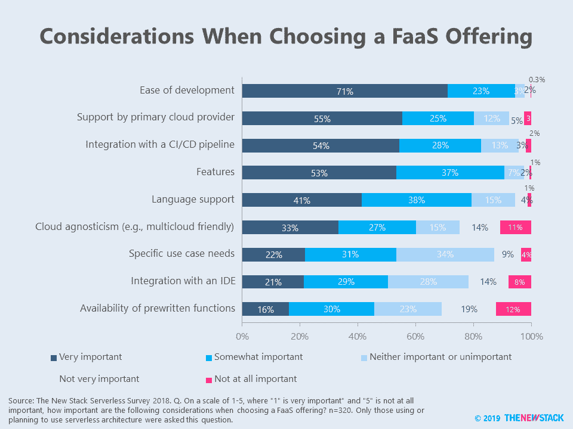
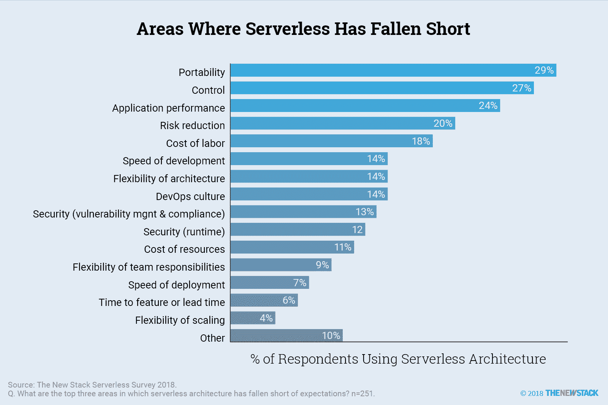

# FaaS 的选择标准:对多云的渴望很少

> 原文：<https://thenewstack.io/faas-selection-criteria-little-desire-for-multicloud/>

人们希望从“功能即服务”中获得简单、快速的开发(FaaS)。根据我们的[调查](/ebooks/serverless/guide-to-serverless-technologies/?)，71%使用无服务器架构的人表示，在考虑 FaaS 产品时，开发的便利性非常重要。

55%的受访者表示，在考虑 FaaS 时，获得主要云提供商的支持非常重要。相比之下，33%的人认为云不可知论非常重要，你会意识到选择产品时，多云几乎是事后的想法。在我们看来，这证明了无服务器并不崇拜多云。

我们上一篇关于[托管和可安装平台](https://thenewstack.io/serverless-roadmaps-platforms/)的文章展示了哪些解决方案实际上是首选的。尽管 AWS Lambda 遥遥领先，但许多 Azure 和谷歌客户都渴望使用他们主要云提供商的 FaaS 产品。我们相信，不必更换云提供商会使许多人更容易使用无服务器，因为许多人开始使用 FaaS。与用户的 CI/CD 渠道集成同样重要。

> 无服务器不崇拜多云的祭坛。

不太重要的是与 IDE 的集成，这表明开发人员在创建无服务器应用程序时不需要全面的开发环境。此外，对预写函数的需求很少，只有 16%的人认为这在选择 FaaS 解决方案时非常重要。鉴于这些发现，我们认为云提供商不会因为专注于 FaaS 产品的新产品开发而获得很多新客户。

正如我们的“[无服务器技术指南](https://thenewstack.io/ebooks/serverless/guide-to-serverless-technologies)”电子书中所报道的，灵活的扩展、资源成本的节省和开发速度是人们看到的无服务器在软件开发生命周期中最积极的好处。在所有被问到的好处中，可移植性(跨云环境)是最不可能被提及的。事实上，当用户被问及无服务器架构的不足之处时，可移植性是最常被提及的。

当无服务器用户从开发速度和伸缩灵活性中获益时，可移植性和控制被牺牲了。

通过 Pixabay 的特征图像。

<svg xmlns:xlink="http://www.w3.org/1999/xlink" viewBox="0 0 68 31" version="1.1"><title>Group</title> <desc>Created with Sketch.</desc></svg>