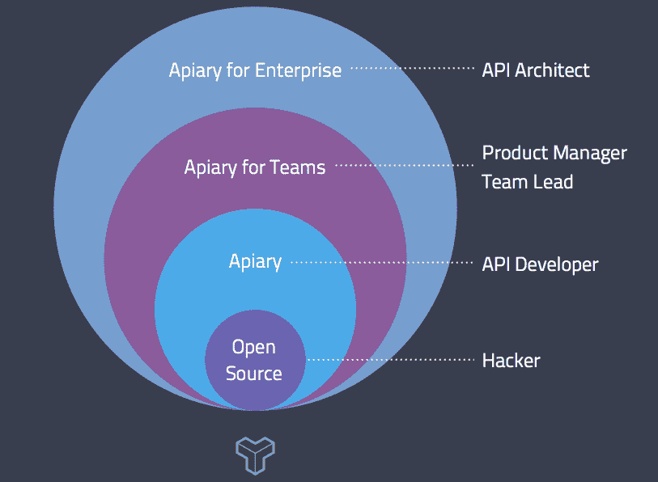

# 脸书和个人编码文化的神话

> 原文：<https://thenewstack.io/facebook-and-the-myth-of-an-individual-coding-culture/>

在最近一篇关于工程文化的文章中，脸书软件工程师 Pierre Raynaud-Richard 分享了他对社交媒体巨头的开发文化如何促进协作和鼓励对他们创造的代码感到自豪的见解。

雷诺-理查德论文的关键是他对“个人代码所有权”咒语的驳斥。许多软件开发公司相信并实践“个人代码所有权”。“这听起来可能不像是一个基本原则，但它实际上对定义软件组织如何工作有很大帮助，”雷诺-理查德写道。

虽然从表面上看，这种方法似乎鼓励内部专家自豪地创建编写得更好、错误更少的代码，但对许多公司来说，实际影响是它扼杀了创新，抑制了开发人员的技能增长。Raynaud-Richard 表示，这种方法阻碍了公司的创新，因为开发人员最终会倾向于现状:随着时间的推移，他们会捍卫自己构建的代码库，并对它有一种隐含的偏见，无法适应需要彻底改变方向的新机遇或挑战。对于个人开发者来说，这种方法阻碍了他们的技能增长，因为它强化了他们的技能基础，限制了他们识别高影响力机会的能力。

“初看起来，单独的代码所有权提供了一些吸引人的好处:更好的设计、维护和支持代码，以及组件和服务更长的生命周期。不幸的是，这是以引入僵化的角色定义为代价的，这会限制创新以及公司和个人的成长，”雷诺-理查德总结道。

在今天的全栈开发环境中，软件团队知道[没有一个开发人员能够知道所有的事情](https://thenewstack.io/bigpanda-and-the-app-incident-problem-one-person-can-never-solve/ "The App Incident Problem No One Developer Can Solve")。但是许多人转向更有创造性的方法来鼓励灵活的工程文化，而不是个人代码所有权模型培养的日益专业化的途径。

## 创业开发文化

数据库即服务初创公司 [Orchestrate](https://thenewstack.io/60705/ "Orchestrate") 的首席技术官和联合创始人伊恩·普洛斯克(Ian Plosker)表示，该公司有一个由 10 名工程师组成的分布式团队，在五个时区工作。

“我们通常没有代码所有权，”普洛斯克说。“也就是说，领域专家确实是自然发展的，通常从开发或审查代码的人开始。”Plosker 说，有时，特定的工程师可能最终专攻特定的技术或方法，当使用特定的技术时，他们将更经常地被吸引到项目中。

“一个人拥有代码是危险的，因为整个团队可能不知道事情是如何工作的。幸运的是，在一个较小的组织中，很难做到这一点。知识在组织内传播是非常重要的。”

Orchestrate 避免个人代码所有权的关键过程之一是代码审查:“代码审查是知识转移的最重要的地方之一，它保证至少有第二个人知道代码，已经评估了测试用例是完整的，并且知道代码库是如何工作的。”

Orchestrate 为多个数据库的集合提供了单一的 API 和用户界面。从键值开始，该产品现在支持多种搜索格式，包括全文、时间排序和图形搜索。最新产品是一个新的地理空间搜索功能，它避免了开发时的个人代码所有权方法:

“我们经常使用 GitHub，所以你会有一个开发人员在一个功能分支上工作，就像我们添加地理空间搜索功能一样。因此，工程师将在一个功能分支中工作，他们打开一个拉请求来合并该功能。希望他们添加所有的单元测试和集成测试，这就是深度技术评估发生的时候。

“如果功能很重要，我们至少会有两对眼睛来观察事物，GitHub 会让你对特定的行进行评论，比如说‘嘿，你为什么要这样做？’

“所以对话就发生在那里，在拉式请求中嵌入了许多知识。

“一旦经过全面审查，我们就会运行并测试它。

“我们有几个测试步骤:在内部，我们有一个名为 Orchestrate Runner 的工具，它可以在您的机器上构建一个完整的编排堆栈(一个基于 Java 的 HTTP 服务器、web 前端，所有这些都是由我们的工具在内部完成的)。这是第一轮测试。

“然后 GitHub 上的每次提交都由 [Travis CI](https://travis-ci.org/ "Travis CI") 运行。这对我们来说工作得很好，这将运行我们所有的单元测试和集成测试。我们甚至在 travis CI 中构建了一个迷你编排堆栈。

“我们还使用 Hipchat，我们甚至在 Hipchat 中创建了一个机器人，它可以告诉我们许多关于代码部署的信息。在每个成功的构建大师之后，我们在 Travis 构建结束时将它们上传到 S3，根据构建号，我们可以要求我们的聊天机器人部署代码！比如，'嗨，prodbot，将 46 号内部版本部署到 USC 暂存环境'Plosker 还提到了 Mumble，这是一个聊天客户端，允许任何开发团队互相提问，或者就编码模式和设计选择开始非正式的聊天。

为了促进围绕新功能设计的协作和小组讨论，Orchestrate 鼓励任何团队成员创建一个概述想法的提案:

“在我们开始任何重大功能之前，往往会有人成为该功能的拥护者。因此，我们倾向于为这个功能写一个提案:这是它将如何工作，这是我们为什么应该这样做，挑战，机遇…这些往往是谷歌文档，整个团队将致力于此。这是自然发生的。

“例如，现在我们正在致力于搜索 faceting，所以有一个每个人都在评论的文档。在这一点上，我们已经有相当多的知识在流通。”

## 可扩展的业务

在线菜单和食品配送服务 Just Eat——现在在 13 个国家运营，并宣布 2014 年上半年收入增长 58 %——仅在英国办事处就有大约 60 名开发人员组成的工程团队。据技术负责人 Anton Jefcoate 称，该公司正在经历“相当可观的快速增长”，这要求开发人员在两个办公地点和远程协同工作。“增长率促使我们采取了一些非常好的做法。基础已经存在，但是当你扩大你的开发团队时，你不能脱离你所提倡的工程文化。

“我们已经将我们的开发团队分成几个小组来处理不同的领域:消费者应用程序、商业应用程序、从事 API 工作的开发人员..API 团队是整个平台的核心。因此，API 团队被进一步划分，他们控制平台的特定部分。

“任何一个新项目都会让 API 驱动和本地应用团队的几个人聚在一起:任何项目最少两个人，最多 10 个人。这显然取决于该功能的大小，以及该功能将在平台上传播多远。”

Jefcoate 认为 Raynaud-Richard 指出软件公司中个人代码所有权文化模式的缺点是正确的。

“缺点对我们来说是真实的，”Jefcoate 说。“我认为敏捷是打破这种文化的东西之一。我认为在敏捷之前，开发人员通常是孤立的，但是敏捷鼓励团队而不是个人。当你着眼于跟踪速度或团队生产的更大利益时，每个人都平均分担工作。我们有一种每个人都参与进来的文化。我相信这与工作实践和使用敏捷流程的人的类型有关:这里有一些工作要做，每个人都在甲板上，这并不适合个人代码所有权的场景。”

Just Eat 复制了许多在基于云的软件创业公司中越来越常见的文化方面。像他们这一代的其他人一样(Just-Eat 始于 2001 年)，他们有一种创建开源项目的文化，并经常采用一种招聘流程，要求申请人提供 Just-Eat API，以展示可以做出什么，或者指出可以改进 Just Eat 代码库的机会。

Jefcoate 认为开源方法是培养代码自豪感的一种不同方式，这种自豪感可能来自于个人代码所有权:

“你只需要看看我们的堆栈，就能看到我们每天用来解决问题的所有开源工具，所以作为一个整体的开发者社区，我们确实从更大的利益中受益。开源让很多人解决问题；很少有地方你可以找到免费的产品，这些产品有着那么多经过检验和测试的历史。开源是有用的，我想对我们来说，对它有所贡献也是对我们公司的一个声明。我们发布的开源内容(相对来说还处于起步阶段)是帮助开发者社区解决问题的通用内容。我们试图通过确保开发人员在我们的平台上帮助测试新技术，确保我们的开发人员为整个 Just Eat 工程团队解决问题，来获得个人代码所有权的好处(比如培养自豪感，鼓励个人风格和对编码项目的个人投资)。如果发生这种情况，那么它可能会解决我们公司以外的事情，所以这就是我们开源项目的开始。通常是关于伸缩性和弹性。我们首先尝试在内部采用它，然后看看它是否能让社区受益。”

为了进一步嵌入协作文化而不是个人代码所有权模型，Just Eat 每季度举行一次内部黑客马拉松，将开发人员聚集在新的团队配置中:“使用团队代码所有权，你确实会错过一些好处，比如代码可能会变得更好，因为开发人员会更加投入或成为领域专家。内部黑客马拉松是为了鼓励我们的开发人员从事个人喜爱的项目。”

Just Eat 使用 [JIRA](https://www.atlassian.com/software/jira "JIRA") 来跟踪正在完成的工作，并协调拉动式请求，然后每个拉动式请求都会得到同行评审:“一个团队是半独立的，但一切都是由全球产品需求驱动的。一旦你通过了全球需求，团队倾向于自我管理来完成它。因此，提出拉取请求通常是在团队对话中。同行评审是一个奇妙的过程，因为它既是学习也是验证。我们有很多自动化功能:我们真的在 CI 中考虑是/否是否可以部署它。”

Jefcoate 还认为该公司使用结对编程(让两名程序员在一个编码项目中一行一行地一起工作的方法)证明了该公司重视的个人编码文化的对立面:“我们在新开发人员入职时使用结对编程，并将其作为一种通用的开发实践。如果我在做一件特别新的事情，我会和某人配对，并确保其他人知道这件事。这些都是远程完成的，配对是实现代码质量标准化的最佳工具之一。”

## 企业发展文化

Jakub Nesetril 是 API 设计和文档编码工具套件 Apiary 的创始人兼首席执行官。本周，apary 发布了面向企业的[apary](https://blog.apiary.io/Enterprise-Release "Apiary for Enterprise")，以帮助大公司在创建 API 产品和服务时摆脱个人代码所有权。Nesetril 越来越多地看到企业处理多个 API，每个 API 都以不同的方式编写，现在需要有共同的编码结构和术语，由多个团队成员而不是分配给特定业务部门的单个开发人员来工作。

在成千上万的养蜂场用户中，Nesetril 通常看到个人黑客或小团队使用他们的开源工具，其中每个开发人员可能都有几乎个人的代码所有权方法(主要是因为他们是唯一的编码者)。随着团队的成长，他们开始使用养蜂场的商业产品，当他们达到 20 个团队成员时，他们就转向养蜂场为团队服务。正是在这个阶段，组织基础设施倾向于引入产品经理，以确保开发人员编码在各种 API 项目中是统一的。

在企业客户中——一旦团队的开发人员数量达到 40-60 或更多 API 架构师往往会被雇佣。Nesetril 解释说:“他们正在努力解决的一个问题是他们的 API 的一致设计，这就是为什么我们为企业建立了 Apiary。该产品的核心是一个风格指南工具，帮助公司确保开发人员符合组织约定，如命名和数据格式。

Nesetril 看到企业客户放弃了个人代码所有权的旧观念，特别是因为许多人通过合并和收购继承了不同 API 的遗产，或者因为个人用例在不相连的业务单元内驱动初始 API 开发项目。

“从历史上看，代码所有权有着强大的推动力，因为它创造了问责制，但也给协作带来了困难。Nesetril 说:“我们在企业的开发团队中看到了更多的共享资源，个人可以在项目的各个部分轮流工作。

“合作方法的诀窍在于，他们需要单一版本的真理。不是每个人都能成为公司内部所有事情的专家，但是当他们能在公司内部做一些事情的时候，那是很棒的。单一版本的真理文化的最大诀窍是在不限制合作的情况下到达那个地方。”Nesetril 认为，对于试图管理多个 API 而又不创造一种鼓励开发人员回归成为个人代码专家的文化的企业来说，API for Enterprise 是理想的:“它让他们知道，当他们在开发一个 API 时，它符合高级检查和通知的主动级别，如果你不担心自己做错了，例如，日期格式，它允许你更具实验性和雄心。人们可以尽早开始做出有意义的贡献。”

## 个人代码所有权消亡了(半公开)

Raynaud-Richard 的博客文章实际上可能是在标记个人代码所有权的时间和死亡。从初创公司到企业，各个层次的企业已经开始采用更多的协作开发方法。Google tools 和 Hipchat 在所有级别的开发团队中普遍使用，新的开发产品正在出现，这有助于巩固更具协作精神的氛围。在今天的开发环境中，需要追求专业化和一般知识之间的中间道路，其中最大的编码技能是异步共识构建:在分布式团队中合作和促进知识转移的能力。

通过 Flickr 知识共享的特色图片[。](https://www.flickr.com/photos/ter-burg/8823162570/in/photolist-eqJHbr-erF1QA-azAtw-eqJHRr-eqJNt4-eqJMhP-eqJPKH-eqJLFF-eqJJbk-eqJPYp-eqJHqe-eqJNYZ-erF2EW-erF5JC-eqJKo8-erF1ib-eqJLuM-erEZUq-erF67J-eqJMx8-5nVzXm-bqAL6q-bBhnp6-5DxsE3-eqJHDZ-eqJKxt-eqJNdg-erF26q-eqJJB4-eqJQd4-erF3Ym-eqJKYP-eqJN2x-erF36o-9qFLdL-9qCHDc-9qFJQu-9qFHQS-9qFKam-9qFJz3-9qCGLn-9qCJVz-9qFKLJ-9qCKsk-if24Ga-if1n6T-if1EVS-if1mZk-if1nLR-4KRQ6q/)

<svg xmlns:xlink="http://www.w3.org/1999/xlink" viewBox="0 0 68 31" version="1.1"><title>Group</title> <desc>Created with Sketch.</desc></svg>