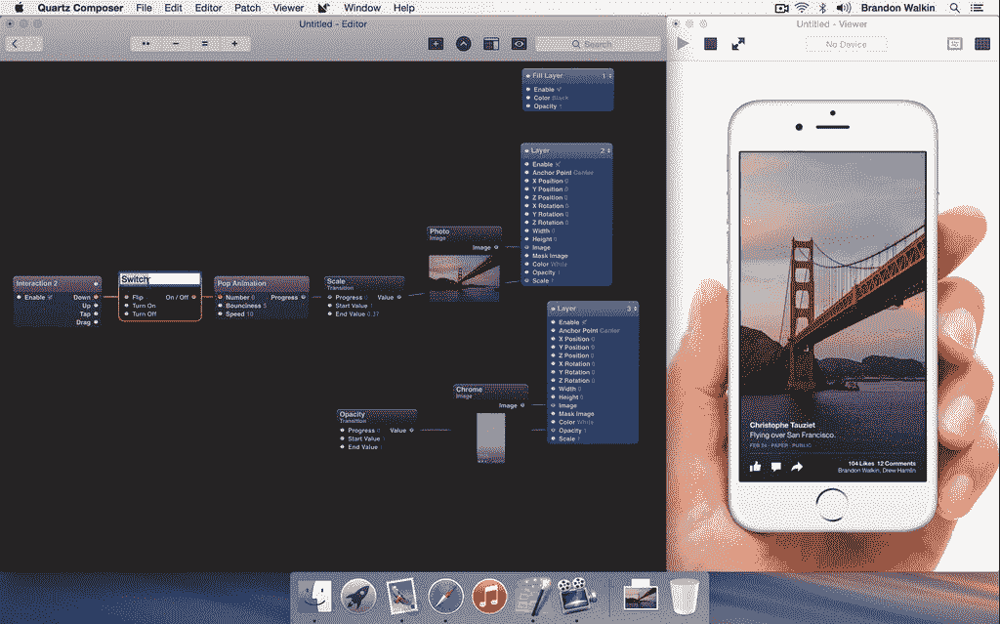

# 脸书改造了 2007 年的苹果工具，用于开发 iOS 应用原型

> 原文：<https://thenewstack.io/facebook-retrofits-2007-apple-tool-prototyping-ios-apps/>

许多脸书开发人员的首选工具是一个名为 Quartz Composer 的苹果工具，用于原型制作他们希望他们的应用程序如何出现在 iPhone 上。苹果是否在乎仍是个谜。表面上，Quartz Composer 是一个快速应用程序开发工具——或者说，曾经是。它仍然作为 Xcode 的一部分由苹果免费提供，但在过去八年的大部分时间里，它主要由志愿开发者提供支持。

也就是说，直到脸书来拯救这个工具。现在，一个 RAD 工具可能已经成为 iOS 上脸书应用的领先原型工具，苹果只是勉强承认它的存在。本周，脸书发布了一系列新的更新，它称之为 Origami，这是一个资源库，包含苹果——也许很不幸(至少对苹果来说)——早先称之为“补丁”的新图形元素

因此，纯粹出于需要，脸书正在修补苹果产品。

## 脸书从苹果中断的地方重新开始

现代开发人员喜欢 Quartz Composer 的主要原因是因为它可以帮助他们构建良好的移动应用原型……或者说，它应该这样做。你看， [Quartz Composer 是一个 Mac OS 工具](https://developer.apple.com/library/mac/documentation/GraphicsImaging/Conceptual/QuartzComposerUserGuide/qc_intro/qc_intro.html)。正如苹果在 2007 年左右解释的那样，它的目的是让程序员能够构建苹果(也只有苹果)称之为“动态运动合成”的东西。这些图形元素可以在屏幕上操作，这些操作将产生代码，而无需开发人员手动编写。

很快，dynamic motion 什么的就在一个更擅长使用 JavaScript 和 jQuery、Sencha Ext JS 等库构建 Web 应用的社区中失宠了。当这种情况发生时，Mac OS 开发人员使用其他工具(如 Sketch)制作原型，而 Quartz Composer 似乎受到了冷落。有一天，当一名开发人员报告了 Quartz Composer 的一个 bug 时，一名苹果工程师回应说 Quartz Composer 已经“[弃用了](http://vdmx.vidvox.net/blog/quartz-composer-im-not-dead-yet)”

这对最近一直从脸书得到暗示的移动开发者来说是一个冲击。

早在 2013 年 4 月，[脸书开发者 Julie Zhuo 公开承认](https://medium.com/the-year-of-the-looking-glass/go-big-by-going-home-af182add5a2f)她和她的同事发现了 Quartz Composer 作为原型工具的优点。忽略 Quartz Composer 生成代码的能力，他们发现它非常适合让对象在屏幕上表现出开发人员希望它们在最终版本中表现的方式。

“当你看到一个现场的，精美的，可交互的演示时，你可以立即理解一些东西是如何工作和感觉的，这是文字或长时间的描述或线框永远无法实现的，”周写道。"这导致了更好的反馈，更好的迭代，最终更好的最终产品."

在 Quartz Composer 行话中，“补丁”以类似于数据库模式的方式显示在屏幕上。它们的属性通过你实际绘制的电线相互连接，这些连接触发事件。

脸书正在打造自己的定制补丁。2013 年末，它以 Origami 的形式向开发者社区发布了这些补丁。它们代表了你期望在 iPhone 应用中找到的基本控件，比如工具栏、滚动文本和按钮的平台。(是的，Quartz Composer 需要新的补丁来解释按钮。)最重要的是，它为运行外形像 iPhone 的原型提供了一个框架。

例如，假设您需要一种方法来向设计团队演示您希望图形元素如何在动画页面中流动。也许，当应用程序启动时，主面板从中心轻轻地放大到视图中，一系列图标从左侧摆动过来，一个接一个，就像被一根普通的绳子拴着一样。Quartz Composer 使用这种编排为表示面板和图标的对象提供了进入显示的环境。这些对象还没有与功能相关联，但这不是重点:您想要演示它的外观。Origami 提供补丁，将这些对象变成 iPhone 用户希望看到的熟悉的东西。

这样，一个为 Mac OS 生成 RAD 应用程序的工具就可以用来为 iOS 生成移动应用程序原型。

## 在 Quartz Composer 退出后，折纸 2.0 重新流行起来

到目前为止，移动应用开发者所缺乏的是在 iOS 上实际运行这些原型的方法。周二，脸书宣布发布一款名为 Origami Live for iOS 的运行平台。它可以从 App Store 下载，允许开发者第一次在实际的 iPhone 上测试原型，用 Origami 在 Quartz Composer 中渲染。

“你可以快速尝试新想法——使用多点触控、设备传感器等。产品设计师 Brandon Walkin 在脸书的企业博客上发表的一篇文章中写道:[。“然后，有了您的设备，您的团队成员或用户就可以尝试一个看起来和感觉上都像最终产品的高保真原型。”](https://code.facebook.com/posts/883904991672650/introducing-origami-live/)

同样重要的是，脸书还发布了 Origami 的 2.0 版本，该版本实际上承担了 Quartz Composer 最初创建时的工作:生成代码——只不过这次是针对 iOS、Android 和 Web 应用程序。具有讽刺意味的是，在 Sketch 中创建的原型文档现在可以通过脸书设计的插件链接到折纸原型。

因此，现在有了一个明确的“下一步”:使用 Origami 2.0 开发移动应用原型的开发人员现在可以在后台使用该过程生成的框架，以附加客户端功能并构建功能性应用。

人们得到的印象是，用不了多久，开发人员不仅可以使用折纸补丁，还可以使用除 Quartz Composer 之外的其他工具来构建 Facebook 平台移动应用的原型。如果苹果没有注意到一直使用自己的 Quartz Composer 的开发人员，它会注意到他们何时离开吗？

特色图片[通过](https://www.flickr.com/photos/sheila_sund/8370889743/in/photolist-dKGZTe-8uGtcv-oW7m-645q1n-2u9bd-649DhL-QgDU-EJeVR-2xsyYa-Mujh-5xEVSg-2Gwvaz-7z4zor-5jmtYy-5xEYFz-gcahXh-9TwFjm-i4DMQq-eZ9ZCn-nUgdu9-fpigu7-pz1ZMH-5PhjGt-eZmXSw-EJeUM-cCKaem-9Gdjj5-5zC1qX-7pwYps-6CXJ3-g9Bi5B-oLJyX-55EPyP-bp8dNY-5H2AYd-hsywCS-6Lsem-hszdmC-bC37Hi-oa3tEs-9tL3w-2yYuYa-6tPhHW-4pfQVz-8G4sBS-jECoyg-hhqZQ1-gbaetv-6uCZen-6tK9sn) Flickr 知识共享。

<svg xmlns:xlink="http://www.w3.org/1999/xlink" viewBox="0 0 68 31" version="1.1"><title>Group</title> <desc>Created with Sketch.</desc></svg>