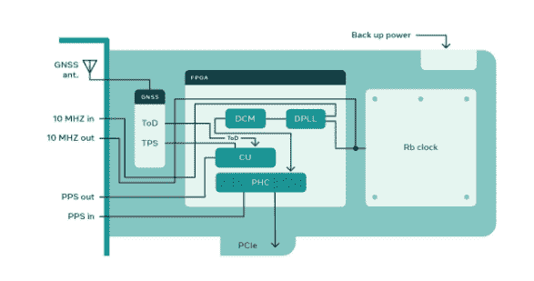
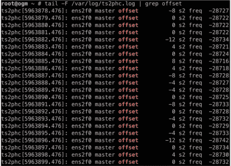

# 脸书推出自己的高精度商用时间服务器

> 原文：<https://thenewstack.io/facebook-rolls-its-own-high-precision-commodity-time-servers/>

由于对现成的时间同步所提供的精度不满意，脸书已经为自己的皮秒级精确计时设备——开放计算时间设备——创建并开源发布了规范。脸书工程师 [Ahmad Byagowi](https://www.linkedin.com/in/ahmad-byagowi-b9401631/) 和 [Oleg Obleukhov](https://www.linkedin.com/in/leoleovich/?originalSubdomain=ie) 在[周三发表的一篇博客文章](https://engineering.fb.com/2021/08/11/open-source/time-appliance/.)中解释说，它使用 PCI Express (PCIe)卡将商用 x86 服务器转化为提供超精确时间设备的设备[。](https://github.com/opencomputeproject/Time-Appliance-Project/tree/master/Open-Time-Server/)

这项工作始于去年，当时这家社交媒体巨头正在寻找改善其服务计时的方法。基于名副其实的[网络时间协议](http://www.ntp.org/)，它希望将精确度从 10 毫秒提高到 100 微秒。“精确的计时使我们的数据中心能够进行更高级的基础设施管理，并提高分布式数据库的性能，”该团队写道。拥塞控制、负载平衡和增强的安全性是受益于精确时间控制的其他一些脸书任务。

最初的设计依赖于一组“ [Stratum 1](https://endruntechnologies.com/products/ntp-time-servers/stratum1) ”服务器，这些服务器又链接到一个“权威时间源”，例如来自美国政府官方计时系统[全球导航卫星系统](https://www.gps.gov/systems/gnss/) (GNSS)的信号。研究人员解释说，这种对外部计时的依赖，无论多么精确，都有其缺点。如果失去与外部时间源的连接，相关系统保持的时间可能会偏离准确度。

脸书的 PCI 卡设计带有内置的微型原子钟(MAC)，即使在 GNSS 连接丢失的情况下，也可以继续保持准确的时间，以及额外的准确性。如果服务器失去了与 GNSS 的连接，时间卡将继续显示 24 小时保持在 1 微秒的精度范围内。

当然，市面上也有[计时服务器](https://www.microsemi.com/product-directory/synchronization-systems/3818-enterprise-network-time-servers)，尽管这些都有缺点。脸书担心的是能否及时获得软件更新，以及在需要时自己维护它们的能力。商业产品也更贵，当你有和脸书一样多的服务器时，这不是一个小问题。

在此卡上，GNSS 接收器提供时间(ToD)和每秒一个脉冲(PPS)。这些读数的精度在几十纳秒以内，但正在进行的同步或校准，带有内置的高稳定性振荡器——如机载原子钟或“[恒温晶体振荡器](https://www.electronics-notes.com/articles/electronic_components/quartz-crystal-xtal/ocxo-oven-controlled-crystal-xtal-oscillator.php)”——将时间测量精度提高到 10 皮秒范围内，比卫星读数本身精确 1000 倍。

各种滤波、同步、错误检查、时间戳等处理逻辑在现场可编程门阵列(FPGA)上运行。该团队使用 Nvidia[mellan ox ConnectX-6dx](https://www.nvidia.com/en-us/networking/ethernet/connectx-6-dx/)作为初始设备的基础，因为它支持 PPS 输入/输出和数据包的硬件时间戳。该卡可以支持 NTP、PTP、SyncE 和其他时间同步协议。

实际上，任何安装了此卡的服务器都成为时间服务器。

由[开放计算项目基金会](https://www.opencompute.org/)管理的 Time Appliance 项目的源代码[可以在 GitHub](https://github.com/opencomputeproject/Time-Appliance-Project) 上找到。关于如何构建服务器本身的更多细节，包括卡，可以在这里找到。

<svg xmlns:xlink="http://www.w3.org/1999/xlink" viewBox="0 0 68 31" version="1.1"><title>Group</title> <desc>Created with Sketch.</desc></svg>