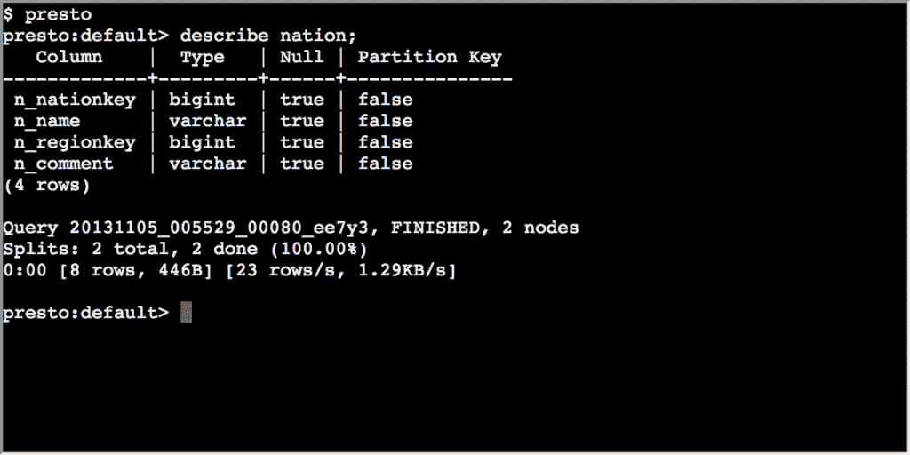

# 脸书的 Presto 大数据查询引擎迁移到 Linux 基础上

> 原文：<https://thenewstack.io/facebooks-presto-big-data-query-engine-moves-to-the-linux-foundation/>

最初在脸书开发的开放源码交互式数据查询引擎 [Presto](http://prestodb.github.io/) ，正在作为新成立的 [Presto 基金会](https://www.linuxfoundation.org/uncategorized/2019/09/facebook-uber-twitter-and-alibaba-form-presto-foundation-to-tackle-distributed-data-processing-at-scale/)在 Linux 基金会的管理下运行。

脸书开源软件工程经理 Kathy Kam(T7)说:[Linux 基金会](https://www.linuxfoundation.org/)似乎是这个项目的天然家园。

“我们希望让社区掌握决策权，并影响技术的发展方向，”她说。

脸书[在 2013 年开源了](https://www.computerworld.com/article/2485668/business-intelligence/facebook-goes-open-source-with-query-engine-for-big-data.html)这项技术。

Linux 基金会战略项目副总裁迈克尔·多兰(Michael Dolan)说:[这个项目与另一个基金会](https://www.linkedin.com/in/michaelkdolan/)[完全不同，后者是在 1 月份](https://thenewstack.io/prestos-new-foundation-signals-growth-for-the-big-data-sql-engine/)为相同的大数据 SQL 查询引擎而成立的。这个实体涉及到它的创造者[马丁·特拉弗索](https://github.com/martint)、[戴恩·桑德森](https://github.com/dain)和[大卫·菲利普斯](https://github.com/electrum)。截至本文发布之日，另一家 Presto 基金会尚未对媒体的询问做出回应。

Dolan 说，Linux 基金会领导的努力将通过一个过程成为一个更加中立的、以社区为重点的开源项目，超越脸书对该项目的计划。

“在接下来的一年里，我认为你会看到社区聚集在一起，形成规范和方法来建立对项目的共识，”他说。“随着越来越多的公司开始关注 Presto 并依赖它，我们希望看到更多的声音进入社区。”

据脸书 Presto 团队的软件工程经理 Nezih Yigitbasi 称，该集团的核心公司脸书、阿里巴巴、推特和优步在数千台机器上使用 Presto，规模达到 Pb 级。

Presto 有很多竞争对手，包括 Apache Drill、Apache Impala、Spark SQL、Apache Hawk，以及最近的开源选项之一，GPU 加速的 [BlazingSQL](https://thenewstack.io/blazingsql-a-gpu-accelerated-sql-engine/) 。

据该组织称，它解决了必须在快速但昂贵的商业产品和免费但需要过多硬件的较慢选项之间做出选择的问题。

根据 Yigitbasi 的说法，与其他开源选择相比，Presto 通常在资源方面更有效。它以高性能和大规模著称。

“在脸书，一千多名员工使用 Presto，每天运行几百万个查询，处理数 Pb 的数据，”他说。

单个查询可以用于来自多个不同存储系统的数据，而无需移动数据。它可以[跨内部和云端的数据源](https://docs.starburstdata.com/latest/connector.html)进行查询，包括 HDFS、亚马逊 S3、Kafka、Cassandra、Postgres、Oracle 和 Redis。

而且非常可靠，Yigitbasi 说。

从它在这些大公司的使用来看，“一切都是经过战斗考验的，并证明可以正确工作。”

Linux 基金会是新堆栈的赞助商。

通过 Pixabay 的特征图像

<svg xmlns:xlink="http://www.w3.org/1999/xlink" viewBox="0 0 68 31" version="1.1"><title>Group</title> <desc>Created with Sketch.</desc></svg>