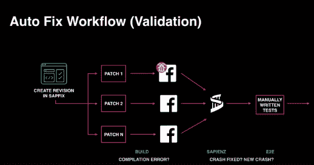
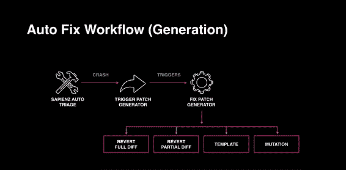

# 脸书用于 20 亿用户规模自动化测试的工具

> 原文：<https://thenewstack.io/facebooks-tool-for-automated-testing-at-2-billion-users-scale/>

测试通常是开发中最艰巨的部分——在开发运维以及个人代码所有权的世界中，程序员越来越多地承担起这个责任。随着代码变得越来越小，越来越分散，对自动化投资的需求也越来越大，尤其是测试自动化。如果开发人员撕掉他们的代码猴子标签，最终被认为是有创造力的工人，测试自动化是摆脱一些最平凡和重复的任务的好方法。

问题是测试并不总是可扩展的。开发和发布代码的人越多，失败的风险就越大。现在想象一下每天运行 100 多万个源代码控制命令，或者每周提交 100，000 个以上的代码，会有多大的错误风险。然后，考虑到在一个拥有超过 20 亿用户的应用上可能发生的几乎无限的点击、滑动和其他用户行为。有了这样的数字，脸书是大规模测试自动化的完美试验场。

Sapienz 是基于搜索的软件工程(SBSE)原则的一个应用，用于在脸书(以及更远的地方，一旦它是开源的)大规模自动化测试。)Sapienz 试图应用搜索技术来自动发现测试序列，然后通知开发人员潜在的错误。现在，它正朝着为所发现的错误提供最佳修复建议的方向发展。

这一切都回避了一个问题——如果开发人员不必担心那些不必要的无聊工作，他们能完成什么？

## 软件测试的不理想状态

“我不得不承认这是一个缓慢而痛苦的过程，”脸书工程经理 Mark Harman 在脸书 TAV 研讨会上谈到当前软件测试行业实践时说道。“如果我们真的对自己诚实，一个软件工程师早上醒来说‘我迫不及待地开始工作，这样我就可以测试我的软件了’，这真的很不寻常。”

但问题是，正如 Harman 所说，这意味着测试被认为是“不重要的”,因此它经常被推迟，直到紧急的错误或崩溃发生。对于复杂的分布式代码库，每个人都有能力做出贡献，这充其量是一种冒险的行为。

软件行业目前的实践状态是，工程师将设计测试用例，然后机器将执行它们。哈曼在加入脸书之前就听说，在学术界，机器实际上也设计测试。后者对脸书等拥有庞大用户基础的应用公司颇具吸引力，因为用户对应用的使用行为多种多样，每次潜在更新都可能有无数次测试。

Harman 解释说“测试本质上是一个巨大搜索库的一部分——太大了，无法一一列举。因此，我们的任务是试图找到智能计算搜索技术，如果有错误，它将找到那些更有可能揭示错误的测试序列。”

这是基于搜索的端到端系统级测试，将整个系统视为输入，避免了许多误报，Harman 称之为“无摩擦故障查找”

脸书大学的团队开发了用于系统级测试的 Sapienz，该测试应该介于随机模糊化(将随机或意外的数据引入软件)和智能人类设计之间。

Sapienz 现在支持许多运行在 Android 上的脸书应用程序，包括 Messenger、脸书 Lite、Instagram 和 Workplace，并且在任何给定时间，每个应用程序都运行数百个模拟器。

## 智能设计中基于搜索的软件测试中的适应度函数

当 Sapienz 测试脸书应用程序时，输入是用户可以做的任何事情——滑动、点击等。—默认的定义遵循隐含的原则:应用程序不应该崩溃。

Harman 表示，即使没有人工智能加入这种混合，这种随机搜索在避免崩溃方面也“令人惊讶地有效”，因为人类会自然地测试搜索基础的倾斜部分，通常会忽略角落情况。

请记住，这些脸书应用程序有 21 亿用户，所以即使是一个微小的，不可能的边缘情况通常也很重要。

那么这种随机性真的是智能的吗？基于搜索的测试中的一个关键要素是评估每个测试用例的适用性，以便智能地指导搜索。

API 策略师罗布·萨苏埃塔解释说，适应度函数是“用来将遗传算法的输出与理想值进行比较，并返回一个指示其接近程度的值。智能健身功能要么写得很好，要么可以根据需要进行调整。”

Harman 说，当你发现一个解决方案比另一个更“合适”时，Sapienz 不仅提高了测试覆盖率，还降低了序列长度，这样开发者就更容易找出错误。

“如果我们能够用智能适应函数将领域知识和专业知识融入我们的搜索，然后将这些知识和专业知识与良好的算法一起用于基于搜索的优化，那么这将产生一个过程，在这个过程中，结果将是精心设计的，”他解释说。

这个过程也是成功的，因为人工编写的测试用例非常脆弱，一旦 GUI 改变就会崩溃。有了 Sapienz 自动播种好的测试序列和子序列，它就便宜多了，而且不需要创建测试用例库。

这也允许脸书在生产中测试，只从测试用例中排除真实用户，这意味着测试尽可能地准确。

“在软件方面，我们有一种独特的工程材料，允许我们对材料本身进行优化，而不是对模型进行模拟，”哈蒙说。

测试结果是真实的人工制品，而不是航空工程师之类的模拟。

## 与开发人员交流错误，并最终修复它们

当然，所有这些都是无效的，除非你可以通知工程师他们的错误，然后他们可以采取行动。脸书将框架 FB Learner 用于其机器学习基础设施和工作流自动化。递归运算符将获取应用程序的最新版本，构建并运行测试搜索，发现崩溃，应用基于规则的方法来识别 DIFF 中的行并将其本地化，最后在审阅系统中将其报告给开发人员。这已经在全面运行了。开发者提交的每一个脸书安卓应用 DIFF，以及其他应用的许多应用，都经过了一系列 Sapienz 测试案例的测试。

当然，真正的梦想是自动修复，机器学习和基于搜索的测试软件不仅能找到漏洞，还能修复它们。这是 Sapienz 愿景的下一步。

Harman 问道，“如果很难自动设计一个测试用例来揭示一个错误，那么寻找代码的微小变化来修复这个错误会有多难呢？”

在学术领域，这被称为“自动化故障修复”这包括使用基于搜索的技术来生成候选解决方案，在此基础上再次运行您的测试用例，以查看哪一个是正确的修复。它甚至检查回归，并为您现有的软件找到近邻解决方案。

哈曼解释说，“如果你采用一个现有的系统，并试图调整和改进它，就像修复一个错误，这就像试图从猿进化成人类”，而不是从氨基酸进化成人类。与从更接近我们想要和需要的东西开始相比，从没有代码(或人类进化的氨基酸)开始在理论上可行，但在实践中花费的时间太长了。

他说，最近下载的 Messenger、Instagram 和其他运行在 Android now 上的脸书应用程序都是由自动修复的软件构建的，“使用基于搜索的软件测试自动设计的崩溃对测试案例进行搜索”。“这是一个完全自动化的端到端过程，直到找到的补丁被建议给开发人员，然后开发人员是最后的把关人，他说，‘是的，它将进入代码库。’"

这不仅包括删除坏的东西，还包括对差异进行部分和全部的修复，因为“在 insta-crash 被修复之前，你的测试已经被破坏了。”

在脸书，每隔几秒钟就会发布一次 DIFF，因此对一个 DIFF 进行完全恢复会对其他 DIFF 产生连锁反应。也有使用 Get-a-Fix 的模板，其思想是从过去人类设计的修复中学习。然后，当模板不能修复错误时，它们会发生突变，产生候选补丁，在获胜者被发送给开发人员批准之前，通过 Sapienz 对候选补丁进行重新测试。

> “我们的想法是，我们的测试必须不断适应，以免变得脆弱。人工测试做不到这一点，但自动化测试人员可以不断丢弃那些因为 GUI 改变而不再运行的测试，并生成新的测试。”——马克·哈曼，脸书。

这个自动修复系统还不是一个完全完美的工具，但更像是一个正在使用的原型，旨在向开发人员证明这可以工作，并观察他们如何应对工作流程中的变化和失控。

它也没有大规模的工作，因为他们只是将它应用于空指针崩溃。这当然是哈曼所说的最糟糕的自动化测试罪犯，但也是最容易发现和修复的。

为此，Sapienz 团队正在联系科学界，并在 2019 年 5 月在蒙特利尔举行的国际软件工程会议上，在同行评审的科学文献中发表自动修复工作。Sapienz 测试设计系统的[原型版本也可以作为开源](https://github.com/Rhapsod/sapienz)获得，其目标是整个产品最终开源。

脸书团队希望扩大技术规模，并为实验的最佳实践建立自动化基础设施，这将是开源的。

最后，TAV 研讨会的一名观众询问人类测试员是否还有未来。

“自动化很快就会带走跑腿的工作，”哈曼说。它是“自动化工程师所做的单调乏味的跑腿工作。我确实认为它会像高级语言一样，将人类提升到抽象链的顶端。”

<svg xmlns:xlink="http://www.w3.org/1999/xlink" viewBox="0 0 68 31" version="1.1"><title>Group</title> <desc>Created with Sketch.</desc></svg>