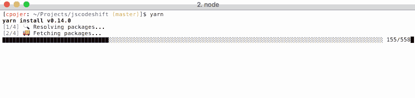

# 脸书纱线揭示了 JavaScript 包的依赖管理问题

> 原文：<https://thenewstack.io/facebooks-yarn-unraveled/>

脸书开源发布了该公司与谷歌、Exponent 和 Tilde 联合开发的新 JavaScript 包管理器，名为 [Yarn](https://code.facebook.com/posts/1840075619545360?__mref=message_bubble) 。Yarn 旨在成为一个更快、更可靠、更安全的 npm 客户端，保留对庞大的 [npm](https://www.npmjs.com/) (节点包管理器)注册表的访问，同时解决脸书和其他公司试图扩展 npm 以跟上工作人员和代码库指数增长时出现的问题。

脸书多年来一直使用 JavaScript 包和 Node 的 npm 客户端，该公司的许多项目——如 React——都依赖于 npm 注册表中的代码。然而，脸书的软件工程师发现，他们越来越多地花时间为突然出现的问题建立单独的解决方案——这些解决方案反过来又常常会产生新的问题。

这些问题中最常见和最棘手的包括在安装依赖项时不同机器和用户之间缺乏一致性，以及引入依赖项所需的时间越来越长。还有关于自动执行某些 npm 依赖项的代码的安全问题。

> Yarn 保证在每次安装时下载完全相同的依赖项集，从而降低了不同机器之间发生冲突的可能性

“像 Ember、Angular 和 React 这样的主要框架强调官方 npm 客户端的限制，这已经不是什么秘密了，”Ember.js 的联合创始人[耶胡达·卡茨](http://yehudakatz.com/)在关于发布的[博客帖子中写道。在 Yarn 开发的后期，Katz 作为一名积极的贡献者加入了这个项目，同时加入的还有“几十个来自其他公司的人”](http://yehudakatz.com/2016/10/11/im-excited-to-work-on-yarn-the-new-js-package-manager-2/)

脸书远不是唯一一家经历 npm 成长烦恼的公司，最初的 Yarn.js(不要与流行的 Hadoop 调度程序 [YARN](http://hortonworks.com/apache/yarn/) 混淆)开发团队联系了社区中的其他工程师。

Exponent、Google 和 [Tilde](http://www.tilde.io/) 都贡献了脑力来构建 Yarn 客户端，使其可以在所有主流 JS 框架上无缝工作，并且可以扩展到其他语言。

Yarn 旨在完全取代现有工作流中的 npm 客户端，同时保持与 npm 注册表的完全兼容。Yarn 的创建者表示，它具有相同的功能集，同时操作更快、更安全、更可靠，也是一个完全开源的社区项目，拥有自己的 GitHub 组织，使用的治理模式与 Rust 和 Ember 一样有效。

根据一篇[脸书的博客文章](https://code.facebook.com/posts/1840075619545360):

*   “纱线速度超快。在第一次安装一个项目后，Yarn 允许开发人员在几秒钟内添加和更新依赖项。任何规模的项目都会看到纱线的好处；代码基数越大，好处越大。在我们的测试中，我们发现性能平均提高了 10 倍。

*   Yarn 保证在每次安装时下载完全相同的依赖集，减少了不同机器之间冲突的可能性。有了 Yarn，任何规模的工程师都可以访问 npm 注册表中他们的项目所需的成千上万的包，同时还具有快速移动和更好地控制代码执行方式的额外好处。"

这个“保证”是基于对部分[节点](/tag/node.js/)生态系统的重新思考。npm 客户端的功能是非确定性的，这意味着依赖关系按照给定用户安装的顺序进入给定的 **node_modules** 目录，因此, **node_modules** 目录的结构可能因人而异，这可能会引入令人恼火的模糊错误“它在我的机器上工作良好”。

为了解决版本问题，Yarn 使用锁文件和确定性安装算法。这将已安装的依赖项锁定到特定版本，并确保每个安装在所有实例的 **node_modules** 中产生完全相同的文件结构。此外，编写的锁文件是简洁的，以确保审查是简单的，并使用有序的密钥，以确保容易进行更改。

脸书工程师 [Sebastian McKenzie](https://twitter.com/sebmck) 、 [Christoph Pojer](https://github.com/cpojer) 和 [James Kyle](https://github.com/thejameskyle) 在博文中写道:“Yarn 让工程师在使用共享代码时行动更快、更有信心，这样他们就可以专注于重要的事情——开发新产品和新功能。”。

这是不是意味着 npm 坏了？与 Yarn 发展关系最密切的人说，事实远非如此。

“尽管人们对官方客户端有很多抱怨，但它确实是人们所依赖的，npm 团队多年来已经做了很多工作来改进它。我真诚地尊重他们的工作，并认为维护一个 npm CLI 客户规模和范围的项目所付出的努力远远没有得到应有的重视，”Yehuda Katz 写道。

毕竟 npm 是最流行的 [JavaScript](/tag/javascript/) 包管理器。它是 npm 注册表中超过 300，000 个软件包的网关，每个月有多达 50 亿次下载，有超过 500 万名工程师使用。

那些不在脸书或谷歌的极端规模下工作的人不太可能经历推动 Yarn 作为替代方案的问题。Node.js 领域的大部分参与者表示，这确实是一种“人越多越好”的情况。

“JavaScript 和 Node.js 在过去几年里发展迅猛，” [Node.js 基金会](https://nodejs.org/en/foundation/)的社区经理 [Mikeal Rogers](http://mikealrogers.com/) 说。“随着企业越来越多地利用 Node.js 来扩展和满足当今移动和设备驱动的世界的需求，对软件包生态系统的需求也在持续增长。很高兴看到对 Node.js 和 Node.js 生态系统的持续投资。”

尽管如此，其他人还是乐于接受 npm 的替代方案。

“这对 JavaScript 社区来说是一个巨大的飞跃——可能比许多人马上意识到的还要多，”[黑客新闻](https://news.ycombinator.com/item?id=12684980)上的一位评论者写道，他将 Yarn 比作 Rust 的包管理器 Cargo。

<svg xmlns:xlink="http://www.w3.org/1999/xlink" viewBox="0 0 68 31" version="1.1"><title>Group</title> <desc>Created with Sketch.</desc></svg>