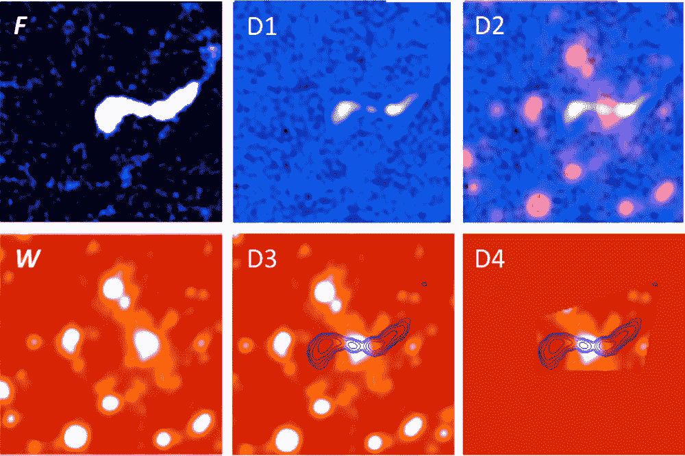
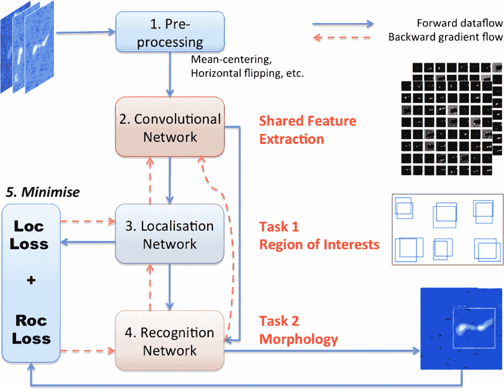

# 面部识别算法被重新训练以识别遥远的星系

> 原文：<https://thenewstack.io/facial-recognition-aigorithm-re-trained-to-recognize-faraway-galaxies/>

用于检测和识别物体的技术在过去几年里已经有了很大的发展，正在被用于自动驾驶汽车中，用于[识别行人](https://thenewstack.io/deep-learning-algorithm-helps-driverless-cars-recognize-pedestrians-better/)、[从视频中提取数据](https://thenewstack.io/using-opensource-watson-turn-videos-data/)，或者赋予机器能力[识别人脸](https://thenewstack.io/amazons-got-goods-banish-long-lines-whole-foods/)和[知道你的感受](https://thenewstack.io/affective-computing-emotionally-intelligent-machines/)。这种人工智能计算机视觉的使用似乎没有限制，现在来自西澳大利亚大学和国际射电天文学研究中心(ICRAR)的一个团队正在利用相同的深度学习技术来识别外太空深处的遥远星系。

昵称为 ClaRAN(ClaRAN 是 **Cla** 分类**R**adio sources**A**automatically with**N**eural networks)的算法改编自脸书和微软使用的相同面部识别技术。但是，ClaRAN 不是扫描人脸，而是扫描射电望远镜的图像，以检测所谓的[射电星系](https://en.wikipedia.org/wiki/Radio_galaxy)——一种活动星系核(AGN)，它发出强烈的光，但在无线电波长，而不是在可见光谱内。正是从这些星系中心的超大质量黑洞中，出现了这些无线电波射流。

天文学家[Ivy Wong](https://www.icrar.org/people/iwong/)博士，最近发表的[论文](https://academic.oup.com/mnras/article/482/1/1211/5142869#)的主要作者之一，告诉 *[科学日报](https://www.sciencedaily.com/releases/2018/10/181031080608.htm)* “这些超大质量黑洞偶尔会喷出可以用射电望远镜看到的喷流”。“随着时间的推移，喷流可以从它们的主星系延伸很远，这使得传统的计算机程序很难找出星系的位置。这就是我们试图教 ClaRAN 去做的。”

根据该团队的说法，目前使用的传统计算机算法可以识别大约 90%的无线电辐射源。

“由于其扩展结构的复杂性，仍有 10%，即 700 万个‘困难’星系必须由人类肉眼观察，”Wong 博士解释道，他还强调了公民科学项目的重要性，如射电星系动物园(RGZ)项目，以发现这些难以捉摸的剩余星系。“如果 ClaRAN 将需要视觉分类的来源数量减少到 1%，这意味着我们的公民科学家有更多的时间来研究新类型的星系。”

## 一种更快的卷积神经网络

为了做到这一点，ClaRAN 接受了同时执行两项关键任务的训练:在给定的图像中识别无线电喷流的来源，并对已识别来源的形态进行分类。特别是，ClaRAN 的算法是基于一种叫做[更快的基于区域的卷积神经网络](https://towardsdatascience.com/r-cnn-fast-r-cnn-faster-r-cnn-yolo-object-detection-algorithms-36d53571365e)方法的[卷积神经网络](https://en.wikipedia.org/wiki/Convolutional_neural_network) (CNN)，这种方法比它的前辈提供了显著的性能提升:它使用起来直观灵活，在识别射电源方面更准确更快。然后，使用数千幅世界坐标系对齐的同一空间区域的无线电和红外图像来训练该算法。在识别这些成对图像中的射电源后，它将把探测到的信号源归类到 RGZ 使用的六种形态类型之一。此外，该团队的方法提供了他们所谓的“单一的、端到端的数据管道”

“端到端，我们的意思是整个训练管道只有一个单一的优化步骤，这两项任务在一次训练迭代中同时训练，”该团队写道。“这也意味着在获得手工制作的特征时几乎不需要人工参与，特征提取主要是由从训练集中学习的卷积核驱动的，而不是由专家强加的事先假设。”

该团队使用人工智能交叉匹配这些不同数据源的方法似乎非常有效，使用无线电和红外图像精确定位射电星系的准确率超过 90%。正如该团队所指出的，随着我们对浩瀚宇宙越来越深入的窥视能力随着更好的硬件而提高，在下一代射电巡天中收集的数据量(例如即将到来的

[Evolutionary Map of the Universe](https://www.atnf.csiro.au/people/Ray.Norris/emu/index.html)

)将是巨大的——这意味着像 ClaRAN 这样的工具将在未来使这种研究切实可行方面至关重要。

图片:NASA &吴、陈；Wong，Oiwei Ivy

<svg xmlns:xlink="http://www.w3.org/1999/xlink" viewBox="0 0 68 31" version="1.1"><title>Group</title> <desc>Created with Sketch.</desc></svg>