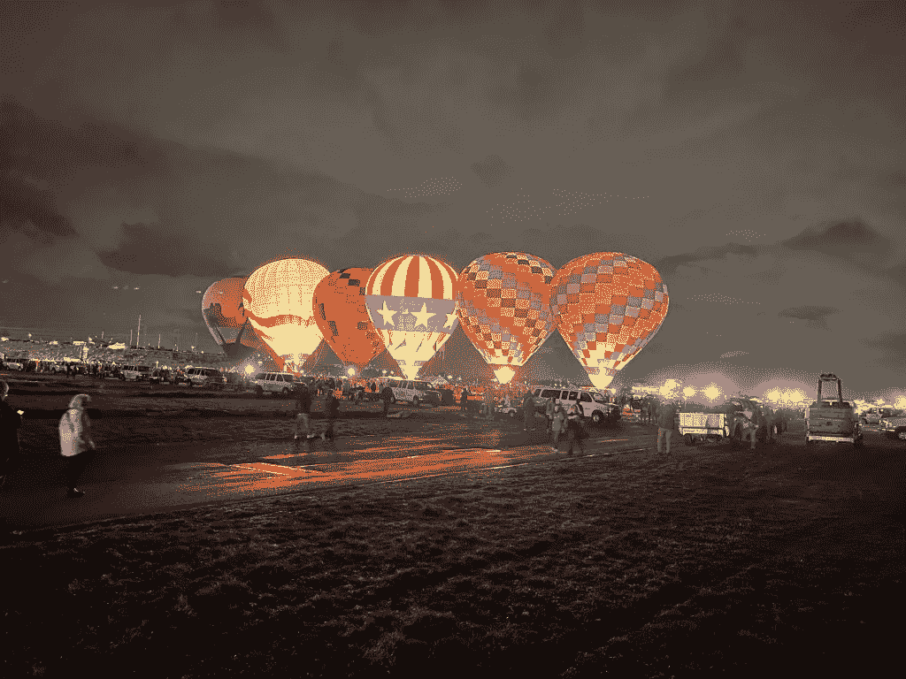

# 在阿尔伯克基的气球节上面对技术的极限

> 原文：<https://thenewstack.io/facing-technologys-limits-at-albuquerques-balloon-fiesta/>

这是令人兴奋的飞行奇迹，每年都用最新的特殊设备和最先进的装备来庆祝。半个世纪以来，热气球飞行员一次又一次地面对他们的技术无法做到的限制，同时在新墨西哥州阿尔伯克基的大型气球节阿尔伯克基气球节上尽情享受它所能做到的。

2022 年 10 月 6 日，星期四，阿尔伯克基气球节的直播截图——特殊形状的地面照片

但是，在让观众激动不已，并为乘客提供一生难忘的体验的同时，这项活动也展示了一种特定的技术如何演变成一种文化，无缝融入美国第 32 大人口城市的日常大都市生活。

飞碟形状的气球——阿尔伯克基气球节现场截图——小丑特殊形状，2022 年 10 月 6 日，星期四

当参与者优雅地庆祝气球艺术时，他们也展示了它如何逐渐转化为更多的东西——一些神奇、有意义的东西，但总是像技术本身一样不可预测。

## 突袭着陆

始于 1972 年的阿尔伯克基“气球节”现在是地球上最大的气球节。600 多名热气球驾驶员被邀请带着他们的气球参加一种年度“大会”，在为期九天的节日的每个早上，他们同时飞向天空。

TC Currie 拍摄于 10 月 6 日

这些航班有着不可抗拒的吸引力，吸引着各行各业的人们。阿尔伯克基当地[科琳·佩里](https://albuquerque.momcollective.com/author/colleenperry/)形容自己是一个“家庭主妇和训狗师”——但她现在也领导着早期“黎明巡逻”气球的追逐队。他们帮助气球充气——但随后跟随它的飞行路线，这样他们就可以帮助它着陆，然后分解它，这样它就可以被运送回来，供以后发射。

事实上，预计今年将有 80 万游客，这是一个由各种冒险家和爱好者组成的社区，其中至少有一对游牧夫妇将一辆巴士改造成了一个梦想中的家。他们在 YouTube 上分享了[他们自己的视频，这是“黎明巡逻队”为黎明前的飞行而充气(并点燃内部)的第一批气球](https://www.youtube.com/watch?v=0y8pBI4HkJI)

但是，当看着第一批气球照亮清晨的黑暗时，这对夫妇也在思考乘气球的基本挑战:“他们一直不知道他们会在哪里结束。”

至少在莱特兄弟第一次飞行的一个世纪前，人类已经在试验用气球升空，给气球充入热空气或比空气轻的氢气。这项技术总是有其局限性，这是每年在气球节上实时上演的一课。气球驾驶员只能选择何时上升和何时下降，其他所有动作都由他们上方和下方的风向决定。每天都有数百个气球升空，每个飞行员都面临着这种不可预测性。周四，当地电视台 KOB [捕捉到一个气球降落在郊区街道上的镜头。](https://www.youtube.com/watch?v=kd2sbzM3jt8&t=7992s)

这种情况并不少见。

在卡梅尔大道和圣克拉丽塔的交叉口意外着陆。大卫·卡塞尔摄影

10 月 6 日，星期四——一只气球降落在激光眼科手术诊所的停车场。大卫·卡塞尔摄影

去年 WBUR [指出](https://www.wbur.org/hereandnow/2021/10/08/hot-air-balloon-ride-albuquerque)当地的土地所有者甚至铺开彩纸邀请气球驾驶员着陆(或者告诉他们在别处着陆)。但他们也指出，2021 年，在两个气球意外撞上电线后，1200 户家庭断电。

本周的一天早上，那对坐在改装巴士上的夫妇发现，风把一名热气球驾驶者吹进了他们的停车场。他们后来采访了另一名气球驾驶员，他故意开玩笑说，“一旦燃料耗尽，着陆就很容易了”，同时还记得另一只实际降落在便利店停车场的气球。

从好的方面来看，他指出，“我还没有错过地面。”

其他陷阱也在等待着。一名工作人员在一个公园里成功地打包了他们的气球——却发现沉重的装备把他们的卡车沉入了公园柔软的草地里。

Dana Seymour 摄于 10 月 6 日

正如一家气球公司[微妙地描述的那样](https://www.hotairballoonatics.com/faq-s)，“最终，气球随风而行，并不总是停留在我们过去降落过的地方。”但他们向潜在客户保证，“新墨西哥人喜欢热气球，大多数居民和业主都很高兴让我们在附近降落气球。”

佩里在一个名为“阿尔伯克基妈妈”的博客中写道:“真正追逐的乐趣之一是永远不知道气球会在哪里结束，或者会飞多长时间。”。

事实上，不可预测性已经成为当地文化的一部分。“在居民区着陆的最大好处之一就是让附近的人参与进来，”佩里补充道。“只要条件可以，追剧人员会经常请围观者帮忙把气球弄下来。如果可能的话，我们还会在放气之前让孩子们在篮子里呆一会儿。”

观众有时甚至会参与一项由来已久的传统:气球驾驶员总是带着一瓶香槟。传说第一个气球被误认为是喷火的龙或来自另一个世界的恶魔——法国气球驾驶员带来了香槟，以证明他们是普通的热爱乐趣的法国人。

直到今天，当你在土地上意外着陆时，它对安抚愤怒的土地所有者还是很有用的。一名追逐机组人员称赞他们的飞行员，当他们降落在一个商业树木种植场时，他们分享了香槟。

“如果一个气球降落在你的院子里，飞行员会和你分享香槟，以示感谢和善意，”佩里写道。

佩里还补充道，“我们通常也会搭配奶酪和饼干。”

## 追逐船员的刺激

在过去的半个世纪里，电影节逐渐积累并采用了最新的技术。一名地面“追踪人员”告诉我，他们还使用了一种基于网络的飞行追踪器来追踪他们服务的气球，这种追踪器可以立即将气球的 GPS 坐标转换成一张方便的可视化飞行路径追踪地图。空对地无线电现在增加了 GPS 跟踪系统，甚至还有备用手机，用于与地面人员联系。当然，气球驾驶员也使用高度测量高度计。

还有一个官方的气球嘉年华应用程序，现在可以向 Android 和 iPhones 提供新闻和日程更新。

但是现代技术继续在这个事件的优雅庆典中找到自己的方式。其中一个停车设施甚至由英特尔赞助并以其命名，芯片制造商也在电影节上放飞了自己的气球。

当地警察部门甚至会给孩子们戴上电子标签，这样他们就可以在活动中游荡，同时仍然能被他们的父母找到。在电影节官方直播的采访中，一名当地警察表示，该部门已经标记了“500 至 700 名儿童。”

当活动于 10 月 1 日开始时，第一项活动是无人机灯光秀。

[https://www.youtube.com/embed/hQWYn8xw_NQ?feature=oembed](https://www.youtube.com/embed/hQWYn8xw_NQ?feature=oembed)

视频

但是技术只能完成这么多，过去半个世纪也将嘉年华带到了一个面临气候变化的世界——以及由此带来的棘手的天气模式。

“美国唯一有雨的地方是新墨西哥州，”热气球驾驶者斯科特·阿普尔曼向当地新闻站抱怨道。(或者至少是唯一一个雨水过多可能导致洪水的州。)

气球节的气象学家布拉德·特梅尔告诉电视台，佛罗里达州的飓风伊恩已经在落基山脉形成了一个低压天气区。“它只是不能移动，因为飓风横扫东海岸。这种低气压在整个周末都在持续，导致了恶劣的阵雨和雷雨天气。”此外，低云降低了能见度——这对今年的气球飞行员来说是一个危险的情况。

标志性的“大规模升天”活动——数百个气球在早上一起飞向天空——由于下雨，一周内[取消了两次](https://twitter.com/balloonfiesta/status/1577809868747988993)。周四晚上的 Glowdeo 也被取消了，这是一个取悦观众的奇观，空气加热燃烧器被调节到照亮整个气球，创造了一个发光的画布盛会。

图片由 Dana Seymour 提供

但最令人失望的可能是壮观的长途气体动力气球比赛的取消，这让来自五个国家的八支不同的队伍失望，包括来自德国的父子队[，他们目前保持着世界纪录](https://balloonfiesta.com/Post/2022-America-s-Challenge-Celebrates-Silver-Anniversary)，根据电影节网页。(过去的参赛者从阿尔伯克基一路飞到加拿大，甚至美国东海岸，电影节网站补充道。)

活动的组织者已经安排了基于卫星的所有气球位置的实时跟踪，准备通过电影节的网站和电影节的 Android 和 iphone 官方手机应用程序进行网络直播。但最终，“天气条件使得安全、有竞争力的比赛无法进行，”嘉年华的官方网页[解释道。](https://balloonfiesta.com/Americas-Challenge)

然而，随着这一事件进入第二个半个世纪，气球驾驶员的精神仍然无畏无惧。Dana Seymour 告诉我，他们的飞行员是众多以气球驾驶员的祈祷结束所有飞行的飞行员之一。

“愿风温柔地欢迎你。
愿太阳用温暖的双手祝福你。
愿你飞得如此之高，如此之好，上帝会和你一起欢笑
，并将你轻轻地放回大地母亲慈爱的怀抱。”

在阿尔伯克基一家汉堡店享用午餐时，西摩说得更简洁了。

"在阿尔伯克基气球节上，我们反复发现的一件事就是快乐."

科罗拉多 2 号“追捕小组”成员——丈夫和妻子达娜和朱莉·西摩。

<svg xmlns:xlink="http://www.w3.org/1999/xlink" viewBox="0 0 68 31" version="1.1"><title>Group</title> <desc>Created with Sketch.</desc></svg>