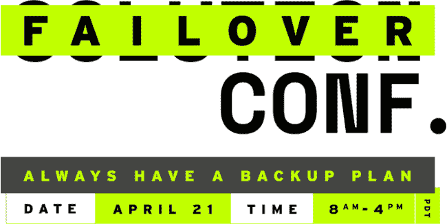

# 故障转移会议:面对不确定性确保弹性

> 原文：<https://thenewstack.io/failover-conf-ensuring-resilience-in-the-face-of-uncertainty/>

Gremlin 在 4 月 21 日下周二的[故障转移会议](https://failover-conf.heysummit.com/)上发表了这篇文章。

 [安德烈·纽曼

Andre 是 Gremlin 的技术作家，他在那里写了关于混沌工程的好处和应用。在加入 Gremlin 之前，他是初创公司和 SaaS 提供商的顾问，撰写了关于 DevOps、observability、SIEM 和微服务的文章。他曾在 DZone、StatusCode Weekly 和 Next City 中出现。](https://www.gremlin.com/) 

仅仅一个月的时间，我们的生活就完全改变了。办公楼现在空无一人，会议室一片漆黑，与同事共度时光意味着开始视频通话。[新冠肺炎·疫情](https://www.cdc.gov/coronavirus/2019-ncov/index.html)是一个严酷的教训，告诉我们世界变化有多快，但它也有力地提醒我们有多么坚韧和适应能力，尤其是在一个由技术连接的世界里。

在 [Gremlin](https://www.gremlin.com/) ，我们的使命是通过[混沌工程](https://thenewstack.io/chaos-engineering-can-give-distributed-systems-stability/)让互联网更加可靠。我们总是在思考事情是如何失败的，这同样适用于基于人的系统和基于技术的系统。当市政当局开始发布居家命令时，这对我们的工作能力几乎没有影响。但是许多组织发现自己处于一个全新的、不熟悉的环境中。如果组织不能适应这种新常态，他们就真的有失败的风险。

当我们想到弹性时，我们真正谈论的是从逆境、变化或其他问题中快速恢复的能力。有弹性的人和流程可以快速适应新的和不寻常的情况，正是这种“现实世界的弹性”可以在逆境中成就或摧毁一家公司。

也就是说，我们如何才能建立这种级别的弹性，尤其是因为我们已经处于疫情的中间？以下是一些建议:

总是想着失败。作为一家痴迷于可靠性的公司，我们总是在思考我们的系统和流程是如何发生故障的。这就是[故障转移配置](https://failover-conf.heysummit.com/)的由来。当活动取消开始淹没我们的新闻提要时，我们意识到期待这些活动的开发人员、专业人员和爱好者现在无处可去。我们很快执行了创建虚拟会议的计划，并在混沌工程社区的帮助下，实现了这个计划。虽然不可能为每一个突发事件做好计划，但即使是最好的计划也可能很快失败，因此制定后备策略非常重要。

**培养有韧性的人。**我们经常谈论应用于技术的混沌工程，但这只是一部分。没有弹性的人和过程，弹性系统就什么都不是。这就是为什么我们有消防演习这样的事情，在那里我们制造事故，看看我们的团队将如何应对。只要我们的员工能快速适应新环境，我们就能对自己应对逆境的能力更有信心。新冠肺炎正处于前所未有的逆境中，但想想 24 小时轮班工作的医生和护士所表现出的韧性，或者公司旋转装配线以制造个人防护设备，或者 SREs 努力保持技术服务的正常运行。社会依赖于那些能够在突发事件中做出快速战略决策的人，这就是为什么让他们加入你的团队非常重要。

**关注对客户来说重要的事情。**具备弹性意味着认识到失败可能带来的限制，并在这些限制内创造性地工作，以继续提供尽可能最好的客户体验。例如，对于 Failover Conf，我们的目标不是重现面对面的会议体验。我们意识到，社区在会议中重视的是与其他人交谈、向专家学习以及合作的能力。华丽的场地和纪念品是不错，但它们不是重点。对公司来说也是一样:如果你不能提供全面的服务，那就确定什么是重要的，并专注于此。

始终、始终、始终测试您的系统。正如我们今年所看到的，灾难可能在任何时候以任何形式出现。我们永远不知道会发生什么，所以我们需要确保我们的系统能够在最极端的情况下运行。在 Gremlin，我们相信吃自己的狗粮，所以我们使用自己的产品来测试我们的系统，使它们更加可靠。即使是现在，我们也在使用我们的混沌工程工具来准备我们的平台，以应对与会者登录、流式视频和全天运行实验时我们预计会看到的需求激增。

从你的经历中学习。一旦尘埃落定，反思事件和你的反应。考虑它有什么影响，你准备得如何，你如何回应，以及你本可以做些什么。这通常说起来容易做起来难，尤其是对于一个仍在进行的事件。但是对我们来说，改进的最好方法是从过去的经验中学习，并为未来做好计划，作为一个社区来分享这些经验有助于我们更快地成长。

## 结论

我们将混沌工程视为一种强化我们的应用程序和基础设施以抵御故障的方法。但归根结底，技术只是用来支持人们的。如果我们作为个人、团队、公司和社区没有弹性，那么即使最有弹性的系统对我们也没有多大价值。

Failover Conf 有两个主要目的:为混沌工程社区提供一个在会议取消后聚集在一起的平台，并展示我们作为一个社区可以多快地适应新环境并创造出令人惊叹的东西。

*无论您是多年来一直从事混沌工程的专家还是刚刚起步，我们都邀请您于 4 月 21 日上午 8 点到下午 5 点参加我们的[活动。](https://failover-conf.heysummit.com/)*

<svg xmlns:xlink="http://www.w3.org/1999/xlink" viewBox="0 0 68 31" version="1.1"><title>Group</title> <desc>Created with Sketch.</desc></svg>