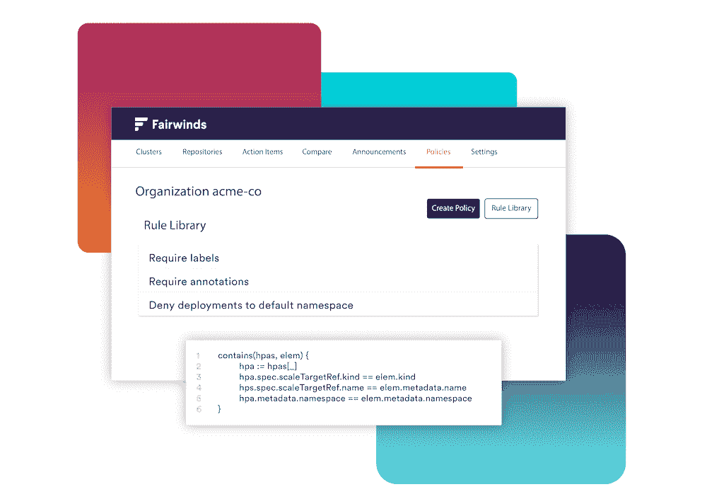

# Fairwinds Insights 为开发人员带来了 Kubernetes 配置检查

> 原文：<https://thenewstack.io/fairwinds-insights-brings-kubernetes-configuration-checks-to-the-developer/>

随着 Kubernetes 在云生态系统中获得更广泛的采用，安全团队(和领导层)需要一种方法来利用一组现成标准中的最佳实践，并编写自己的策略，以使整个组织的人员能够采用具有统一标准的 Kubernetes。

为了应对这一速度， [Fairwinds](http://www.fairwinds.com) 发布了 [Fairwinds Insights 2.0，](https://www.fairwinds.com/blog/fairwinds-insights-v2.0-now-available)包括允许将配置检查“向左转移”到 CI/CD 管道中的新功能，以及在大型企业中执行策略所需的工具。 [Fairwinds Insights](https://www.fairwinds.com/insights) 是一个专注于安全性、可靠性和效率的配置验证平台。它来自 Fairwinds 自己的开源项目，如 [Polaris](https://thenewstack.io/polaris-points-the-way-to-kubernetes-best-practices/) Kubernetes 配置检查器以及第三方开源工具，如 Aqua Security 的 [Trivy](https://github.com/aquasecurity/trivy) 。

“Fairwinds Insights 2.0 实现了‘左移’，让开发人员能够看到 Kubernetes 的错误配置，从而可以在开发生命周期的早期解决这些问题，”Fairwinds 首席执行官比尔·莱丁汉姆在一份声明中说。“Fairwinds Insights 支持 DevSecOps，确保安全性在整个开发过程中紧密集成。通过主动的、策略驱动的配置验证、对安全风险的更高可见性以及从开发到生产的一致性，团队可以节省时间和资金。”

除了 1.0 版本中包含的最佳实践之外，Fairwinds Insights 2.0 现在还支持使用开放策略代理(OPA)编写自定义检查，并将策略作为代码启用。

对于在整个组织中拥有许多 Kubernetes 集群的组织，Fairwinds Insights 2.0 通过支持 Kubernetes 的服务所有权来应对这种增长。运营和安全团队可以构建基础设施并制定策略，这些策略将在 CI/CD 管道或准入控制器中强制执行，从而向负责服务的工程师揭示问题并提供解决方案。

<svg xmlns:xlink="http://www.w3.org/1999/xlink" viewBox="0 0 68 31" version="1.1"><title>Group</title> <desc>Created with Sketch.</desc></svg>