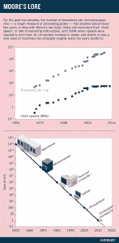

# 告别摩尔定律

> 原文：<https://thenewstack.io/farewell-moores-law/>

“半导体行业将很快放弃对摩尔定律的追求，”科学杂志*《自然* 的标题[警告道。英特尔的联合创始人戈登·摩尔在 1965 年曾预言，微处理器上的晶体管数量将每两年翻一番。但 50 多年后，这将不再是半导体行业的指导现实。](http://www.nature.com/news/the-chips-are-down-for-moore-s-law-1.19338)

*《自然》*周二报道称，“由于越来越多的硅电路挤在同一个小区域内不可避免地会产生热量，这种翻倍已经开始动摇。”

戈登·摩尔，来自英特尔在 2015 年拉斯维加斯消费电子展上的“摩尔定律 50 年”演讲。

但是还有另一个罪魁祸首:量子物理学。据《自然》报道，微芯片的电路特征已经达到 14 纳米，比一根头发的宽度还要小几千倍。

负责半导体行业路线图小组的 Paolo Gargini 告诉该杂志，到 21 世纪 20 年代初，芯片将开始达到“2-3 纳米的极限”，这是一个硬极限，“特征只有 10 个原子宽”，分子之间的电流流动变得更难预测。

这一消息引起了整个技术媒体的反响。“摩尔定律在长期患病后去世，享年 51 岁，”Ars Technica 写道。基督教科学箴言报 补充道 [*“归咎于量子不确定性”。但它的真正意义在于，多年来，摩尔定律已经从一个观察结果演变成了芯片制造商追求的自然目标。*](http://www.csmonitor.com/Technology/2016/0211/Moore-s-law-is-coming-to-an-end.-Blame-quantum-uncertainty)

多年来，摩尔定律一直是行业官方路线图的基础，由代表美国、日本、韩国、台湾和欧洲 936 家半导体制造商的专家小组每两年发布一次，以帮助协调芯片生产的各个阶段。

一本 1998 年的经济学教科书甚至注意到“当在预测的时刻存在技术规格达不到要求的危险时，就要付出额外的努力。企业利用法律来指导特定技术的投资决策……政府愿意提供补贴，以帮助企业避免达不到预期价值的危险。”

但下个月，这一翻倍将首次不再反映在行业路线图中。

去年，86 岁的戈登·摩尔通过视频在消费电子展上特别亮相。摩尔[告诉观众](https://www.youtube.com/watch?v=iPUKqhCZzi0)“我试图传达的信息是，集成电路是通向更便宜电子产品的道路。

据《自然》杂志报道，早在 1965 年，摩尔就正确地预测到，廉价的半导体可能会导致家用电脑、个人通讯设备、电子手表和汽车自动控制。但当谈到他的著名预测时，摩尔记得“它确实从衡量行业发展演变为或多或少推动行业发展的东西。”

《自然》杂志还分享了他们采访丹·里德的声音片段，他现在是爱荷华大学的管理人员，前微软公司副总裁。

“整个经济引擎基于这种增长模式，即每一代新设备都更小、更快，而且销量更高——这变得越来越难实现。"

不是说不可能。“我敢打赌，在我们耗尽物理学之前，我们将会耗尽资金，”里德告诉《自然》杂志，“因为建造下一代半导体生产线的成本已经从数百万美元上升到数十亿美元，并且还在继续攀升。”

但也不全是坏消息。“物联网的兴起是即将到来的重大事件之一，”里德告诉该杂志。"这实际上是基于数十亿个非常小且相对简单的设备."

据领导英特尔高级微处理器研究部门的 Skehar Borker 说，一般来说，消费者只是希望看到他们的价值翻一番。他告诉《自然》*,仍然有可能以其他方式交付这些设备。*

 *“我们的工作是设计它们。”

或者，正如摩尔自己在 2015 年 CES 上对观众说的，“只要记住。无论做了什么都可以超越……”

[https://www.youtube.com/embed/iPUKqhCZzi0?feature=oembed](https://www.youtube.com/embed/iPUKqhCZzi0?feature=oembed)

视频

英特尔是新堆栈的赞助商。

<svg xmlns:xlink="http://www.w3.org/1999/xlink" viewBox="0 0 68 31" version="1.1"><title>Group</title> <desc>Created with Sketch.</desc></svg>*