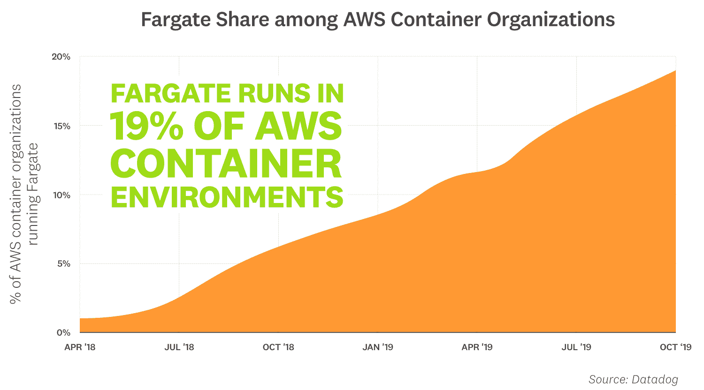
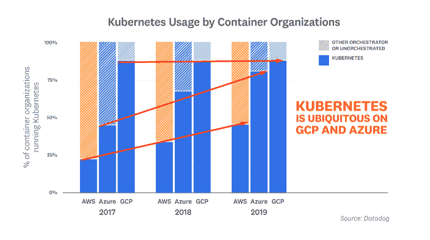

# 在 AWS 客户中，Fargate 的增长速度超过了 Kubernetes

> 原文：<https://thenewstack.io/fargate-grows-faster-than-kubernetes-among-aws-customers/>

除非您的组织大规模广泛使用容器，否则 Kubernetes 不会成为容器编排的既成事实。

是的， [Kubernetes 超过了通用容器的采用](https://thenewstack.io/what-does-kubernetes-need-to-address-in-2020/)，但在 Datadog 的容器使用客户群中，它去年“仅”增长了 29%(2018 年 10 月为 35%，2019 年 10 月为 45%)。根据监测公司关于[改变容器格局](https://www.datadoghq.com/container-report/)的最新报告，亚马逊网络服务的 Fargate 采用率在使用容器的 AWS 客户中上升了约 170%至 19%。

Fargate 的计算引擎允许亚马逊弹性容器服务(Amazon ECS)的用户在不管理服务器或集群的情况下运行容器。这种易于使用、低维护的选择可能很有吸引力，尤其是对于那些担心 Kubernetes 复杂性的小型运营团队的公司。

[管理员/操作员体验](https://thenewstack.io/ux-is-kubernetes-biggest-short-term-challenge/)仍然是 Kubernetes 的一个痛点。作为对这一问题的部分回应，出现了诸如亚马逊弹性 Kubernetes 服务(亚马逊 EKS)之类的托管 Kubernetes 服务。事实上，在云计算原生计算基金会的交互环境中，已经列出了 125 个经过认证的 Kubernetes 平台相关产品。Datadog 的研究发现，大约 40%使用 Kubernetes 的 AWS 用户选择了 EKS。根据新堆栈的计算，这意味着 17%使用容器的 AWS 客户选择其 Kubernetes 托管服务，而不是其自己的 Fargate 产品。

尽管 IT 基础设施提供商主要决定在 Kubernetes 上进行构建，但这并不意味着整个 IT 社区都在赶潮流。Rishidot Research 最近的“[决策者指南— Nomad Vs Kubernetes](https://github.com/rishidot/Decision-Makers-Guide/blob/master/Decision%20Makers%20Guide%20-%20Nomad%20Vs%20Kubernetes%20-%20Oct%202019.pdf) ”警告人们不要将容器编制器进行比较，但提醒我们非 Kubernetes 选项可能仍然是一些公司的最佳选择。

新的堆栈在原始图形中添加了箭头，以展示 AWS、谷歌和微软 Azure 之间的增长率差异。

* * *

在过去的 16 年里，劳伦斯·赫克特一直在撰写关于信息技术市场的研究报告。他出版《T2》周刊，并管理新书库的调查研究项目。

<svg xmlns:xlink="http://www.w3.org/1999/xlink" viewBox="0 0 68 31" version="1.1"><title>Group</title> <desc>Created with Sketch.</desc></svg>