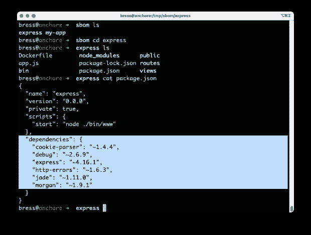
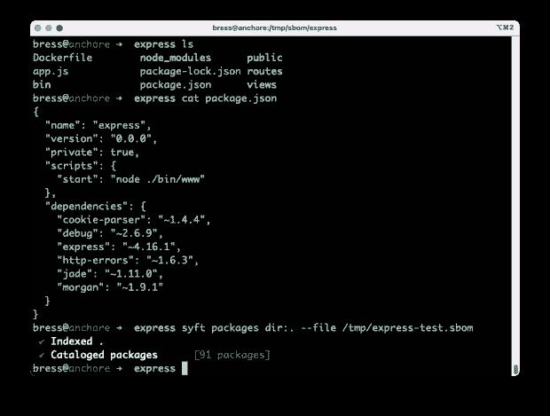
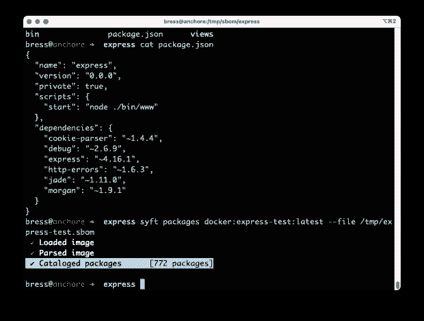
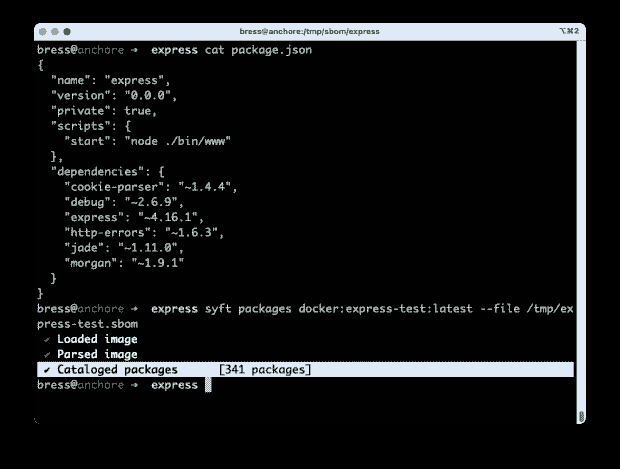

# 速度与激情:双倍下注 SBOM 漂移

> 原文：<https://thenewstack.io/fast-and-furious-doubling-down-on-sbom-drift/>

如今，你一转身就能碰到谈论软件材料清单(SBOMs)的人。每个人都在关注软件供应链安全，这是一个好消息，尤其是因为 SBOMs 是这一切的基础。

作为背景，联邦网络安全和基础设施安全局( [CISA](https://www.cisa.gov/sbom#:~:text=A%20SBOM%20is%20a%20nested,Administration's%20(NTIA)%20multistakeholder%20process.) )将 SBOM 定义为“嵌套的清单，组成软件组件的成分列表。”安全专业人员和开发人员使用 SBOMs 以前所未有的方式深入了解我们的软件。了解我们软件中的内容是安全之旅的第一步。

但是 SBOMs 还有另一个方面没有被讨论。这就是所谓的漂移。漂移背后的想法很简单:应用程序中包含的依赖关系将在构建步骤中以及随着时间的推移而改变。可能会添加新的依赖项，删除或升级旧的依赖项。

如果你今天创造了一个 SBOM，它可能不是你明天创造的同一个 SBOM。某些依赖可能会添加或删除内容，或更新版本，甚至完全消失。有时，依赖项的数量会根据发生的情况发生巨大的变化。

像许多新话题一样，实际展示这一点比解释它要容易得多。在这种情况下，显示生命周期漂移要比显示基于时间的漂移容易得多，但原理是一样的。随着应用程序的开发，SBOM 经常会改变每一步。

## **举重若轻**

对于这个特殊的例子，我们将使用来自 Anchore[的开源](http://www.anchore.com) [Syft](https://github.com/anchore/syft/) 项目。Syft 是一个可以从你的项目、应用程序、容器等等中生成 SBOM 的工具。它易于使用，支持大量的语言和生态系统。

首先，让我们创建一个非常小的 Node.js 应用程序，它使用一个名为 Express 的库。这个演示是通过运行`npx express-generator`创建的，它负责所有的设置，并包括一些外部依赖项以使一切正常工作。如果我们查看 package . JSON(NPM 存储依赖关系细节的文件)，我们可以看到在我们的演示应用程序中有六个依赖关系。

现在我们通过运行`npm install`来安装这些依赖项。下载所有依赖项需要几分钟时间。请记住，依赖关系也可以有自己的依赖关系。那些依赖也有依赖。一旦这些都完成了，我们最终会有很多层的依赖关系。

现在，如果我们用 Syft 扫描项目，我们会在 npm 安装后看到 91 个包。刚刚发生了什么？这是 SBOM 漂移的一个例子。我们认为我们的项目有六个依赖项，但是当我们安装这些依赖项时，数量激增到 91 个。这没什么不好；现代应用程序确实需要大量的库来为我们完成繁重的工作。问题是当我们没有意识到发生了什么。

如果我只看 package.json 依赖项，我只看到六个。我可能会错误地认为我只使用了六个额外的依赖项。但是运行中的应用程序显然需要更多。

## **观看漂移**

现在，应用程序的下一步是构建一个容器，它将在生产环境中部署和运行。您可能已经发现，当我们将应用程序放入容器中时，依赖项的数量也会增加。对于这个例子，我们将使用 node:15 容器图像。它被命名为`express-test:latest`，所以这就是我们要告诉 Syft 扫描的内容。

772!这可比 91 年多了。

在我们的发展过程中，我们从 6 个依赖关系到 91 个，现在是 772 个。这是 SBOM 漂移的想法。随着我们软件的开发，会有一些变化。有时这些变化很大；有时它们很小。跟踪这些变化可以让我们深入了解我们的环境正在发生什么。

如果我们不创建和观察 SBOMs，我们可能仍然认为我们有六个依赖项。如果我们只在构建时扫描项目，我们会认为我们有 91 个依赖项。这个例子的目的是说明在整个过程中的每一步构建 SBOMs 的重要性。仅仅在第一次构建时创建一个 SBOM 会遗漏一些东西，仅仅在最后扫描一个 SBOM 并不能告诉我们在哪里或者为什么引入了依赖。

## **攻击面**

所有这些还有一个非常重要的角度，它涉及到挑选我们的依赖关系。我们在应用程序和容器中包含的所有东西都可能是安全人员所说的“攻击面”的一部分。

基本思想是，您包含的依赖项越多，您的攻击面就越大。普遍认为小的攻击面比大的好。

如果我们尝试一个更小的容器图像呢？Alpine Linux 以其小巧著称。让我们看看如果我们使用它会发生什么。

它显示了 341 个包，这仍然是一个很大的依赖项，尽管比我们构建的第一个超过 700 个包的容器要少得多。我们可以这样想，我们的依赖性攻击面几乎被减半了。现在，我不再需要跟踪和管理 772 个依赖项，而是必须跟踪和管理 341 个。

## **测量两次，切割一次**

这个例子只是通过展示一个简单的例子来说明为什么 SBOM 漂移是软件开发和部署过程中的一个重要指标。如果我们不衡量我们的软件在许多不同的地方发生了什么，我们可能会对我们的环境中发生的事情视而不见。

老话“衡量两次，削减一次”在软件世界和在现实世界一样正确。我们正处于 SBOM 管理的最早期阶段，但像 SBOM 漂移这样的概念很容易理解，潜在的好处也同样简单。

洞察我们的环境有助于我们在软件构建过程中做出更好的决策。这反过来又有助于形成更强大的安全态势，能够长期抵御软件供应链安全违规。

<svg xmlns:xlink="http://www.w3.org/1999/xlink" viewBox="0 0 68 31" version="1.1"><title>Group</title> <desc>Created with Sketch.</desc></svg>