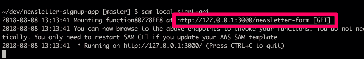
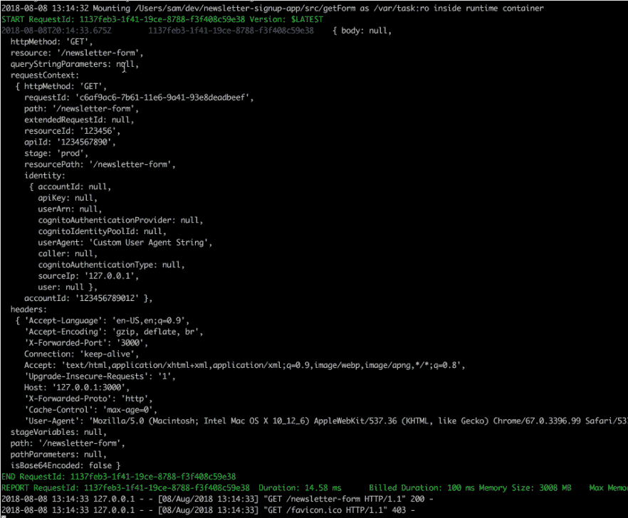

# 借助 Stackery 和 SAM CLI 更快更轻松地部署 Lambda

> 原文：<https://thenewstack.io/faster-and-easier-lambda-deployments-with-stackery-and-sam-cli/>

Stackery 赞助了这篇文章。

 [托比·费

Toby 是 Stackery 的社区开发人员。她的角色和经历结合了软件工程师、作家和技术讲师的工作，用新兴工具构建有趣的项目，并与世界分享她的发现。在加入 Stackery 之前，Toby 是 NWEA、瓦卡萨和新遗迹公司的工程师。](https://www.stackery.io/) 

无服务器可以作为一个简单的案例研究——但是这个平台也有它自己的警告。

与传统的虚拟机服务器相比，无服务器提供的优势包括:您的服务可以在几个小时内提供您实际需要的可用性，而无需随机打开端口。所有关于更新和时间管理的问题都变成了你的供应商的问题。

但是，当要编写更复杂的无服务器函数时，一个问题出现了:当你第一次部署你创建的代码时，你该怎么做？

似乎一个基本的 [lambda](https://aws.amazon.com/lambda/) ，通常只有十几行 JavaScript，就应该“正常工作”——但是功能错误和解析不正确的 JavaScript 都可能是主要的绊脚石。

这是一个部署工具，例如 [Stackery](https://www.stackery.io/) 提供的工具，使得部署多个小的改变到你的堆栈变得更加容易。

然而——无论你使用什么工具，你都要等几分钟才能观察到 Lambda 的任何变化。

每个代码更改额外的几分钟是最好的情况:如果您是团队的一员，并且没有部署权限，您可能必须等待您的领导吃完午饭回来。

幸运的是，有一个工具集可以在本地运行您的整个堆栈: [AWS Labs](https://github.com/awslabs) 提供了一个[无服务器应用模型(SAM) CLI](https://github.com/awslabs/aws-sam-cli) 工具，可以在本地运行您的代码。

但是通过使用 SAM 标准的 Stackery 的工具，一切都会变得更好更快——你可以可视化地创建你的堆栈，获得一个基本的配置，然后用 AWS 的工具运行它。

下面是一个基于我的经验的真实例子:在编写本指南时，我正试图在我的新 OSX 机器上安装 SAM CLI。问题是我运行的是预装版本的 Python。完整的解决方案将是一篇独立的文章，但是如果您[按照本指南设置 pyenv](https://github.com/pyenv/pyenv#homebrew-on-mac-os-x) ，然后运行 pyenv install 3.6.1&&pyenv global 3 . 6 . 1，使得 python-version 返回 3 . 6 . 1，您应该准备好按照下面的链接设置 CLI。

在您[安装了 SAM CLI](https://github.com/awslabs/aws-sam-cli) 之后，转到包含 template.yml 文件的文件夹，并使用:sam local start-api 来启动您的堆栈。

您的堆栈将在 Docker 容器中启动，在输出中您将看到您的函数的 URL。将它复制并粘贴到浏览器中，您将看到提供了相同的表单页面—真的就这么简单。

该工具还监视您的文件—您可以更新 index.js 文件，并在刷新本地 URL 后立即看到页面更新。

在这个例子中，我们的 index.js 文件也有一行 console.log(message ),记录了 lambda 获得的全部输入。加载本地 URL 后，您可以返回到您的 shell，并在此处看到 SAM CLI 输出的日志记录:

你还可以看到，绿色的是每个 Lambda 在被调用时的标准日志记录，向你显示它的开始和结束时间，而“报告”行显示了计费的时间。我不会把太多的股票在这个本地版本的尝试估计时间，但对于这些早期测试，我们不应该超过 100 毫秒的最低阈值。

SAM CLI 确实有一些限制:它不能运行 CloudFormation SAM 模板可以描述的所有内容，尽管它可以运行您需要的所有 API 端点和 lambdas。一旦您掌握了基础知识，请参阅 SAM CLI repo 文档了解高级技巧，例如将事件从多个模拟服务发送到您的 lambda。

在我职业生涯之前的一段时间，开发人员会在纸上手写工作代码，然后一次向编译器中输入数百行代码。的确令人印象深刻。然而，由于我们已经缩短了从编写到测试和修复的“开发周期”;这种更快的步伐一直是我们技术革命的驱动力。有了本地测试，您的开发循环现在应该更短了，更短的开发循环可以导致每周数百次的代码迭代。

为了进一步加速您的开发，考虑使用 [Stackery](https://www.stackery.io/) 来构建堆栈并作为一个团队来工作，使用 [Rookout](https://www.rookout.com/) 来测试动态运行 lambdas，使用 [Epsagon](https://epsagon.com/) 来增加对您的产品代码的可见性。

通过 Pixabay 的特征图像。

<svg xmlns:xlink="http://www.w3.org/1999/xlink" viewBox="0 0 68 31" version="1.1"><title>Group</title> <desc>Created with Sketch.</desc></svg>