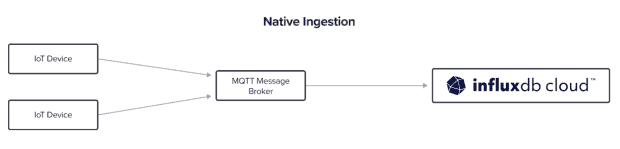

# 使用 InfluxDB 加快 MQTT 数据收集

> 原文：<https://thenewstack.io/faster-mqtt-data-collection-with-influxdb/>

[MQTT](https://www.influxdata.com/mqtt/?utm_source=vendor&utm_medium=referral&utm_campaign=2022-08_native-mqtt-collector_global&utm_content=tns) 是物联网(IoT)领域的巨头。它的发布/订阅模式和缺乏定义的有效载荷结构使它能够无限适应现代传感器、设备和系统的需求。物联网数据也是时序数据。带时间戳的数据使业务和应用程序能够跟踪实时和历史变化，它还可以有助于预测和预报。

InfluxDB 刚刚引入了一个新的[本地收集器](https://www.influxdata.com/products/data-collection/cloud-native/?utm_source=vendor&utm_medium=referral&utm_campaign=2022-08_native-mqtt-collector_global&utm_content=tns)特性，旨在加速从基于云的发布/订阅服务收集数据。这个新特性的第一个可用集成是原生 MQTT 收集器。

原生 MQTT 允许 InfluxDB 用户直接从 InfluxDB 云接口订阅 MQTT 主题。然后， [InfluxDB Cloud](https://www.influxdata.com/products/influxdb-cloud/?utm_source=vendor&utm_medium=referral&utm_campaign=2022-08_native-mqtt-collector_global&utm_content=tns) 服务直接与他们的 MQTT 代理通信，立即开始接收发布到这些主题的任何消息。

## 配置本机 MQTT

本地 MQTT 很容易设置，并且不需要在软件栈中安装任何额外的软件或者任何定制的代码。这是一个真正的无代码解决方案。因此，让我们来看看基本配置，以及您可以使用的一些额外的解析选项。

要让 MQTT 数据流入 InfluxDB 实例，原生 MQTT 需要三个基本配置步骤。

1.  **代理详细信息:**为 MQTT 消息代理指定 IP 地址、端口和认证参数。
2.  **主题名称:**提供您要订阅的主题的名称。
3.  **解析规则:**设置解析规则，将 MQTT 消息中的元素映射到 InfluxDB 的线路协议数据模型的不同元素:度量、时间戳、字段和标记。

嘣！就是这样。

## 数据解析选项

说到数据解析，您有几种选择。MQTT 允许使用通配符。+和#通配符允许您动态订阅特定代理上的一个或多个特定主题。通配符的使用符合 MQTT 关于主题名称和主题过滤器的规范。

您甚至可以将通配符与特定的写目的地结合起来，以优化 MQTT 代理的工作流。这样做允许您将特定主题的数据动态写入特定的 InfluxDB 桶。例如，您可以将能源相关主题的所有数据写入“能源”桶，将天气相关主题的所有数据写入“天气”桶。

最后，因为 MQTT 允许非结构化数据负载，所以原生 MQTT 特性允许您分别使用 JSON 路径表达式和正则表达式动态解析 JSON 和强负载。这意味着您可以从 MQTT 数据中挖掘时间戳、度量、字段和标记集，而不用考虑文本格式。

典型配置只需几分钟。一旦完成，发布到 MQTT 代理的任何消息都将作为时间序列数据流入 InfluxDB。此时，您可以启动任何必要的查询、可视化和警报，或者使用 [Flux 脚本语言](https://www.influxdata.com/products/flux/?utm_source=vendor&utm_medium=referral&utm_campaign=2022-08_native-mqtt-collector_global&utm_content=tns)为您的数据设置附加任务和转换。

## 结论

原生 MQTT 为开发人员提供了一种只需一步就可以在云中收集时间序列数据的方法。不再需要编写定制代码、编排额外的技术层或整合额外的托管服务，这意味着开发人员可以将更多时间用于实际使用他们收集的数据，而减少配置或管理基础架构的时间。

对于想要或需要真正托管的、无服务器的云到云解决方案的用户，原生 MQTT 提供了这种解决方案。

要了解更多关于本地 MQTT 和 InfluxDB 的信息，请访问 [InfluxDB 本地收集器页面](https://www.influxdata.com/products/data-collection/cloud-native/?utm_source=vendor&utm_medium=referral&utm_campaign=2022-08_native-mqtt-collector_global&utm_content=tns)。

有兴趣将 Python 与 InfluxDB 和 MQTT 结合使用吗？查看这个 [Python MQTT 教程](https://thenewstack.io/python-mqtt-tutorial-store-iot-metrics-with-influxdb/)。

<svg xmlns:xlink="http://www.w3.org/1999/xlink" viewBox="0 0 68 31" version="1.1"><title>Group</title> <desc>Created with Sketch.</desc></svg>