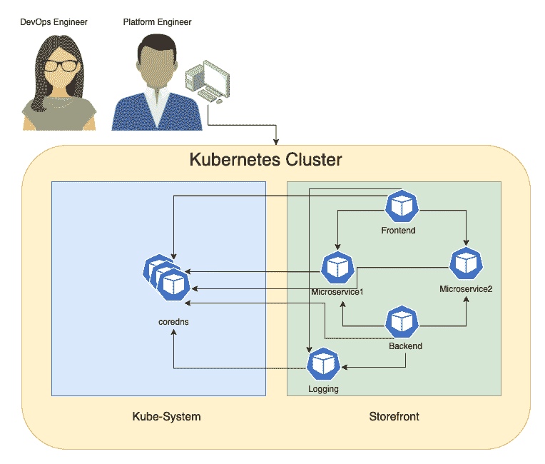
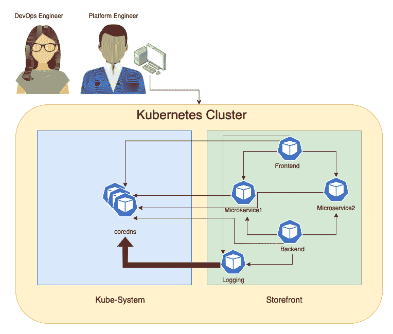

# 使用动态数据包捕获排除微服务故障

> 原文：<https://thenewstack.io/faster-troubleshooting-with-dynamic-packet-capture/>

迪拉吉·塞加尔

迪拉吉是 Tigera 的产品营销总监。

在动态环境中，对 Kubernetes 集群中的容器连接问题和性能热点进行故障排除可能是一项令人沮丧的工作，在这种环境中，成百上千的 pod 会不断地被创建和销毁。如果您是一名开发运维工程师或平台工程师，需要解决微服务和应用连接问题，或者找出服务或应用执行缓慢的原因，您可以使用传统的数据包捕获方法，如对 pod 中的容器执行 tcpdump。这可能有助于您在孤立的单开发人员环境中实现目标，但是企业级故障排除有其自己的一套强制要求和规模。您不希望被这些需求拖慢脚步，而是要解决它们以缩短解决问题的时间。

动态数据包捕获是 Kubernetes 的一种原生方式，可以帮助您快速有效地对您的微服务和应用进行故障排除，而无需授予额外的权限。让我们看一个具体的用例，看看在 Kubernetes 环境中使用数据包捕获进行实时故障排除的一些挑战和最佳实践。

## 用例:核心 DNS 服务降级

让我们在一个假设的环境中讨论这个用例。

### 方案

贵组织的开发运维团队和平台团队正在努力找出 DNS 服务的问题所在，因为在过去几天中，他们已经多次发现 DNS 服务质量下降。



团队注意到，在每次停机前的几分钟，除了来自 storefront 名称空间中的日志记录 pod 的数据包重新传输之外，还有大量的请求。



### 问题观察

 [约瑟夫·约斯托斯

Joseph 是 Tigera 的技术营销工程师。](https://www.linkedin.com/in/joseph-yostos-6365b029/) 

开发人员和平台工程师面临以下问题:

*   当没有店面服务负责人在场进行实时故障诊断时，问题会在一夜之间发生。
*   DevOps 工程师没有 storefront 命名空间的管理权限，无法在此 pod 上运行数据包捕获。
*   一种替代方法是运行 tcpdump，这在店面映像上是不可用的，修补该应用程序以添加 tcpdump 将需要进一步的批准，这在短时间内很难获得。
*   随着越来越多的客户访问店面，pod 会自动扩展，导致需要数据包捕获的新日志记录 pod 的引入。
*   由于 Kubernetes 的动态特性，如果 pod 被重新创建，您需要从新 pod 捕获流量。

### 期望成果

开发人员和平台工程师希望快速解决问题，并以最少的步骤快速解决问题。

*   开发运维工程师需要自助式按需访问，以在店面命名空间中运行动态数据包捕获作业，从而捕获核心 DNS 上的问题。
*   只有 DevOps 工程师和 storefront 服务所有者能够检索和查看捕获的文件。
*   需要进行额外的筛选来进行特定的捕获，以便进行更快、更有针对性的审查，并避免耗尽捕获相关信息的空间。

使用动态数据包捕获对 Kubernetes 中的微服务和应用进行故障排除时，您应该考虑以下最佳实践:

*   将数据包捕获文件配置为按大小和时间轮换。
*   根据端口和协议过滤捕获的流量。
*   启用具有 RBAC 控制的自助服务模型，允许团队在自己的命名空间内对工作负载进行故障排除，而不会影响 Kubernetes 集群的其他部分。
*   利用 Wireshark 等常用的基于桌面的网络故障排除工具来分析数据包捕获的数据。

### 演示:使用动态数据包捕获解决问题

动态数据包捕获是一种 Kubernetes 固有的方法，用于从一个特定的 pod 或一组具有指定数据包大小和持续时间的 pod 中捕获数据包，以便更快地解决性能热点和连接问题。动态数据包捕获作为 Kubernetes APIs 中的自定义资源定义提供，它使用现有的基于标签的方法来确定工作负载的网络内策略，以识别单个或多个工作负载端点来捕获实时流量。

以下是如何选择单个工作负载的基本示例:

```
  apiVersion:  projectcalico.org/v3
kind:  PacketCapture
metadata:
  name:  sample-capture-nginx
  namespace:  sample
spec:
  selector:  k8s-app  ==  "nginx"

```

下面是另一个如何在示例名称空间中选择所有工作负载端点的示例:

```
apiVersion:  projectcalico.org/v3
kind:  PacketCapture
metadata:
  name:  sample-capture-all
  namespace:  sample
spec:
  selector:  all()

```

我们将选择应用程序“logging ”,并在清单中指定 UDP 端口 53，如下所示:

```
apiVersion:  projectcalico.org/v3
kind:  PacketCapture
metadata:
  name:  pc-storefront-logging-dns
  namespace:  storefront
spec:
  selector:  app  ==  "logging"
  filters:
    -  protocol:  UDP
      ports:
        -  53

```

使用基于名称空间的 RBAC 控制器，我们可以授予服务帐户在 storefront 名称空间中运行数据包捕获的权限。

注意:此 RBAC 授予 DevOps 工程师运行数据包捕获的权限，但不授予检索捕获文件的权限。

```
apiVersion:  rbac.authorization.k8s.io/v1
kind:  Role
metadata:
  namespace:  storefront
  name:  tigera-packet-capture-role
rules:
-  apiGroups:  ["projectcalico.org"]
  resources:  ["packetcaptures"]
  verbs:  ["get",  "list",  "watch",  "create",  "update",  "patch",  "delete"]
---
apiVersion:  rbac.authorization.k8s.io/v1
kind:  RoleBinding
metadata:
  name:  tigera-packet-capture-role-devops
  namespace:  storefront
subjects:
-  kind:  ServiceAccount
  name:  devops-sa
  namespace:  storefront
roleRef:
  kind:  Role
  name:  tigera-packet-capture-role
  apiGroup:  rbac.authorization.k8s.io

```

此时，DevOps 工程师拥有运行数据包捕获作业的权限，但不能检索捕获的文件。如果他们试图检索这些文件，他们应该得到 403 HTTP 响应。(客户端没有对内容的访问权限，所以服务器应该拒绝提供所请求的资源)。

为了允许 DevOps 工程师访问为 storefront 名称空间生成的捕获文件，可以使用类似于下面的角色/角色绑定。

```
cat  <<EOF|  kubectl apply  -f  -
apiVersion:  rbac.authorization.k8s.io/v1
kind:  ClusterRole
metadata:
  name:  tigera-authentication-clusterrole-devops
rules:
-  apiGroups:  ["projectcalico.org"]
  resources:  ["authenticationreviews"]
  verbs:  ["create"]
---
apiVersion:  rbac.authorization.k8s.io/v1
kind:  ClusterRoleBinding
metadata:
  name:  tigera-authentication-clusterrolebinding-devops
roleRef:
  apiGroup:  rbac.authorization.k8s.io
  kind:  ClusterRole
  name:  tigera-authentication-clusterrole-devops
subjects:
-  kind:  ServiceAccount
  name:  devops-sa
  namespace:  storefront
---
apiVersion:  rbac.authorization.k8s.io/v1
kind:  Role
metadata:
  namespace:  storefront
  name:  tigera-capture-files-role
rules:
-  apiGroups:  ["projectcalico.org"]
  resources:  ["packetcaptures/files"]
  verbs:  ["get"]
---
apiVersion:  rbac.authorization.k8s.io/v1
kind:  RoleBinding
metadata:
  name:  tigera-capture-files-role-devops
  namespace:  storefront
subjects:
-  kind:  ServiceAccount
  name:  devops-sa
  namespace:  storefront
roleRef:
  kind:  Role
  name:  tigera-capture-files-role
  apiGroup:  rbac.authorization.k8s.io
EOF

```

最后，一旦 DevOps 工程师拥有检索捕获文件的权限，他们就可以使用以下 API 下载 pcap 文件。

```
  # if you already has a load balancer or ingress in your environment, you don't need to do the port forward step 
kubectl port-forward  -n  tigera-manager service/tigera-manager  9443:9443  &
# Update these to match your environment
NS=<REPLACE_WITH_PACKETCAPTURE_NS>
NAME=<REPLACE_WITH_PACKETCAPTURE_NAME>
TOKEN=$(kubectl get secret  -n  storefront  $(kubectl get serviceaccount devops-sa  -n  storefront  -o  jsonpath='{range .secrets[*]}{.name}{"\n"}{end}'  |  grep token)  -o  go-template='{{.data.token | base64decode}}')

curl  "https://localhost:9443/packet-capture/download/$NS/$NAME/files.zip"  -L  -O  -k  \
-H  "Authorization: Bearer $TOKEN"  -vvv

```

一旦 DevOps 工程师捕获到运行分析所需的流量，他们可以使用以下命令停止数据包捕获:

```
kubectl delete PacketCapture pc-storefront-logging-dns  -n  storefront

```

## 结论

在大多数需要捕获数据包的事件中，问题不会持续很长时间，通常是随机发生的。因此，当它发生时，您需要非常快速地捕捉一些有用的信息，以找到问题的根源。由于 Kubernetes 的动态性和短暂性，像动态数据包捕获这样的 Kubernetes 本地解决方案是您最有效的选择。

*准备好亲自尝试动态数据包捕获了吗？从为期 14 天的免费 [Calico 云试用](https://www.calicocloud.io/)开始。*

<svg xmlns:xlink="http://www.w3.org/1999/xlink" viewBox="0 0 68 31" version="1.1"><title>Group</title> <desc>Created with Sketch.</desc></svg>