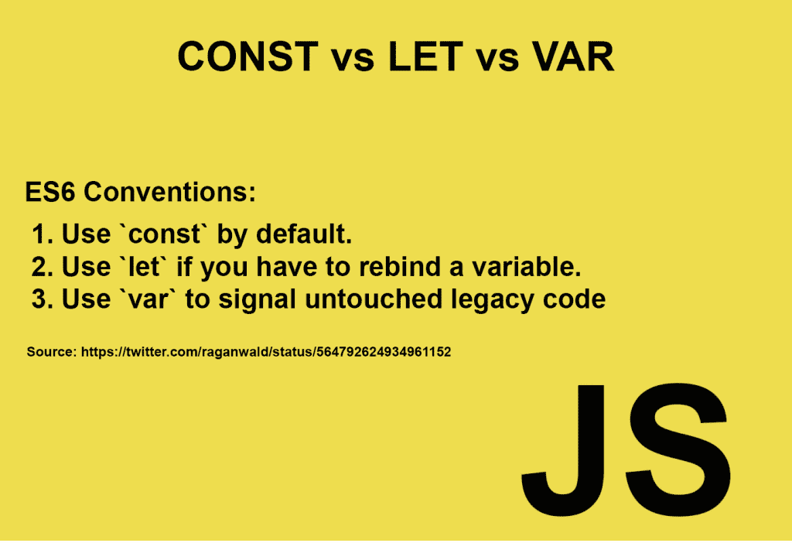

# 粗箭头指向这个方向:为忙碌的 JavaScript 开发人员提供简单的 ES6 好东西

> 原文：<https://thenewstack.io/fat-arrow-points-way-easy-es6-goodies-busy-js-devs/>

一开始，有 LiveScript，由布伦丹·艾希创建。Netscape skybeards 的任务是创建一种脚本语言，使早期万维网的设计者和程序员能够组装浏览器组件，例如图像和插件，它们的代码可以直接写入页面标记。1995 年 5 月，艾希工作了十天十夜，从黑暗中诞生了一种计算机语言，Mocha/LiveScript，它很快又令人困惑地被重新命名为 JavaScript。

瞧，这很好。

从那时起，许多人开始研究 JavaScript，直到今天。1997 年，ECMAScript 对该语言进行了编纂和标准化，这将我们带到了 1999 年的 Internet Explorer 5 时代，并创造了 ECMAScript 3，此后被称为 ES3。黑暗势力阻止了那里的进步，ES4 被挫败了，但是看，AJAX 的力量和好斗的开源开发者们在 2009 年带来了我们大多数人学习的 JavaScript 版本:ES5。

这是一个互联网大繁荣的时代，标准 JSON 的和平躺在土地上。但是时间在前进，技术也在前进，ES6，ECMAScript2015，现在已经来到了人们的面前。ES6 主要是语法上的，因为 ECMA 委员会——最终包括了女士们——为在标准中包括任何更突破性的东西争论了很久，但毫无结果，比如异步函数。然而，在他们认为适合向我们 web 开发人员呈现 ES7 之前，我们应该继续关注 ES6 的改进并明智地使用它们。

Tl:那个圣经废话博士 ES6 中有什么值得用的？

ES6 于 2015 年首次发布，是对 JavaScript 的重大升级。一些最有用和最容易获得的部分让我们产生更光滑、更整洁、更易读的代码。因此，如果你还不是已经跟随胖箭头走向 ECMAScript 2015 及以后的酷孩子之一，这里没有特定的顺序，有一些可爱的小技巧要学会并从今天开始使用:

## 反斜线的美丽

ES6 引入了[模板文字](https://developer.mozilla.org/en-US/docs/Web/JavaScript/Reference/Template_literals)，一种在字符串中输出变量的新方法。之前我们在哪里

> ```
> var id  =  'Your name is '  +  firstName  +  ' '  +  lastName  +  '.'
> var url  =  'http://localhost:8080/api/messages/'  +  id
> 
> ```

ES6 现在让我们能够在两个反斜杠字符中包含一个新的语法:`${varName here}`像这样:

> ```
> var id  =  `Your  name  is  ${firstName}  ${lastName}.`
> var url  =  `http://localhost:8080/api/messages/${id}`
> 
> ```

在这个特殊的 ES6 飞碟上的一个额外的美味珍闻是能够容易地格式化多行字符串，而不需要换行符和转义特殊字符:

```
var ironButterfly  =  'Innagadadavida,  honey\n\don\’\t  you know   that  I\’\m  lovin you?’;

```

变成了…

```
var ironButterfly  =  `Innagadadavida,  honey,
Don’t  you know that  I’m  lovin you?`

```

### 跟着粗箭头走

这是 ES 6 的特点，对我来说，是最快乐的，也可能是最讨厌的。

首先，我个人对此乐此不疲，因为我对 CoffeeScript 的主要享受是它的箭头语法，这让我觉得它有各种各样的意义。胖箭头是一个美丽的东西，不仅仅是因为代码的经济性，还因为它们有自己的词法绑定。

在 ES5 中，每当你创建一个闭包时，它就会变异[，这会导致不可预见的代码行为和许多诅咒。ES6 为我们带来了粗箭头函数语法— = > —其中“this”总是保留函数上下文，即“this”总是被绑定到包含它的函数或方法的范围。省了这么多打字！更不用说压力:不再需要“那个=这个”或。绑定(这)或其他此类乏味但必要的声明！我们从:](https://developer.mozilla.org/en-US/docs/Web/JavaScript/Closures)

> ```
> let chicken  =  {   
>      name:  'Pidgey',   
>       jobs:  ['scratch for worms',  'lay eggs',  'roost'],   
>      showJobs:  function()  {   
>         let _this=  this;   
>         this.jobs.forEach(function(job)  {   
>         console.log(`${_this.name}  wants  to  ${job}`);   
>  });
>      }
> };
> 
> ```

变得更经济——和词汇稳定——

> ```
> let chicken  =  {
>  name:  'Pidgey',
>        jobs:['scratch for worms',  'lay eggs',  'roost'],
>        showJobs()  {
>         this.jobs.forEach((job)  =&gt;  {
>         console.log(`${this.name}  wants  to  ${job}`);
>  });
>      }
> };
> chicken.showJobs();
> //Pidgey wants to scratch for worms
> //Pidgey wants to lay eggs
> //Pidgey wants to roost
> 
> ```

ES6 箭头功能的令人恼火的部分是，ECMA 的大脑认为也不适合给我们细箭头。它本质上取代了普通的“函数”语法，只是没有设置词法 this。一次吃太多糖果对我们不好，也许？我不知道。也许 ES7 的箭筒可以装下细箭…

有几件事要记住:

*   您可以混合搭配——例如，将= >嵌套在传统的函数声明中，不会产生冲突
*   作为单个语句的一个方便的新内置:用作单行表达式的 Arrow 函数隐式返回该语句的结果，而不需要包含 return 语句。(如果不止一行，您仍然需要显式声明“return”)。
*   最后，单个参数的括号()在箭头函数中是可选的。但是，对于多个参数，您仍然需要它们。

### 随它去吧

你可能已经遇到了 **let** 和 **const** 。像 **var** 一样，它们也用于变量赋值，但是 let 和 const 都具有函数语义意义。

在 ES5 和之前的版本中，使用 var 的声明受制于变量提升，被移动到函数的顶部(或者全局范围，如果在函数之外声明的话),而不管它们在代码中的什么地方被声明。(使求职面试中最受欢迎的 Zen koan JavaScript 代码挑战成为可能:有可能调用一个变量尚未声明的函数吗？).

**Const** 和 **let** ，但是，在声明变量时加入了块作用域的概念。就像 var、const 和 let 都可以定义一个可以在函数内部和外部调用的变量——很好的全局和局部作用域。然而，有了这两个新的变量声明关键字，ES6 增加了一个新的甚至更具体的范围级别:块范围。

**let** 关键字声明了一个块范围局部变量，可以选择将其初始化为一个值。let 声明的变量的作用域是定义它们的块，以及任何包含的子块——由花括号定义。这样，let 的工作方式非常类似于 var。主要的区别是 var 变量的范围有点混乱，因为它可以落在整个封闭函数中的任何地方:

> ```
> function varProblem(es6)  {
> var oldschool  =  'Non-block variable'
> if  (es6)  {
> var oldschool  =  'Now I am block scoped!'
>          }
>   {  // this is a NEW block - dig the curly braces!
>       var oldschool='REALLY block scoped!'
>       {//another NEW block:
>        var oldschool  =  'REALLY REALLY REALLY!'
>        }
>    }   
> return oldschool
> }
>  
> console.log(varProblem())    // “REALLY REALLY REALLY”
> 
> ```

一个简单的改变会产生彻底的结果:

> ```
> function letsTryLet(es6)  {
> var oldschool  =  'Non-block variable'
> if  (es6)  {
> let oldschool  =  'Now I am block scoped!'
>          }
>   {  // a new block
>      let oldschool='REALLY block scoped!'
>      {
>        let oldschool  =  'REALLY REALLY REALLY!'
>        }
>    }   
> return oldschool
> }
>  
> console.log(letsTryLet())   // “Non-block variable”
> 
> ```

看出区别了吗？甚至还在用 **var** 初始化‘old school’(这不是最佳实践——在这里这样做只是为了说明的目的),对后续变量声明使用 let 将它们包含到各自的块中。因为在这些块中，我们实际上没有告诉 JavaScript 做任何事情，返回任何新的值，赋值就像特百惠盒中的 vegemite 三明治一样，原封不动地放在那里。

值得注意的是引入了[时间死区](https://stackoverflow.com/questions/33198849/what-is-the-temporal-dead-zone)的概念。这听起来像是《神秘博士》中的情节，但遗憾的是与时间转移无关。但是我们的新朋友**让**知道这一点很重要。你看，在任何给定的块中，从该块的开始到 let 变量被初始化的点之间的线被称为时间死区。在那个区域中，试图引用那个 **let** 变量(在声明它之前)会返回一个 ReferenceError。在旧的 var 世界中，我们没有得到错误是因为 ES 支持[提升](https://medium.freecodecamp.org/what-is-variable-hoisting-differentiating-between-var-let-and-const-in-es6-f1a70bb43d)。重要的一点是:用**声明的变量不能被提升。因此它们在代码块中的位置具有重要的功能意义。**

### 持续疼痛

**const** 语句是块范围的，就像 **let** 一样。然而，与 **let** 不同的是， **const** 声明不能被重新声明或者通过后续的重新赋值来改变。坦率地说，Const 在这方面是个讨厌鬼。说实话，我还在纠结。但是 **const** 的引入让许多编码者——你知道你是谁，那些暗地里希望 JavaScript 是强类型语言的人——非常高兴。

关于 const 要记住的几件事:

*   **Const** ，像 **let** 一样，是块范围的，使得它只能在定义它的代码块(花括号)中访问。它也受制于时间死区规则。

```
        const myCat  =  ‘Fluffy’;  //so far so good

```

*   与 **let** 不同， **const** 必须在声明时赋值。

```
        const myDog;
        //whoops! “SyntaxError: Missing initializer in const declaration”

```

*   一个 **const** 需要是唯一的，并且不能与其他任何东西共享它的名字，包括同一个作用域中的函数或对象。

```
        myCat  =  ‘Puffball’;  //whoops again!  “TypeError: Assignment to constant variable.”

```

*   用 **const** 声明的变量可以被全局声明，但是它的值不会成为窗口对象的属性(就像 var 赋值一样)。
*   一个**常量**声明创建了一个值的只读引用。这并不意味着它的值是不可变的——这只是意味着变量标识符不能被重新赋值。例如，如果 const 持有一个对象，则该对象的内容可以更改为您的小心脏的内容:

> ```
> const myobject  =  {name:'George',  age:39}
>  
> //so far so good. Say you need to change George’s age, though: 
>  
> myobject  =  {name:  'George',  age:40}
>  
> //This throws an error, because you just told JS that myobject is George and he’s 39\. However, 
>  
> myobject.age  =  40  
>  
> //totally ok!  
>  
> console.log(myobject)
>  
> //{name: “George’, age: 40}
> 
> ```

现在问题变成了，我们是不是干脆完全停止使用 var？即使在 ES6 上线这么久之后， **var** 仍然被广泛使用；它在 JS 自助餐还有一席之地。开发人员的共识总结在这条图形推文中:



这就是对三个最有用的 ES6 产品的很好的基本介绍。不过，糖果店中还有各种其他的好东西可以玩，包括新的数据结构，如 **Map** 和 **Set** ，以及新的 **Math** 、 **Number** 、 **String** 、 **Array** 和 **Object** 方法。ES6 还增加了理解(再次感谢，强大的 CoffeeScript！)并激活了之前保留的关键字类，它本身会调用一篇专门的文章。如果读者给我足够多的肯定回答，我会很乐意去写。

<svg xmlns:xlink="http://www.w3.org/1999/xlink" viewBox="0 0 68 31" version="1.1"><title>Group</title> <desc>Created with Sketch.</desc></svg>