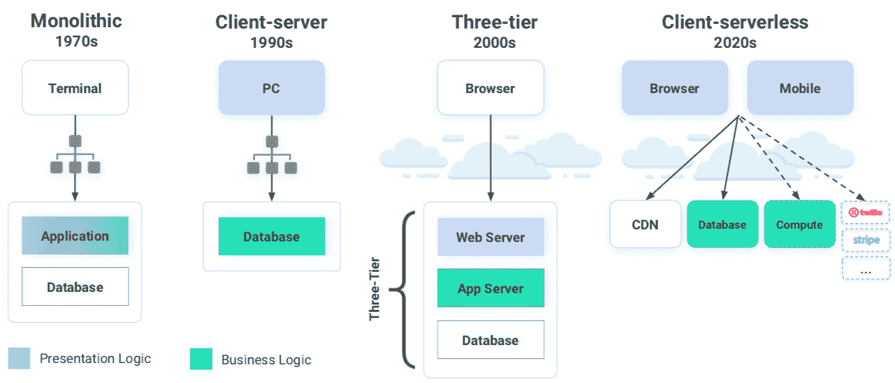

# 动物群及其客户端-无服务器应用模型

> 原文：<https://thenewstack.io/fauna-and-its-client-serverless-application-model/>

 [理查德·麦克马努斯

理查德是《新书库》的高级编辑，每周撰写一篇关于云原生互联网未来发展的专栏文章。此前，他在 2003 年创立了读写网，并将其打造为全球最具影响力的科技新闻和分析网站之一。](https://twitter.com/ricmac) 

在无服务器范例中，想法是抽象出后端，这样开发人员就不需要处理它。对于像 Kubernetes 这样的服务器和复杂基础设施来说，这一切都很好。但到目前为止，数据库系统还没有典型地成为无服务器剧本的一部分。假设开发人员将构建他们的无服务器应用程序，并选择一个单独的数据库系统来连接它——无论是传统的关系数据库还是 NoSQL 服务。

[动物群](https://fauna.com/)正在挑战这个假设。它的目标是为无服务器应用提供一个强大的“数据 API”，这样开发者甚至不需要接触数据库系统。正如联合创始人埃文·韦弗(Evan Weaver)在一次采访中向我解释的那样，“我们正在将所有后端运营和服务构建从产品团队中分离出来。”这意味着一切(包括数据存储)都是通过 API 控制和访问的。

## 动物群与其他数据库服务有何不同

首先，我问 Weaver，与亚马逊 Aurora 和 MongoDB Atlas 等[数据库即服务](https://thenewstack.io/database-as-a-service-a-win-for-app-developers-but-not-dbas/) (DBaaS)产品相比，Fauna 的方法有何不同？

他回答说，DBaaS 是关于“采用传统运营模式并减轻一些负担[但是]你仍然必须考虑你所提供的数据库的物理性。”

Weaver 认为——与 Vercel 的 Guillermo Rauch 的观点类似——开发者只想关注他们产品的前端用户体验。他们不应该担心“我必须查询哪个极光碎片”，就像他滑稽地说的那样。

那么，与 NoSQL 解决方案相比，福纳解决方案如何？韦弗承认有许多相似之处。

“它(Fauna)是一个面向 NoSQL 文档的界面，它源于 web，源于 JavaScript 和文档模型，是应用程序开发人员现在熟悉并希望使用的。”

他说，动物群与 MongoDB 和 Redis 等产品的不同之处在于，它是无服务器的，这意味着“你不必考虑供应或碎片或虚拟机或副本。”他补充说，“即使这些东西是在云中管理的，但有了 Atlas(MongoDB 的 DBaaS 服务)，它们仍然存在，仍然会影响你的应用程序。”

Fauna 还声称它可以提供传统上与关系数据库系统相关的事务功能。根据 Weaver 的说法，Fauna 具有“传统的 RDBMS 功能，但是是在网络本地服务模型中。”

## 客户端-无服务器应用程序模型

为了支持其雄心勃勃的说法，即动物群提供了 SQL 和 NoSQL 世界的最佳产品，该公司提出了一个理论，即科技行业已经进入了应用程序开发的新时代。在 2010 年代，三层模式占主导地位——web 服务器、应用服务器和数据库。但是弗娜认为，21 世纪 20 年代将创造一种新的范式，它称之为“无客户端-无服务器”动物群的下图说明了这种演变:

来源:动物

“在我们看来，”Weaver 说，“这是客户端-服务器架构的回归，因为现在每个人的口袋里都有丰富的客户端——他们的笔记本电脑，他们的移动设备——………,我们有面向前端产品的框架，就像你在关于 Vercel 的文章中谈到的那样，这让没有管理云服务[和]管理三层系统经验的开发人员仍然可以构建功能齐全的完整产品。”

根据 Weaver 的说法，三层模型“对于典型的开发人员来说已经不够好了”，因为“无论他们交互什么，人们都期望基本上是消费者级别的产品——你必须发布一个渐进的 web 应用程序，你必须发布到多个移动平台，它必须看起来很好。”

在他于 2012 年联合创立动物群之前，韦弗在 2008 年至 2011 年期间担任 Twitter 的基础设施总监，这是 Twitter 从一个书呆子气的利基产品迅速发展成为大众消费者产品的时期。Weaver 是 Twitter 的第 15 名员工，在我们的谈话中，他几次提到他那时的经历，主要是为了强调在过去十年中开发人员发生了多大的变化。

“Twitter alpha 是文本区的圆角，”他说。“好像，就是这样。我们这样做了，我们认为我们有了一个生意。你不能再那样做了——你必须真正地*建造*。这就是为什么三层托管云堆栈基本上被新一代开发人员拒绝的原因，他们是使用浏览器长大的，或者[他们]厌倦了在托管云中完成任何事情都必须做的所有 DevOps 繁重工作。他们现在回到这种客户端-服务器模式，我们称之为无客户端-服务器模式，因为最大的区别是客户端是全球性的，它们使用全球无处不在的 API。”

## API 一路向下

在上周的专栏文章中，亚马逊网络服务开发者支持者 [Nader Dabit](https://twitter.com/dabit3) 说 API 是无服务器的头号用例。如前所述，API 也是动物产品的关键。最重要的是，你在动物群中访问数据的方式是通过 API 的[。它有一个 GraphQL 接口，以及诸如“类似 DSL 的函数式查询语言”之类的替代语言。](https://docs.fauna.com/fauna/current/introduction)

但动物群还通过 API 连接到第三方服务的整个生态系统，如 Stripe for payments。

“这个[无服务器]世界有趣的一点是，你可以直接组合这些垂直集成的服务，这是你在三层架构中无法做到的，”Weaver 说。“因此，提高效率的一个方法是，你可以从货架上取下 Stripe 之类的东西。只需将其连接到前端，就可以完成您的计费组件。”

这样看来，通过将所有这些 API 服务连接在一起，你几乎可以在无服务器模式下做任何事情。但是我们不应该忘记，无服务器最终是让开发人员专注于他们最擅长的事情:构建适合他们自己业务需求的应用程序。

“这并没有否定我们一直以来对应用程序堆栈的基本构建模块的需求，”Weaver 解释说，他指的是与第三方服务的轻松连接。“我们一直需要一个应用程序环境和运行时[……]我们一直需要打包和交付，[而且]你仍然需要一个数据库。”

换句话说，您仍然必须创建自己的应用程序，并且通常需要一个数据库来存储该应用程序特有的数据。

如下图所示，Fauna 认为它可以成为无服务器生态系统的核心部分。但是，无服务器数据库概念是否会被广泛采用，或者开发人员是否会坚持使用 SQL、NoSQL 或 DBaaS 选项，还有待观察。

来源:动物

一个重要的潜在问题是:开发人员真的想抽象出数据库和基础设施吗？至少在中短期内，大多数开发人员似乎更有可能继续需要传统数据库系统提供的额外级别的访问控制和安全性。

Amazon Web Services、MongoDB 和 Redis 是新堆栈的赞助商。

通过 Pixabay 的特征图像。

目前，新堆栈不允许直接在该网站上发表评论。我们邀请所有希望讨论某个故事的读者通过推特(Twitter)或脸书(T2)与我们联系。我们也欢迎您通过电子邮件发送新闻提示和反馈:[反馈@thenewstack.io](mailto:feedback@thenewstack.io) 。

<svg xmlns:xlink="http://www.w3.org/1999/xlink" viewBox="0 0 68 31" version="1.1"><title>Group</title> <desc>Created with Sketch.</desc></svg>