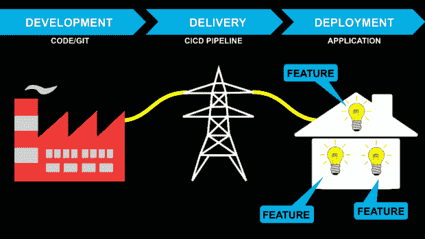
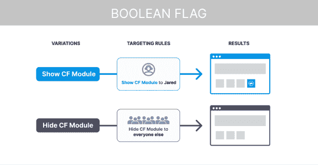
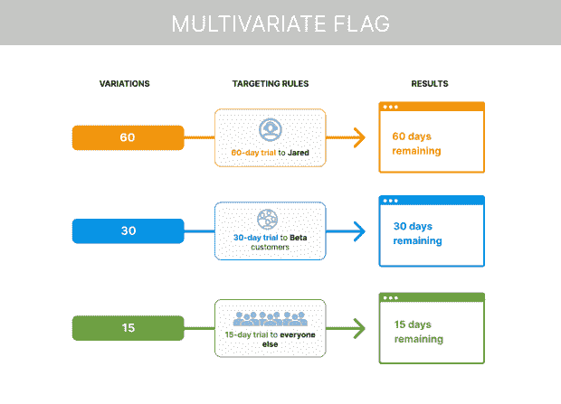
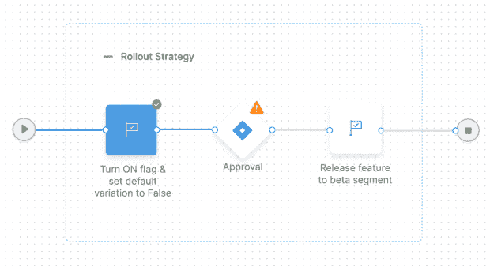

# 特性标志:使软件交付更快

> 原文：<https://thenewstack.io/feature-flags-making-software-delivery-faster/>

如今每个公司都是软件公司，软件产品的变化比以往任何时候都要快。因此，公司需要快速、频繁地推出新功能，以跟上快节奏的软件世界。这就是为什么特性标志对于任何公司的软件开发周期都变得至关重要。

功能标志对于软件开发人员来说是很有价值的，因为它们允许组织通过在有限的人群中进行测试来逐步发布新的功能和服务。这样，他们可以监控这些用户对新功能的反应，尽早发现任何错误或问题，以便在大范围发布之前修复它们。这也使得在必要时禁用某些功能变得更加容易。

这篇博文将介绍如何使用特性标志作为新软件特性的起点。

## 什么是特征标志？

一个[特性标志](https://thenewstack.io/panel-discussion-on-configs-feature-flags-and-automated-canaries/)是一个简单的机制，它使你能够向一部分用户发布新特性，同时对其他人隐藏它们。例如，当您的应用程序在 app store 上运行时，您可以使用功能标志来控制您的哪些新功能对用户可见。这允许您只向选定比例的客户推出新功能。

当您的新功能位于功能标志之后时，它对用户不可见。你只需翻转开关，使新功能可见。这听起来可能是一件小事，但它会对你的产品的成功产生巨大的影响。

您可以使用功能标志来控制您的企业在任何给定时间承担的风险。您还可以使用功能标志来衡量新功能的成功，并获得用户对最新软件功能和版本的初步反应。

它们的工作方式或多或少类似于电力公司，可以通过主开关向一个家庭或一个选定的地方供电或断电。

## 为什么需要功能标志？

当你的企业要推出新的软件功能时，你必须考虑好如何推出它们。还没有完全成熟的特性还没有准备好大范围发布。存在负面评论和用户采用率下降的风险。

功能标志还有许多其他名称，如 switch、toggle 或 threshold，但它们都指的是同一个东西:一种启动和启用功能的方式，这些功能的范围和使用仅限于特定的人群。

用户反馈和持续测试已经成为任何软件公司成功的关键。在持续交付的时代，组织需要比以往更快地推出新功能。同样，用户希望新的特性能更频繁地被添加进来。挑战在于将用户反馈整合到你的开发周期中，这样你就不会发布另一个没人使用或关心的平庸特性。

功能标志使您能够获得早期用户反馈，以验证您的功能并做出更好的业务和工程决策。

当您的企业考虑引入新功能时，您必须决定如何推广它们。使用功能标志，卷展栏可以毫不费力，就像打开和关闭按钮一样。这有助于组织、开发者、站点可靠性工程师和发布经理减少软件发布的痛苦。否则，在向用户交付新功能时，遵循清单通常是一件很麻烦的事情。

特征标志对于降低软件开发中的风险至关重要。它们使您能够尽早和经常地发布代码，并使您能够增加新特性的采用，从而更无缝地向用户提供这些新特性。

## 什么时候应该使用功能标志？

特性标志最好用在您希望以更可控的方式测试的新特性上。它们允许开发人员在不影响现有代码的情况下发布新功能。这是通过拥有相同代码的两个版本来实现的:一个有新特性，另一个没有。当开发人员想要发布一个新特性时，他们只需按下开关，就可以为一定比例的用户启用它。

以下是几个可能需要使用功能标志的示例:

*   您希望控制特性的采用率。
*   您希望控制该功能何时对用户可见。
*   您希望控制新功能带来的风险。

## 线束特征标志

[线束](https://harness.io/)的特征标志最初作为内部项目启动。我们从这个项目中学到了很多，并将我们学到的东西应用到面向客户的功能标志产品中。

线束有两种特征标志类型:布尔和多元。布尔只有两种变体:真和假。多变量作为多重变异；您可以添加任意多的自定义变体。

布尔标志很简单，用于 A/B 测试。多元标志适用于实验，而您的产品团队希望了解新功能的初始反应，并且可以有多个目标规则来确定您希望如何向用户展示它们。

有了 Harness 特性标志，您现在可以以基础结构作为代码(IaC)的方式使用它们——标志作为代码。有了这种能力，开发人员将能够在他们自己的工作流程中工作(在代码中)。组织可以通过[特性标志管道](https://harness.io/blog/feature-flags-pipelines)标准化发布特性所需的流程和步骤。使用线束特征标志管道，您可以有一个更好的软件部署策略，如下例所示。

## 结论

特性标志是在[软件开发](https://thenewstack.io/category/development/)中管理风险的一种强有力的方式。

如果您不确定某个特性，您可以在向更广泛的受众发布之前，尝试使用特性标志来了解用户对它的看法。

我们强烈建议使用特性标志，并将它们包含在您的发布管道中。对于任何希望简化软件部署和提高出货频率的公司来说，特性标志都非常有效。

<svg xmlns:xlink="http://www.w3.org/1999/xlink" viewBox="0 0 68 31" version="1.1"><title>Group</title> <desc>Created with Sketch.</desc></svg>