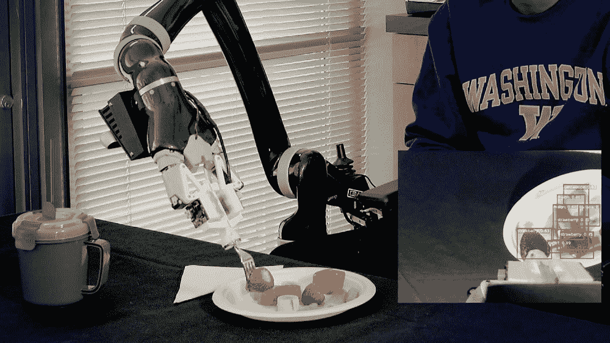
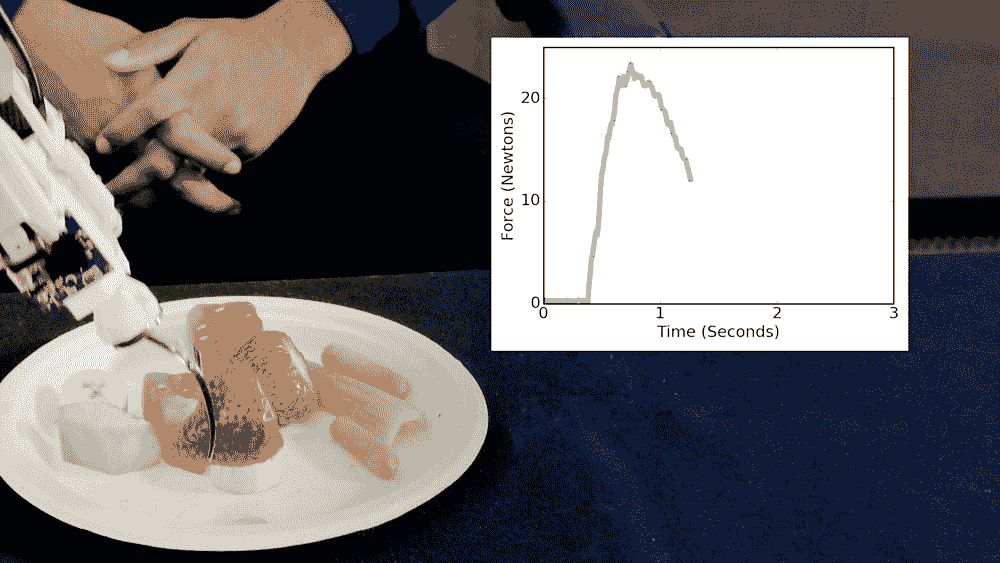
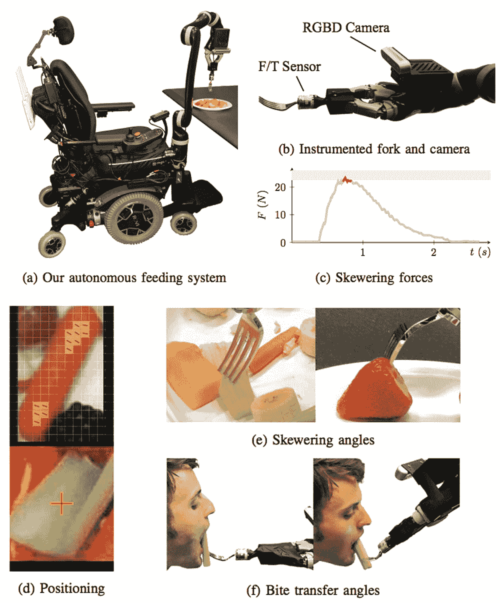

# 用智能机器人手臂给人喂食比你想象的要难

> 原文：<https://thenewstack.io/feeding-people-with-an-intelligent-robot-arm-is-harder-than-you-think/>

随着越来越多的上一代人变老，我们将面临许多挑战，以确保我们的老龄化和能力不同的人口尽可能多地保留自主权。特别是，据估计，仅在美国就有超过 100 万成年人需要某种帮助来养活自己。但是这并不像雇佣一个护理员每天来帮助喂食那么简单:首先，这可能相当昂贵；其次，对一些人来说，这可能是一个令人沮丧的日常提醒，提醒他们已经失去了多少独立性。

现在有一个有趣的问题:如果机器人帮助喂食，这种悲观的看法会改变吗？虽然机器人假肢的使用并不新鲜，但将一块食物送到等待的嘴里的任务实际上比看起来更复杂，尤其是对一台机器来说。毕竟，有很多可变因素:食物有各种不同的形状、大小和质地，加上食物需要以正确的角度处理，以便可以送到人们的嘴里。

为了开发一种解决这些问题的工具，华盛顿大学的研究人员已经提出了[辅助灵巧臂](https://newatlas.com/autonomous-robot-arm-feeding/58844/) (ADA)，这是一种可以连接到轮椅上的机器人辅助喂食系统。该系统配备了一个特殊的装有传感器的叉子，并使用各种算法和组件，使其能够解构将食物从叉子送到嘴里所涉及的复杂任务。观察它是如何工作的:

[https://www.youtube.com/embed/t2eO4CD-0WY?feature=oembed](https://www.youtube.com/embed/t2eO4CD-0WY?feature=oembed)

视频

## “食物种类的世界”

为了开发这一系统，研究人员专注于将喂食任务分解为他们所谓的“咬合习得”(将食物放到叉子上)和“咬合转移”(将食物从叉子上放到某人的嘴里)。正确地串起食物需要考虑食物呈现什么样的属性。例如，一根细长而脆的胡萝卜最好直接从上面刺，靠近末端，这样人们就可以从叉子尖上咬下去，而较软的香蕉需要以一定的角度刺，以确保它不会从叉子上滑落。

“如果我们不考虑一个人咬一口是多么容易，那么人们可能无法使用我们的系统，”[说](http://www.washington.edu/news/2019/03/11/how-to-train-your-robot-to-feed-you-dinner/)计算机科学与工程教授和论文合著者[悉达多·斯里尼瓦萨](https://goodrobot.ai/)。“外面有各种各样的食物，所以我们最大的挑战是开发能够应对所有这些食物的策略。”

为了给系统生成训练数据，研究人员首先寻求志愿者的帮助，他们被要求给人体模型喂食常见的食物，如香蕉、哈密瓜、胡萝卜、芹菜、煮鸡蛋和草莓——使用带有传感器的叉子，传感器可以测量他们拿起食物时使用的力度，以及以什么角度将形状奇怪的食物放入嘴里。

机械臂使用视觉和触觉传感系统的组合来拾取和传送食物。它依靠两种算法来执行喂食过程:首先使用一种叫做 RetinaNet 的物体检测算法，通过在其视觉系统中设置一个红色的边界框来扫描和识别盘子上的食物类型。机器人系统然后使用 SPNet(偏斜位置网络)算法来估计偏斜位置和角度旋转，这将导致最可靠的咬合获取结果和最容易的咬合转移。

使用这种定制的设置，研究小组发现，这些食物定制技术的结合使机械臂的表现与对不同种类的食物使用相同程序的系统相同或更好。研究人员现在正与其他组织合作，通过收集辅助生活设施中护理人员和患者的反馈来测试该系统。

“我们的最终目标是让我们的机器人帮助人们自己享用午餐或晚餐，”Srinivasa 指出。“但重点不是取代护理人员:我们希望赋予他们权力。在机器人的帮助下，护理人员可以设置盘子，然后在人吃饭的时候做其他事情。”

图片:华盛顿大学

<svg xmlns:xlink="http://www.w3.org/1999/xlink" viewBox="0 0 68 31" version="1.1"><title>Group</title> <desc>Created with Sketch.</desc></svg>