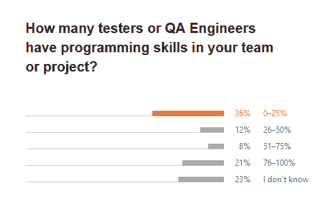

# 很少有测试人员有编程技能

> 原文：<https://thenewstack.io/few-testers-have-programming-skills/>

[两周前](https://thenewstack.io/focus-on-speed-doesnt-mean-focus-on-automation/)我们问，如果组织中没有专门的 QA/测试团队，QA 是否能做好？虽然这个问题仍然悬而未决，但 2020 年版 JetBrains 的开发者生态系统的[状态确实量化了这一专业消失的程度。一个发现是，43%的团队或项目每 10 个开发人员中只有不到一个测试人员或 QA 工程师。如果大多数测试是自动化的，这不一定是一个问题，但是只有 38%的被调查者是这样。](https://www.jetbrains.com/lp/devecosystem-2020/testing/)

该研究还表明，大多数测试人员不具备编程技能。一般的开发人员说，不到一半的测试人员没有编程技能。如果没有开发团队的帮助，就很难编写和自动化测试。正是因为这个原因，61%的人说测试设计和测试实现是在他们的公司进行的。

QA 功能不会完全消失，尤其是面向客户的应用程序。如果测试人员建立在他们的编程技能上，也许测试部门将来会面临更少的预算压力。

来源:JetBrains 的《2020 年开发者生态系统状态》

通过 Pixabay 的特征图像。

*目前，新堆栈不允许在该网站上直接发表评论。我们邀请所有希望讨论某个故事的读者通过 [Twitter](https://twitter.com/thenewstack) 或[脸书](https://www.facebook.com/thenewstack/)访问我们。我们也欢迎您通过电子邮件发送新闻提示和反馈: [feedback@thenewstack.io](mailto:feedback@thenewstack.io) 。*

<svg xmlns:xlink="http://www.w3.org/1999/xlink" viewBox="0 0 68 31" version="1.1"><title>Group</title> <desc>Created with Sketch.</desc></svg>