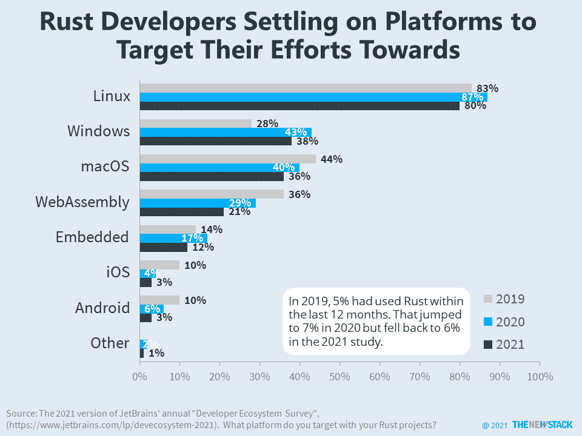

# 更少的 Rust 开发者瞄准 WebAssembly

> 原文：<https://thenewstack.io/fewer-rust-developers-target-webassembly/>

编者按:自文章发表以来，第一张图片下的标题发生了变化。在堆栈溢出调查中，Rust 的采用增加了，而不是保持不变。

根据 2021 年版本的 JetBrains 年度[开发者生态系统调查](https://www.jetbrains.com/lp/devecosystem-2021)，年复一年， [WebAssembly](https://webassembly.org/) 已经成为 [Rust](https://www.rust-lang.org/) 开发者构建应用的不太受欢迎的目标。在过去 12 个月使用 Rust 的 6%的开发人员中，21%的人将 WebAssembly 作为一个平台，这比 2020 年的 29%和 2019 年的 36%有所下降。

需要进一步的研究，但很可能第一代 Rust 开发人员正在决定何时以及是否 WebAssembly 是合适的目标平台。同样，尽管 WebAssembly 开发人员非常喜欢 Rust，但是想要编译其他语言的开发人员还有很大的发展空间。

这些统计数据并没有降低开发人员对 WebAssembly 的兴奋度，这些开发人员的目标通常是无服务器、容器和云原生环境。根据 2021 年 6 月的一项调查[显示，目前只有 24%的 WebAssembly 开发者在无服务器用例中使用该技术，相比之下，73%的开发者在 web 开发中使用该技术。然而，87%的无服务器采用者认为这是一个技术将产生巨大影响的领域。相比之下，只有 44%不使用无服务器的受访者认为影响很大。](https://blog.scottlogic.com/2021/06/21/state-of-wasm.html)

在这项调查中，Rust 的实际采用率在 2021 年并没有飙升。相比之下，在 [2021 堆栈溢出研究](https://insights.stackoverflow.com/survey/2021)中，专业开发人员的采用率有所上升。

<svg xmlns:xlink="http://www.w3.org/1999/xlink" viewBox="0 0 68 31" version="1.1"><title>Group</title> <desc>Created with Sketch.</desc></svg>