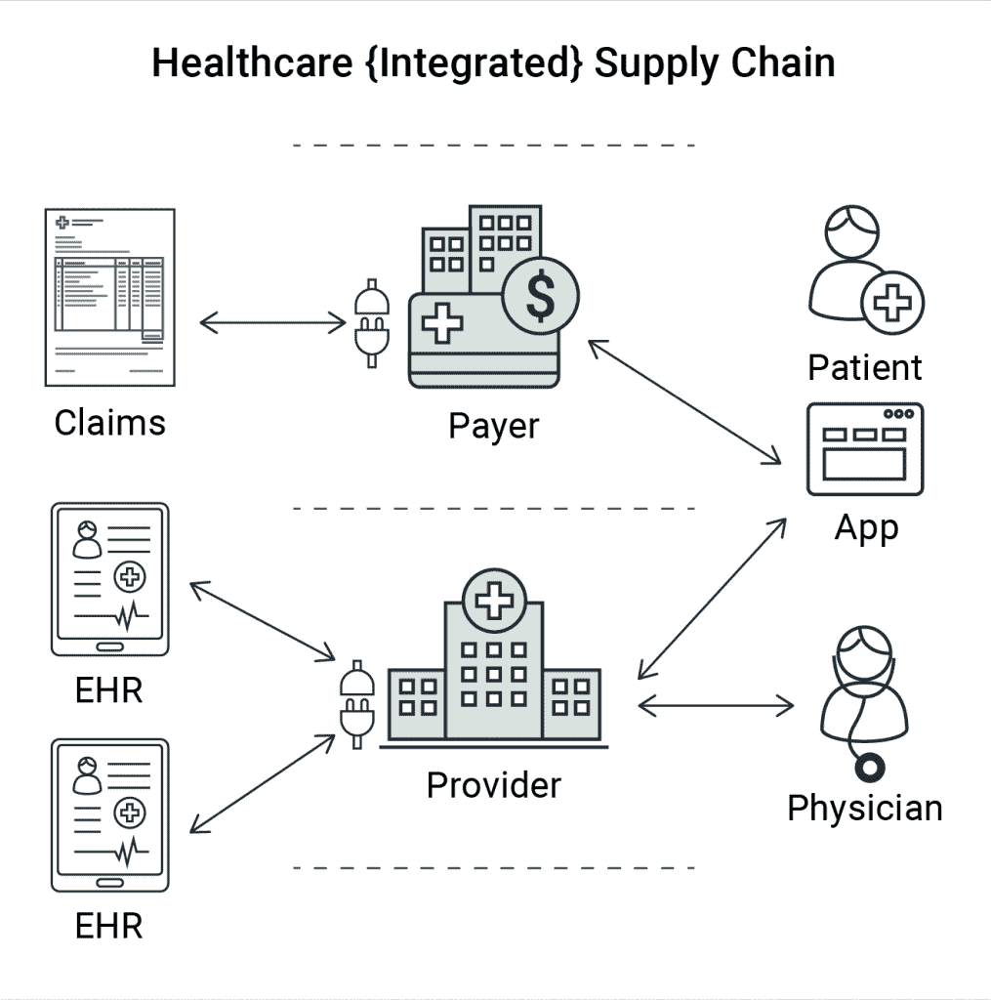

# 数字医疗中的 FHIR 和互操作性—第 1 部分

> 原文：<https://thenewstack.io/fhir-and-interoperability-in-digital-health-care-part-1/>

从聚合健康数据应用程序到远程医疗和数字前门，疫情推动了消费者对创新和增强的医疗保健解决方案的需求。[麦肯锡](https://www.mckinsey.com/industries/life-sciences/our-insights/healthtech-in-the-fast-lane-what-is-fueling-investor-excitement)预计，全球数字健康收入将从 2019 年的 3500 亿美元上升至 2024 年的 6000 亿美元。

在这种背景下，数字医疗保健互操作性现已成为数字供应链的一大挑战，因为医疗保健提供商必须将数据或信息从记录系统(如电子健康记录(EHR)系统)中取出，进入跨多个组织边界的目标系统和消费者，同时确保安全性和数据隐私。这篇文章将探讨数字化医疗供应链现代化的方法，并概述其挑战和机遇。

## 医疗保健现代化

 [米凡·卡里姆

Mifan 是 WSO2 的副总裁兼全球解决方案架构主管。他领导着一个由全球建筑师组成的团队，该团队参与了从医疗保健到政府的 1500 多个整合项目。他还负责 WSO2 进军医疗保健解决方案领域的风险投资。Mifan 是一名全球演讲者和技术思想领袖，致力于 API 战略、开源商业模式以及医疗保健和人道主义服务技术。](https://www.linkedin.com/in/mifan/) 

疫情告诉我们，创新是医疗保健的关键。拥有独特数字体验的组织在这种环境中茁壮成长，而那些努力适应这种环境的组织则深受其害。在过去几年中，消费者的期望也在飙升，患者和会员希望从他们的医疗保健组织获得无摩擦的数字体验，并在整个医疗保健生态系统中访问他们的数据。互操作性，即在利益相关者之间共享正确数据的能力，是这场运动最重要的组成部分。

考虑一个示例组织场景，其中我们有一个提供者，医生和患者作为提供者网络的一部分，使用单个 EHR。可能会有一些挑战，因为提供商可能需要提取不同格式的信息，如 Health Level 7 第 2 版(HL7 V2)或美国国家标准协会认可的标准委员会电子数据交换标准(X12)，并将其转换为标准化格式，如快速医疗保健互操作性资源(FHIR)。

根据 HIMSS analytics 在 2017/2018 年的一项研究，[一家普通医院有 16 家不同的电子病历供应商](http://healthcareitnews.com/news/why-ehr-data-interoperability-such-mess-3-charts)。即使是一个较小的医疗保健提供商也可能有多个记录系统—多种类型的 EHR 系统，一些侧重于门诊系统，一些侧重于住院电子病历(EMR ),其他一些侧重于非住院电子病历、医疗计费系统、远程医疗软件、预约安排系统等。

医院网络还必须与支付者组织密切合作，而支付者组织又需要访问他们自己的收入循环管理(RCM)系统和/或索赔管理系统。

所有这些意味着医疗保健组织、提供者、支付者和其他医疗保健利益相关者需要处理许多异构数据源。重点不仅在于安全地向被验证方公开正确的数据，还在于以有意义的方式聚合、整合和使用信息。

## API 驱动的医疗保健集成

应对这些多重挑战正是医疗保健集成平台的用武之地。目标是连接到这些系统，通过连接器从这些系统中获取数据，将数据转换为适当的格式或规范模型，聚合和合并数据，并存储或传递数据。

可穿戴设备和通过它们共享的数据是一个需要考虑的重要数据集。一旦数据以所需的格式可用，以安全的方式将信息作为 API 或其他可共享和机器可读的格式提供给利益相关方(可以是第三方组织、内部或外部开发人员以及其他应用程序或系统)也很关键。

## 记录处理集成系统的谬误

有许多人支持这样的假设，即他们的 EHR 将处理不同系统之间的连接，并以所需的格式提供整合的信息。虽然这对于特定的较小的边缘情况或单一供应商提供所有后端系统的场景可能是正确的，但在现实中，这远非理想。

为了实现真正的创新，医疗保健组织需要访问跨多个系统的整合信息。检索此类数据的最佳解决方案是依靠独立于记录系统之上的集成层，它可以连接和转换来自当前和未来系统的数据，并提供给消费者。

如图 1 所示，提供者通过部署在提供者端的集成平台连接到多个电子健康记录(EHR)系统和/或其他记录系统。

然后，该平台可以有选择地将数据作为 API(最好是基于 FHIR 的标准 API)提供给内部消费者(系统和用户)和外部消费者，例如支付者组织和第三方开发者。

图 API 集成平台使提供者能够连接到多个 EHR

## 患者手中的数据

通过集成平台和 API 标准(如 FHIR)实现的互操作性为数字医疗创新的未来带来了巨大的潜力。然而，安全、隐私和数据所有权不能是事后才想到的。美国医疗保险和医疗补助中心(CMS)和国家健康信息技术(ONC)法规协调员办公室将数据的权力放在患者手中。他们现在需要通过应用程序访问他们自己的信息，而不管数据存储在哪里或保管人是谁。

此外，患者可以属于多个提供者网络，但是信息应该穿过这些网络并整合到一个全面的应用程序中。这是一个有趣的问题，因为数据现在必须跨越组织边界，而实现这一点的最佳方式是通过 API。要做到这一点，您需要一个能够正确管理许可的解决方案。

在我们的下一篇文章中，我们将阐述如何使用 API 来加速数字化转型计划，并指出与安全性相关的常见问题以及如何克服它们。

我们希望这篇文章能帮助读者了解更多关于医疗保健中的 FHIR 和互操作性。与此同时，我们鼓励您访问位于[https://wso2.com/solutions/healthcare/](https://wso2.com/solutions/healthcare/)的 WSO2 开放式医疗保健解决方案，了解更多信息。

<svg xmlns:xlink="http://www.w3.org/1999/xlink" viewBox="0 0 68 31" version="1.1"><title>Group</title> <desc>Created with Sketch.</desc></svg>