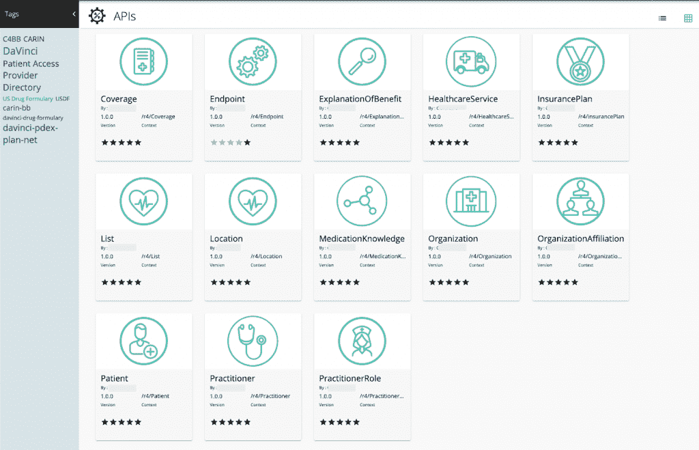

# 数字医疗中的 FHIR 和互操作性—第二部分

> 原文：<https://thenewstack.io/fhir-and-interoperability-in-digital-health-care-part-2/>

在我们的[上一篇文章](https://thenewstack.io/fhir-and-interoperability-in-digital-health-care-part-1/)中，我们强调了医疗保健组织对其产品进行现代化的需求，介绍了医疗保健集成平台，并分析了与将数据保存在组织边界之外的患者手中相关的挑战。

这篇文章将讨论 API 如何帮助医疗保健组织转变他们的产品，引入同意管理，解决安全问题和实现最佳实践。

## **API 管理解决方案**

组织出于多种原因投资 API 管理解决方案，例如发展新的合作伙伴关系，抽象后端系统，以便医疗保健公司可以更快地实现现代化，以及向外部方公开知识产权。

另一个核心原因是 API 网关支持最佳实践。API 管理提供了安全模型、服务质量以及对何时何地应该公开什么的控制。这种分离允许业务团队通过构建面向消费者的服务和应用程序或鼓励外部利益相关者参与来快速创新。

图 1: API 集成平台支持跨提供商的信息共享。

在图 1 中，提供者组织有一个 API 管理系统或 API 网关。这一层由集成功能组成，连接、转换和整合来自多个记录系统的数据，如电子健康记录(EHR)系统。付款人还有一个 API 网关，它从记录系统(如索赔管理系统)中提取信息。

这些数据保管人共享的信息可供会员门户等内部应用程序或外部应用程序以及第三方应用程序开发人员等用户使用。通过这些 API 的数据现在是更广泛的数字医疗供应链的一部分。

## **网络效应**

API 平台的一个额外优势是它们提供了网络效果。这是一种公开信息的机制，以便多方可以使用数据。然后这些团体可以将它暴露给他们的用户，创造一个平台网络效应。这使得整个网络中的信息可用性复合在一起，形成了一个价值网络。

图 2 显示了一个在客户处部署的 API 平台的示例，它以快速医疗保健互操作性资源(FHIR)格式展示了 CMS 患者访问 API。这些是公共 API，应用程序开发人员以及其他支付者和提供者组织可以使用这些 API 来构建更好地为患者服务的应用程序。

图 API 平台的例子

现在，图 3 显示了由于通过 API 从数据保管者(公开数据的支付者和提供者)获得信息而导致的消费者激增。

图 3:将 API 引入医疗保健供应链会带来更多的消费者和应用程序。

在这一级，医疗保健提供商已经公开了 API，公司可以构建自己的应用程序，如远程医疗或虚拟护理，然后供患者使用，或者可以有选择地向第三方聚合器公开这些 API，作为聚合器网络的一部分。这些聚合器既可以服务于他们的患者，也可以服务于普通患者。简而言之，数字供应链在各种技术的帮助下不断进化、增加、增加环节和节点。

## **数字供应链安全**

 [米凡·卡里姆

Mifan 是 WSO2 的副总裁兼全球解决方案架构主管。他领导着一个由全球建筑师组成的团队，该团队参与了从医疗保健到政府的 1500 多个整合项目。他还负责 WSO2 进军医疗保健解决方案领域的风险投资。Mifan 是一名全球演讲者和技术思想领袖，致力于 API 战略、开源商业模式以及医疗保健和人道主义服务技术。](https://www.linkedin.com/in/mifan/) 

虽然价值网络带来了巨大的潜力，但也带来了风险。供应链的强度取决于其最薄弱的环节。这意味着医疗服务提供商必须克服网络内外的弱点。

在过去的两年中，医疗保健安全领域出现了不同程度的安全问题。[Knight Ink 有限责任公司的 Alissa Knight 发布的白皮书发现](https://blog.hl7.org/statement-to-the-global-community-from-hl7-international-on-the-paper-playing-with-fhir-hacking-and-securing-fhir-apis)医疗保健 FHIR APIs 易受应用实施和第三方 FHIR 聚合器的漏洞影响。

如果数据存储在电子病历中，它是安全的，但不利于现代化。为了实现真正的创新和现代化，数据必须离开后端系统，进入消费者手中，这样公司才能开始利用数据构建创造性的应用程序。

这意味着组织需要适当的控制。简而言之，it 需要将数据从电子病历中取出，放入应用程序、聚合器和其他提供商。但这意味着在不同的层面上可能存在漏洞。

## **最佳实践**

在 EHR 中获取数据不像在聚合器中获取数据那么容易。此外，如果聚合器存储数据，这可能会打开一个不同的蠕虫罐。幸运的是，有一些工具和最佳实践可以避免这种情况。开放 Web 应用程序安全项目(OWASP)原则讨论安全最佳实践。FHIR 上的 OpenID Connect 和可替代医疗应用和可重用技术(SMART)提供了应用的最佳实践。API 网关本身执行速率限制、节流、服务质量和 API 安全机制。组织可以高枕无忧，因为他们知道静态数据和动态数据都有安全最佳实践。

## **同意管理**

与任何数字供应链一样，需要遵循多种安全最佳实践。这不仅仅是将数据保存在一个地方。这是关于移动数据，这意味着公司需要有适当的控制和必要的同意管理。这涉及数据的所有权和提供使用该数据的许可的能力。这是一个被遗忘已久的医疗保健概念，因为真正的数据所有权属于患者，即使医疗保健提供商可能是这些数据的保管人。数据的消费者只有在征得所有者(即患者)的明确同意后才能这样做。

因此，我们可以添加一个同意管理层，如图 4 所示。

图 4:同意管理记录利益相关者使用数据的许可。

当数据从提供商转移到聚合器时，用户或患者必须同意。类似地，如果数据从聚合器转移到患者，用户必须对此提供同意。如果数据从健康记录系统转移到提供者、支付者或应用程序，患者也必须提供同意书。同意可以是粒度级的。例如，患者可以简单地允许使用他/她的名和姓。

我们希望这篇文章能帮助读者更多地了解数字医疗供应链中的 FHIR 和互操作性，以及这如何使医疗服务提供商能够开发以客户为中心的解决方案。要了解更多信息，请访问我们在[https://wso2.com/solutions/healthcare/](https://wso2.com/solutions/healthcare/)的解决方案页面。

<svg xmlns:xlink="http://www.w3.org/1999/xlink" viewBox="0 0 68 31" version="1.1"><title>Group</title> <desc>Created with Sketch.</desc></svg>