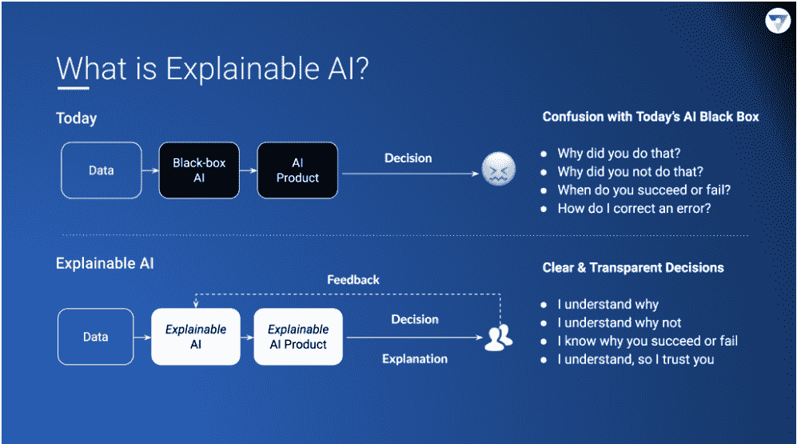
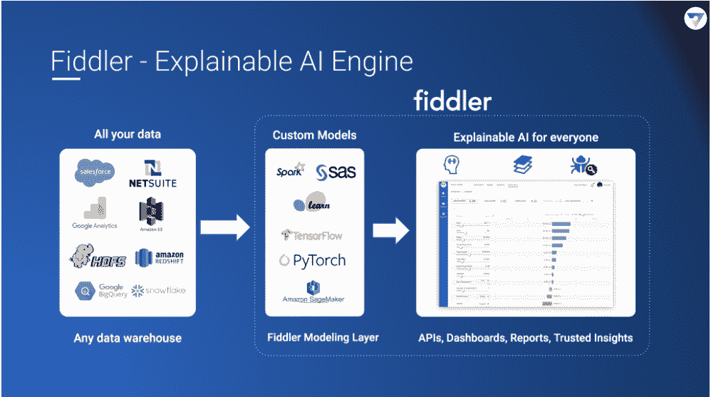

# Fiddler 深入研究人工智能决策背后的决策

> 原文：<https://thenewstack.io/fiddler-drills-into-the-decisions-behind-ai-decision-making/>

对于使用人工智能的公司来说，这种技术往往本质上是一个黑匣子，很难了解他们的模型是如何执行的，或者他们是如何做出决定的。

Fiddler Labs 想要改变这种情况。

“人工智能团队目前面临的一个问题是，当他们实施人工智能时，他们是盲目的。Fiddler 的创始人兼首席执行官 [Krishna Gade](https://twitter.com/krishnagade?ref_src=twsrc%5Egoogle%7Ctwcamp%5Eserp%7Ctwgr%5Eauthor) 说:“因此，从本质上来说，你的人工智能就像是你安装在组织内部的非常复杂的喷气式发动机，你真的无法从驾驶舱的角度了解你的人工智能系统内部发生了什么。”

总部位于加州帕洛阿尔托的 Fiddler Labs 源于盖德在脸书的经历和他的联合创始人[阿米特·卡帕](https://twitter.com/amitpaka?ref_src=twsrc%5Egoogle%7Ctwcamp%5Eserp%7Ctwgr%5Eauthor)在三星的经历，他在三星从事购物应用的推荐工作。第三位联合创始人是公司的首席架构师 Manoj Cheenath。

许多行业都在使用机器学习和人工智能，包括金融、保险、电子商务、运输和医疗保健。IDC 预测，2023 年全球人工智能系统支出将达到 979 亿美元，是 2019 年支出的 2.5 倍以上。但公司和消费者不一定信任自动决策，越来越想了解这些决策是如何做出的，特别是在医疗保健或无人驾驶汽车等情况下。

## 破解“黑匣子”

Gade 是脸书的一名工程负责人，负责新闻订阅排名。各种团队使用这项技术来推荐朋友、你可能想加入的团体和其他功能。

“这在 2016 年大选后变得尤为重要，当时有很多新闻围绕着对脸书新闻源的不信任、潜在的假新闻和错误信息等等。因此，我们需要在调试工具和诊断方面进行投资，以解锁为新闻订阅提供动力的机器学习模型，从而深入了解诸如“我为什么会看到这个故事？”为什么这个故事流传得更广？“为什么这家出版商做得这么好，”等等，等等，”盖德解释道。

它变成了一个跨公司提供反馈的努力，并最终导致了一个面向最终用户的版本，名为“[为什么我会看到这个](https://about.fb.com/news/2019/03/why-am-i-seeing-this/)？”

“[所以]我决定实际上创办一家公司，因为当时没有任何东西可以帮助人工智能和人工智能团队以负责任和值得信赖的方式部署和运营人工智能，”他在 2018 年创办该公司时表示。

他列举了人工智能系统的四个基本问题:

*   缺乏透明度
*   模型漂移
*   潜在偏差
*   合规性—或缺乏合规性

他说，特别是 COVID 关闭，为模型漂移创造了越来越大的可能性。

“因为人工智能真的致力于在历史数据上寻找模式来预测未来。…当您的数据本身发生变化时，当您当前的现实每天都在发生变化时，例如，由于 COVID，申请贷款的企业与去年申请贷款的企业或经济形势良好时申请贷款的企业不同。此外，失业并申请贷款的人与(之前)申请贷款的人不是同一批人。电子商务商店上正在购买的东西与 COVID 之前购买的物品不同。所以你的模型需要不断地被重新训练，需要被监控，这样你才能对正在发生的事情有一个清晰的了解，”他说。

全面了解您的模型还可以帮助您深入了解不同人口统计数据(如年龄、性别、种族或地区)的决策情况。

政府正在引入许多合规性法规。例如,《欧盟一般数据保护条例》( GDPR)第 22 条,赋予公民对影响其生活的自动化决策背后的解释的权利。他说，在某些行业，如金融服务业，如果你运行不合规的模型，你可能会陷入诉讼和巨额罚款。

“根据 IDC 的研究，缺乏机器学习操作(MLOps)和可信的人工智能(AI)是大规模实现人工智能的三大挑战中的两大挑战，”IDC 人工智能研究项目副总裁 [Ritu Jyoti](https://www.linkedin.com/in/ritujyoti/) 说。“Fiddler Labs 的可插拔和可解释的人工智能引擎是企业就绪的。它可以轻松集成到云或内部环境中的多个数据源，并与各种定制模型配合工作，使企业能够在广泛的行业垂直领域中以灵活高效的方式管理、部署、监控和解释人工智能模型。"

### “可解释性”引擎

Fiddler 面临着来自 IBM 的[AI explability 360](http://aix360.mybluemix.net/)的竞争，这是一个解释 AI 模型决策的开源算法集；微软的[interpretml](https://venturebeat.com/2019/05/10/microsoft-open-sources-lnterpretml-for-explaining-black-box-ai/)；谷歌的【TensorBoard 的假设工具；还有初创公司 [Kyndi](https://kyndi.com/) ，建立它所谓的可解释的自然语言处理平台。

脸书创造了一个叫做[公平流](https://qz.com/1268520/facebook-says-it-has-a-tool-to-detect-bias-in-its-artificial-intelligence/)的工具来帮助检测人工智能中的偏见。埃森哲的[教学和测试](https://newsroom.accenture.com/news/accenture-launches-new-artificial-intelligence-testing-services.htm)是另一个例子。

Fiddler 依靠最近的研究和方法，如 [Shapley 值](https://arxiv.org/abs/1909.08128)和[综合梯度](https://www.tensorflow.org/tutorials/interpretability/integrated_gradients)来理解模型预测。

[https://www.youtube.com/embed/u1f3XoPfefQ?feature=oembed](https://www.youtube.com/embed/u1f3XoPfefQ?feature=oembed)

视频

根据 Gade 的说法，该团队建立了专有的即插即用技术，将其称为“可解释性”作为其差异化因素。

“它可以解释一个神经网络，该网络可以解释一个简单的逻辑回归模型…一个基于文本数据与表格数据创建的模型。它可以跨不同的模型格式工作，比如 TensorFlow 模型格式，或者 [PyTorch](https://github.com/pytorch) 模型格式。它非常灵活。…最重要的是，我们能够处理大量数据，因此我们可以大规模地连续监控这些模型，”他说。

“如果你是一家电子商务公司，你可能会在某一天做出数十万甚至数百万条推荐。你在记录所有的预测日志。Fiddler 可以使用所有这些预测日志，因此我们可以监视预测随时间的变化。并帮助您记录随时间的漂移。然后，它将能够查明…在过去的一周或一天里，哪些特征发生了变化，导致模型的行为发生了漂移，”他说。

在监控演示的一个贷款示例中，利率、账户持续时间、债务收入比和贷款金额可能是驱动模型漂移的因素。用户还可以深入查看异常值及其随时间推移对行为的影响、常见数据错误的影响以及平均流量、延迟和错误率等服务指标。

该技术以托管云服务和内部版本的形式提供。

这家 20 人的公司总共筹集了 1400 万美元，最近宣布了一项未披露的投资，并与洛克希德·马丁风险投资公司(Lockheed Martin Ventures)进行了战略合作，致力于国防和航空航天工业的技术开发、测试和规模化。它与脸书及其[为 PyTorch 开发的 Captum](https://ai.facebook.com/blog/captum-and-fiddler-partner-to-improve-explainable-ai/) 模型可解释性库有合作关系，与求职市场[雇佣](https://hired.com/)有合作关系，还有来自[亚马逊 Alexa 基金](https://developer.amazon.com/en-US/alexa/alexa-startups/alexa-fund)的投资。

亚马逊 Alexa 基金的 Zain A. Gulamali 表示:“Fiddler 正在建立对可解释人工智能的发展至关重要的服务，因为该公司正在努力揭开包括金融服务和社交网络在内的垂直行业中人工智能的‘黑匣子’。”。“Fiddler 团队是我们见过的最强的应对这一挑战的团队之一，我们很高兴能够支持该公司继续发展，并在语音和对话界面等领域解决可解释的人工智能问题。”

根据 Gade 的说法，它有七个客户在生产，包括几家大银行。它的客户以几种不同的方式使用这项技术:在模型投入生产之前进行测试，以及在生产过程中持续监控模型。

[https://www.youtube.com/embed/gqnDqrIzabw?feature=oembed](https://www.youtube.com/embed/gqnDqrIzabw?feature=oembed)

视频

<svg xmlns:xlink="http://www.w3.org/1999/xlink" viewBox="0 0 68 31" version="1.1"><title>Group</title> <desc>Created with Sketch.</desc></svg>