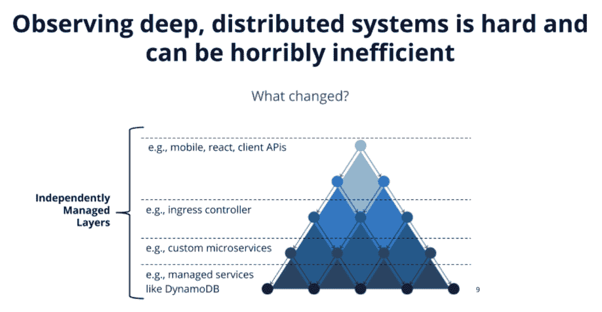

# 生产准备现场指南

> 原文：<https://thenewstack.io/field-guide-for-production-readiness/>

对于团队来说，生产准备比以往任何时候都更加重要，尤其是考虑到最近的资源限制和对基础设施需求的增加。然而，许多团队无法实现真正的生产就绪，并且可能很难定义它实际上是什么样子。

Lightstep 和[清白](https://www.blameless.com/)合作展示了生产准备需要什么。这篇博文强调了关键要点。

## 什么是生产就绪？

 [伊恩·史密斯

伊恩是 Lightstep 的高级销售工程师。他是客户成功组织中 Lightstep 销售工程团队的一员，负责与客户打交道。](https://www.linkedin.com/in/ismith314159/) 

[奥赖利](https://www.oreilly.com/library/view/design-build/9780470257630/9780470257630_what_is_production_readiness_question.html)将生产就绪定义为“…软件系统是否准备好投入使用。最简单的形式是，这意味着“系统准备好实施了吗？”不管你是为外部客户开发软件，还是为内部目的、为一般销售、甚至为你自己开发软件，问题都是一样的。"

随着应用程序复杂性的增加和对创新速度需求的增加，对产品就绪性的投资是关键。然而，它经常被忽视，导致潜在的失败和计划外的工作。这些故障会耗费大量资金，而且随着对持续服务需求的增加，停机成本只会越来越高。此外，计划外的工作会直接影响团队的创新能力。您在事件响应上花费的时间越多，发布新功能或增强可靠性的时间就越少。

 [保罗·朱

保罗是无可指责公司的高级销售工程师。他以技术身份支持各种组织，从产品演示到解决方案规划会议。](https://www.linkedin.com/in/pchu88/) 

为了避免这些成本，您需要确保在发货时，您的团队和产品已经准备好。

确定您的产品是否已准备好实施可能很困难。为了确保你已经检查了所有的框，你需要对你的系统有深入的观察能力。

此外，您需要出色的事件响应，因为众所周知，事件*会*发生。这不是是否的问题，而是何时的问题。通过确保您尽可能彻底并为最坏的情况做好准备，您可以达到生产就绪状态。

这既有好处也有挑战。

**生产就绪的好处:**

*   自信地更快部署。
*   通过自动化实现事半功倍，最大限度地减少工作量。
*   改善客户体验。
*   降低业务风险。

**生产就绪性面临的挑战:**

*   依赖性使得很难观察分布式系统。
*   认知负荷增加。
*   跨分散、孤立的团队进行协调的高成本。

不断波动的业务环境加剧了所有这些挑战，例如对数字服务的需求增加，加速了数字化需求以及向分布式工作模式的转变。

为了获得生产就绪的优势并克服挑战，我们可以依靠关键实践来提高我们的生产就绪性，例如:

*   使用 CI/CD 来自动化发布管道，并确保代码可以安全和自动地部署
*   回归测试，以确保变更不会破坏现有的功能
*   容量管理可扩展和缩减基础架构以满足需求
*   可观察性，全面了解服务运行状况和性能
*   采用事故解决最佳实践、操作手册和行动手册，以减少事故期间的临时工作和辛劳
*   创建事故回顾，以确保您从事故中获得最大收益，并重新投资这些经验

在我们进行的非正式调查中，我们发现许多团队目前正在采用关键实践，如 CI/CD、事件解决和回顾、可观察性和容量管理。2020 年，团队还表示，他们希望在可观察性、事件解决和容量管理能力方面进行更多投资。

这些关键实践是生产就绪的基础。然而，它们也带来了自己的一系列挑战。

## 可观察性痛点

深入了解您的系统是迈向生产就绪的重要一步。随着深度系统、微服务架构、无服务器功能和服务网格的出现，似乎有了无尽的依赖。当我们看典型的架构(通过下面的三角形抽象表示)时，您可以看到我们有多个层。

通常，这些层是独立管理的。如果您是服务所有者或者您的团队拥有少量服务，您可能会查看其中的一个或两个图层，但不会查看所有图层。**这意味着你对整个系统的了解是不完整的。**

此外，在你有责任做的事情和你能控制的事情之间有一个差异。你的职责可能是一项服务或一组服务的性能，但是你所能控制的仅仅是这些服务。您没有能力控制下游依赖项或服务，这些依赖项或服务提供了您在请求生命周期中使用的信息。**这个增量引入了很多压力，尤其是在事件响应工作流**中，并且会影响你的 MTTR 和开发人员的快乐。

你的团队现在使用的工具可能有助于这个增量，但是不能完全克服可观测性的挑战。许多现有的方法都有一些缺点:

*   **指标**:这些工具在理解症状行为或识别或量化特定症状的影响方面非常出色，但它们缺乏让你能够理解因果关系的背景。您将拥有信息，但没有真正的方法将其连接回您的系统层。
*   日志:日志提供了一些你可能需要的背景信息，来理解不同的演员是如何为彼此的表演做出贡献的，但是它们很贵。此外，它们仍然不是从工作流角度构建的，无法为您提供理解聚合行为所需的分析。一个实例不会影响另一个实例，从而让您对系统的行为做出结论。
*   痕迹:许多人试图用痕迹来解决缺乏上下文的问题。跟踪显示请求如何在应用程序中传递。它们可以帮助突出显示哪些指标或日志最有可能帮助解决问题。

换句话说，当使用标准方法时，深入了解分布式系统是昂贵的、手动的和耗时的。可观察性挑战并不是生产就绪的唯一障碍。还有编排方面的挑战需要克服。

## 编排和学习挑战

协调的成本非常高，并且随着深度系统的兴起和向分布式团队的转移而增加。您应该更快地解决事件，减少关键服务中断，并在回顾结束时能够回答“为什么”。有了所有可用的工具，回答这个问题似乎很容易，但事实并非如此。由可观察性工具提供的数据是不够的。它还需要具有可操作性。

这就是为什么为了最大限度地提高生产就绪性，应将**可观察性与复杂的事件响应流程**结合使用。这允许团队将关键的洞察力集中到有价值的经验教训上。

对于当今复杂的系统，团队不仅需要花费数天甚至数周的时间来筛选和解决问题，还需要解读所有可操作的学习内容。团队需要轻松共享的环境，包括测试、变更事件和部署、错误预算违规、监控、警报数据等，以及基于角色的任务等结构化自动化，以释放认知负荷，从而专注于决策制定。汇总所有这些信息，推动协调一致的响应，并在事件发生后的审查中构建背景信息，可能会非常繁琐和费力。

为了克服这些挑战，您需要确保不仅在事故流程中，而且在下游的学习和产品规划流程中，您能够自动获取信息并推动有效的协作和跟进。理想情况下，应在几个工作日内对尽可能多的事故进行事故后审查。毕竟，事故是对系统进行压力测试的计划外投资，如果没有将收益再投资到系统中的结构化流程，企业将面临巨大的风险。您还需要确保记录下您的见解，以便在产品、工程、支持和业务利益相关者之间轻松查询和共享。这将有助于为您的可观察性度量创建上下文，并为您提供“为什么”的答案

## 使用 Lightstep 和无可指责的生产准备

克服可观察性、编排和学习方面的挑战可能会很困难，但使用 Lightstep 和 Blameless 等解决方案会有所帮助，如以下视频演示所示。

[https://www.youtube.com/embed/H-kfG5evZ3o](https://www.youtube.com/embed/H-kfG5evZ3o)

视频

通过同时使用 Blameless 和 Lightstep，您将获得对服务所有层的端到端可见性。借助更好的上下文和事件响应自动化，您将能够减少 MTTA、MTTR 和 MTTI 等指标。

*   [MTTA](https://www.atlassian.com/incident-management/kpis/common-metrics) (平均确认时间):从触发警报到开始处理问题的平均时间。
*   (平均解决时间):从事件开始到事件结束的平均时间。
*   [MTTI](https://searchitoperations.techtarget.com/definition/mean-time-to-detect-MTTD) (平均识别时间):问题在 IT 部署中存在多长时间，相关人员才会意识到它。

这种优化还将消除部落知识，确保您不会孤立于您特定的服务边界之内，并且能够更好地了解您的系统的依赖性。

Lightstep 和 Blameless 还与开发人员、运营人员和 SRE 团队会面，讨论他们现有的工具。这些平台利用其他工具(如仪器仪表、CI/CD、警报、聊天、服务台等)中经常存在的孤岛数据，为内聚的工作流构建与其他工具的桥梁。你可以开始看到这些产品的价值，而不需要漫长的重组过程。Lightstep 的目标是在 30 分钟内实现价值，而 [Blameless](https://www.blameless.com/customers) 只需几分钟即可完成集成，并根据团队的使用情况进行调整。

生产就绪变得越来越难实现，但也比以往任何时候都更重要，因为团队面临着前所未有的变化和不断增长的应用程序复杂性。借助 Lightstep 和 Blameless 等组合解决方案，您的团队可以采用必要的护栏来实施最佳实践，并确保生产就绪，以支持任何规模的团队。

要了解更多信息，您可以查看以下资源:

*目前，新堆栈不允许在该网站上直接发表评论。我们邀请所有希望讨论某个故事的读者通过 [Twitter](https://twitter.com/thenewstack) 或[脸书](https://www.facebook.com/thenewstack/)访问我们。我们也欢迎您通过电子邮件发送新闻提示和反馈: [feedback@thenewstack.io](mailto:feedback@thenewstack.io) 。*

通过 Pixabay 的特征图像。

<svg xmlns:xlink="http://www.w3.org/1999/xlink" viewBox="0 0 68 31" version="1.1"><title>Group</title> <desc>Created with Sketch.</desc></svg>