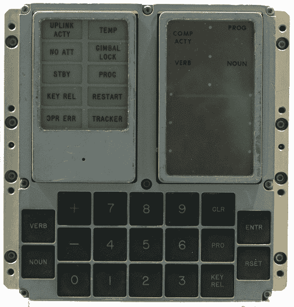
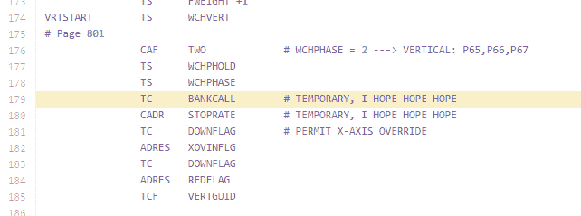

# 五十年前的阿波罗 11 号源代码在 GitHub 上获得了新的评论

> 原文：<https://thenewstack.io/fifty-year-old-apollo-11-source-code-gets-fresh-review-github/>

本月早些时候，一名前 NASA 实习生终于为 50 年前带美国登月的汇编代码创建了一个 GitHub 知识库[。但最有趣的部分可能是我们现代人的反应。](https://github.com/chrislgarry/Apollo-11)

“我妈妈 50 年前写的代码刚刚在 GitHub 上发布，”[在推特上写道](https://twitter.com/linclark/status/751843178530111488)程序员[林克拉克](https://twitter.com/linclark)，后来称她的母亲是“该项目的程序员”(但不是首席软件设计师[玛格丽特·哈米尔顿](http://www.wired.com/2015/10/margaret-hamilton-nasa-apollo/))。很快，GitHub 用户提交了新发现的 50 年前代码的“问题”——其中大多数是有趣的笑话——同时享受着对 NASA 程序员在 20 世纪 60 年代留下的一些评论的又一次大笑。

早在 20 世纪 60 年代，麻省理工学院的仪器实验室就承担了开发阿波罗 11 号飞船飞行软件的任务——根据 Quartz 上的一篇文章，“他们想出了一种存储计算机程序的新方法，称为‘绳内存’，并创造了一种特殊版本的汇编编程语言”[。2003 年，一名麻省理工学院的研究人员终于打出了数千行汇编代码，创造出了阿波罗制导计算机的模拟。](http://qz.com/726338/the-code-that-took-america-to-the-moon-was-just-published-to-github-and-its-like-a-1960s-time-capsule/)

[https://www.youtube.com/embed/hyhI85Rd1kI?feature=oembed](https://www.youtube.com/embed/hyhI85Rd1kI?feature=oembed)

视频

但直到本月，前美国宇航局实习生克里斯·加里(Chris Garry)才为人类迈出了另一小步——将代码上传到 GitHub 上的纪念库中。

知识库将代码指定为公共领域，甚至还有关于如何[编译源代码](https://github.com/rburkey2005/virtualagc)的提示(如果你正在计划自己的登月任务——或者只是创建自己的模拟器)。它已经引起了很多人的兴趣，林·克拉克在推特上回应了一些关于她母亲在阿波罗计划中工作的问题。

> 最终有人问了[一个非常重要的问题](https://github.com/chrislgarry/Apollo-11/issues/39):“我们能在容器中运行这个吗？”

“我真想和她坐下来，让她带我看一遍，”她写道，随后又宣布，代际代码争夺战是不可能的。“我刚刚打电话给我妈问她，她笑着说她什么都不记得了。”在后来的一条推文中，克拉克补充道，“我可以看到…我忘记了我五年前写的代码。”尽管第二天，克拉克在推特上说“她记不太清了，但也许过一段时间她会改变主意。”她还和[分享了一个警示故事](https://twitter.com/linclark/status/752506202202910720)，讲述了她母亲的一些代码最终发生了什么。

“我妈妈实际上用废弃的穿孔卡片做了一个圣诞花环。我应该拍张照。”

## 程序员就是程序员

GitHub 的蒂姆·皮斯似乎是第一个[在推特上发布代码库](https://twitter.com/pea53/status/751418260864667648)的人。但是在两周之内，这个知识库已经被 20，134 名 GitHub 用户标记为最喜欢的，并被转发了超过 2，900 次。当皮斯在 7 月 4 日之后的那个灾难性的星期五分享它的 URL 时，他还附带了一张截图，显示 GitHub 用户已经提交了新的问题。“程序员就是程序员，”他开玩笑说——到月底，已经有 82 期不同的杂志创刊了——也停刊了。

“休斯顿，我们有一个合并冲突，”Twitter 上的一个回复开玩笑说。但是这个仓库最大的问题似乎是电影迷们看了太多的科幻小说。“接马特·达蒙的扩展包”，[一期](https://github.com/chrislgarry/Apollo-11/issues/20)上写道——这显然是指电影*阿波罗 13* 的联合主演(更不用说剧情了)。

另一个问题[似乎来自同一部电影](https://github.com/chrislgarry/Apollo-11/issues/3)，警告说“一个客户在电路故障的情况下搅拌低温储罐遇到了相当严重的问题。”一个问题甚至追溯到更远，抱怨“[无法打开吊舱舱门](https://github.com/chrislgarry/Apollo-11/issues/98)”——这正是宇航员在 *2001:太空漫游*中使用 HAL 自动化系统时遇到的问题。随后的一条评论补充说，“用户模块”没有得到完全支持，抱怨故障的 HAL 单元只给出模糊的错误信息，如“我很害怕”和“我的思想正在消失。”

当然，大多数实际的拉取请求似乎都是为了改进这个历史性的 NASA 代码的格式。但也有许多问题是关于用现代语言重写代码的需求——例如，Rust、Go、Node.js，甚至 AWS，因为“[云比发射平台更接近太空](https://github.com/chrislgarry/Apollo-11/issues/14)…你可以在燃料上节省很多钱！”或者 PHP — [这样它就可以和 Apache](https://github.com/chrislgarry/Apollo-11/issues/128) 一起运行了。

这最后一条评论引发了 17 条评论，大多数建议代码应该被转换成其他现代语言——也许是 Scala，或者 C++，或者 Swift，或者 Java，或者一种叫做 [Whitespace](https://en.wikipedia.org/wiki/Whitespace_(programming_language)) 的晦涩难懂的编程语言。

有人甚至建议用世界上最流行的语言——中文——重写这段代码。最终，有人问了最重要的问题:“我们能在容器中运行这个吗？”

嘿，C 或者 Ruby，或者 JavaScript with React 怎么样？但是最终，有人指出了所有这些提议的问题，回应一个建议用 Python 重写代码的用户[。](https://github.com/chrislgarry/Apollo-11/issues/19)

“……这个回购仅保存火箭的代码和定义其工作方式的所有属性。重写(转换)这是毫无意义的，除非有一个环境，持有空气动力学，大气等的属性。真正的火箭/大气/物理科学。”

## 没有什么是暂时的

事实上，用户界面的语言“是基于两位数的数字代码，用来表示动词(即动作)和名词(即动作的对象)……”在 iBiblio.org 的一页上[解释道。快速浏览一下](http://www.ibiblio.org/apollo/ForDummies.html)[列表](http://www.ibiblio.org/apollo/FabrizioPresentationPhotos/A17_VN_Checklist.png)，可以看到像“显示八进制”和“显示十进制”这样的动词，以及“监控八进制”和“请执行”

这些名词有点难以理解，但其中一个似乎是“L celest body unit vec”。xxxxx]”——一个视频终端被认为是未来的时代的鲜明提醒。动词和名词键用于设置感兴趣的动词/名词组合，并通过按回车键告诉计算机接受它(例如，典型的顺序可能是:动词 16 名词 65 回车键)。清除键用于纠正用户输入错误，而重置键用于取消计算机的错误警告……”

但是，如果“程序员将是程序员”，同样的情况也适用于美国宇航局 20 世纪 60 年代的原始编码员。在 Twitter 上，网络开发人员肯特·多兹(Kent Dodds)注意到了阿波罗项目原始源代码中留下的一条评论，该评论将有 50 年历史的代码中的一行描述为“临时的”。

“没有什么是暂时的，”他[开玩笑说](https://twitter.com/kentcdodds/status/751895629815685120)——他的消息被转发了 1100 多次——并“收藏”了另外 1200 次。与此同时，Reddit 用户开始分享另一条带有相同信息的评论。

50 年后，这条评论的截图在 2016 年突然获得了新的人气，在 Reddit 的“[节目幽默](https://www.reddit.com/r/ProgrammerHumor/comments/4ro9v9/apollo_11_guidance_computer_source_code_now_on/d52y5yt)”表单上吸引了 3658 次投票，在该网站的“[空间](https://www.reddit.com/r/ProgrammerHumor/comments/4ro9v9/apollo_11_guidance_computer_source_code_now_on/d52y5yt)”论坛上吸引了 257 次投票

“典型的软件开发模式。:)"[一位 Reddit 用户](https://www.reddit.com/r/space/comments/4s8sp2/apollo_11_guidance_computer_source_code_now_on/d57ft4t)开玩笑说。

专题图片:NASA 阿波罗飞行软件设计师玛格丽特·哈米尔顿，[来自 NASA](https://en.wikipedia.org/wiki/Margaret_Hamilton_(scientist)#/media/File:Margaret_Hamilton_in_action.jpg) 。

<svg xmlns:xlink="http://www.w3.org/1999/xlink" viewBox="0 0 68 31" version="1.1"><title>Group</title> <desc>Created with Sketch.</desc></svg>