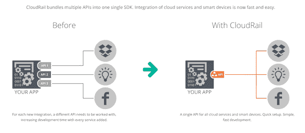
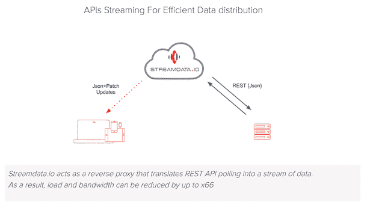
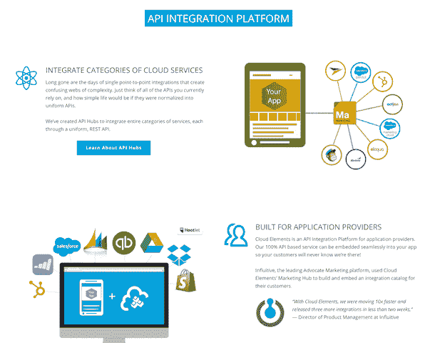

# API 产品的生存之战取决于企业

> 原文：<https://thenewstack.io/fight-api-product-survival-rests-enterprise/>

越来越多的技术，软件即服务(SaaS)的商业模式需要一个快速的势头来赢得企业客户。在过去几年中，这种需求已经加快，今年年初证明，由于更广泛的市场并不完全理解 SaaS 模式，总部位于 SaaS 的企业通过拥有企业客户来适应未来的需求更加迫切。没有任何地方比 API 产品和服务提供商更需要市场生存，他们越来越多地进入市场，从第一天开始就关注企业的吸收。

自 2012 年左右以来，SaaS 模型是科技行业采用的一种方法。SaaS 是影响分布式架构范例兴起的经济背景，这种范例正在推动全球的应用程序开发。提供最小可行产品并通过持续交付管道迭代新功能和能力的创业和敏捷模式，是 SaaS 在早期采用者中获得关键机会的一部分，这些早期采用者愿意赌上选择未经测试的产品的风险。以摇尾狗的方式，它已经成为一种微服务模式，表明科技初创公司如何能够继续创新，并为客户提供新的价值，而不需要进行整体下载来升级商业或消费软件。

最初，虽然有针对商业的 SaaS 产品，但许多 SaaS 模式的初创公司专注于终端客户和消费者相关产品。LinkedIn、Dropbox、Spotify、Airbnb 和无数其他网站都专注于终端消费者。这个想法是要发展一个庞大的消费者群体来延长他们的寿命，然后转向企业客户。

这一点最近在 Slack 的 playbook 中表现得最为明显，该产品面向消费者的设计美学吸引了决定使用它的个人消费者。 [Slack 已经能够通过这种“影子 IT”的方式提高其在业务团队中的认知度](https://thenewstack.io/slack-new-model-business-process-software/),然后更协调一致地将战略重点放在吸引企业客户上。(去年 6 月，Slack 首次组建了一个团队来领导[enterprise uptake](http://fortune.com/2015/06/24/slack-claims-1-1m-users/)，而面向消费者的社交媒体巨头脸书 only [在 2015 年 12 月正式推出了他们的脸书工作产品](http://www.reuters.com/article/us-facebook-facebookatwork-idUSKBN0TT0EG20151210#EKb7m231KPvIfgwV.97)。)这并不是一个特别新的见解:Roderick Morris 一年前在他的中期文章中指出了这一点，但是自今年年初以来，它已经成为一个更重要的驱动因素。

今年 2 月第一周结束时，许多公开上市的 SaaS 产品的市场跌幅在 40%至 60%之间。现在，在 4 月底，许多公司已经反弹(例如，Salesforce 几乎完全恢复了其市场价格)，大多数公司现在的平均估值与 12 个月前相同，已经抹去了 2015 年下半年的所有增长。

金融时报云计算分析师 Richard Waters 说，这其中的一个原因是，拥有大量前期投资和云软件模式的企业“尚未证明他们能够执行”一项从订阅中增加现金流利润率的商业计划，并特别指出 Salesforce(现已运营 16 年)是“第一家进入主流企业软件市场的 SaaS 公司”

那么，提供 API 产品和服务的科技公司正带着两个额外的压力进入这种经济环境。首先，他们不能像 Slack 那样，通过对最终用户的广泛吸引力和鼓励病毒式增长的有趣用户体验来利用“企业消费化”优势。其次，作为 API 产品和服务，他们更多的时候是在构建一个平台，这个平台不仅需要 SaaS 模式，还需要在更可编程的配置中与合作伙伴、供应商和最终客户分享整个价值共创链的收入。

今年，我们看到一些 API 产品公司使用五个关键策略来获得企业立足点。

## 路线一:CloudRail 将 API 开发者视为消费者，并采用企业消费化方法

API 互操作性平台 [CloudRail](http://cloudrail.com/) 的首席执行官兼联合创始人 Felix Kollmar 说:“API 的问题在于，开发人员看到了越来越多的集成需求，但他们没有构建它们，因为它越来越复杂。”。CloudRail 允许开发人员创建基于多个 SaaS 服务的自定义 API，并提供一个 SDK，以便开发人员可以通过一个 API 集成多个服务。API 的工作方式就像一个漏斗，将不同的 API 与它们背后的各种数据模式结合在一起，并创建一个 API 供开发人员使用。

Kollmar 说:“开发人员不从事集成的核心业务，但他们每天都面临着集成服务的问题。“我们帮助他们创建一个通用 API，这样他们就可以将所有东西捆绑到一个端点上，这样他们需要使用的所有服务都会有同样的感受。”

为了鼓励社区增长，CloudRail 专注于一种众包、社交平台类型的方法，鼓励开发人员分享他们需要的 CloudRail 目录中可用的资源。“我们目前通过 CloudRail 获得了 32 种资源，”Kollmar 说。“缺少服务的开发者可以将其添加到 CloudRail，或者提供商可以添加它。”

目前，CloudRail 将开发者视为他们的最终用户，并直接吸引他们。(这是*新堆栈*的 [Lawrence Hecht 所遵循的一项战略，涉及到 Slack 对企业的影响](https://thenewstack.io/parity-check-slack-really-central-modern-stack/)。)开发人员在构建应用程序时可以免费使用 CloudRail workbench 产品，该团队专注于与开发人员直接交互的社区营销技术，希望开发人员能够回馈社区。到目前为止，这有助于推动 CloudRail 围绕下一步将哪些 API 集成到其平台的决策，“主要是开发人员确定要集成哪些 API，我们的重点尤其来自移动开发人员。”

最终，CloudRail 希望进军物联网市场——也许会有一个比以前的尝试更好的模式，过去的尝试专注于(不成功地)向开发者收取 API 集成费用。科尔马可以看到 CloudRail 成为“物联网的 API，特别是在智能家居和可穿戴设备中”，他也认为看到这一前沿领域的最终市场仍“有点为时过早”。

为了减少开发人员的风险障碍，CloudRail 避免了供应商锁定系统。Kollmar 很快解释说它们不是开源的(正在考虑中)，但是它们有一个“开发人员友好的专有许可”它允许开发人员使用 CloudRail 来创建他们的 API 漏斗，允许开发人员将代码嵌入到他们的产品中，并通过他们的应用程序向最终用户和合作伙伴提供代码来进行再许可，但开发人员不得直接共享代码。

“最酷的是，我们没有介于两者之间的东西。在你安装了 SDK 之后，它可以直接工作，因为它不是通过中间件平台来实现的。

Kollmar 目前对谈论企业用例持谨慎态度，他说那些在船上的人正处于早期采用阶段，不想公开发言。总的来说，CloudRail 的用户是开发人员，他们想要创建一个面向消费者的应用程序，但是他们已经花了 50%的时间来构建集成。随着 CloudRail 围绕其产品建立其开发人员社区，它还引入了一种企业定价模型，具有服务级别协议、增强的客户支持和内部交付选项。

## 路线二:StreamData.io 追逐 B2B 市场机会

实时推送 API 服务 [Streamdata.io](http://streamdata.io/) 最初选择专注于 B2B 客户，而不是专门针对大型企业，但已经吸引了大型客户和直接与消费者打交道的企业。获得几项创新、金融科技奖项，以及在 StackShare 等开发者平台上获得投票，也给了他们声誉。Streamdata.io 在现有 REST APIs 的基础上引入实时流处理，以便 API 可以充当实时流。这项服务已经在 fintech 和其他 API 服务中得到应用，如 [Restdb.io](https://restdb.io/) 和 [Restlet](https://restlet.com/) 。

Streamdata.io 首席执行官 Eric Horesnyi 表示:“我们从一开始就将 B2B 收购作为公司决策。“我们选择成为专注于技术的供应商。B2C 货币化需要不同的技能和文化，投资这些资源会分散我们探索技术前沿的注意力。我们的第一批 B2C 客户在我们推出三个月后开始使用该平台。当我们正式上市时(大约又过了三个月)，他们进入了测试阶段，那时我们的 B2B 货币化开始了。三个月后开始大规模实施。”

Horesnyi 分享了 API 技术初创公司应该如何专注于增长的建议:“重要的是专注于团队中的你自己、你的技能和你的抱负。”他警告说，Streamdata.io 的方法是可行的，因为它符合商业价值和目标。“对于技术密集型的初创公司来说，B2B 似乎是一条风险较小的路线，但是，如果有合适的技能，一家专注于 API 的公司可以在保持精益和技术的同时开始为 B2C 服务。我最好的建议是精益:找到早期采用者，一步一步发展，一旦市场确定，只有在必要时才筹集资金。”

Horesnyi 承认，对于专注于企业的 API 初创公司来说，最大的困难之一是，最初，新的企业客户不愿意公开谈论使用该产品，但只有当企业分享他们的例子时，其他企业才会更感兴趣。(这是 CloudRail 试图通过开发作为最终消费者的策略来解决的先有鸡还是先有蛋的问题。)Horesnyi 说，讲故事变得至关重要。“利用公关获得初步成功是最基本的:除非你能展示一个真实的使用案例，否则没人会听你打算做什么，”他说。“你需要从一开始就计划好。从第一次互动开始，你就需要考虑这个企业的沟通团队需要基于项目与你的公司相关联的所有有效理由。上市从一开始就是根本。”

Horesnyi 很快提醒道，虽然共享企业用例很重要；这不应该有损于对价值的关注:“在资源有限的情况下，在某些时候，你可能希望更多地关注于提供最好的服务和物有所值。快乐的客户永远是你最好的销售团队。”

## 路线三:云元素将 B2B 连接到 B2E

[Cloud Elements](http://cloud-elements.com/) 提供 API 集成中间件平台，允许企业创建通用 API 来移动数据、自动化工作流和构建应用。首席执行官 Mark Geene 将 Cloud Elements 与 CloudRail 和其他 API 漏斗型服务区分开来，称它比那些连接到最终用户应用程序资源的集成服务更适合企业的记录系统。

为了吸引企业客户(现在已经包括 unicorns HubSpot 和 KISSmetrics)，Cloud Elements 专注于对企业环境的深入理解。

“在企业中，您有一大堆业务单元，这些业务单元有一个记录系统，该系统包含具有自定义数据重要数据对象。例如，99%的 CRM 系统都有自定义字段，从这些字段映射和转换数据的能力是 it 所需的下一个复杂级别，”Geene 说。他指出，在过去，集成平台即服务通常负责连接客户数据和发票等业务流程，但现在这是在业务部门级别完成的，需要更多的部门工具，而不是组织范围的 it 系统。

今年，云元素的物联网使用案例有所增加，企业和大型企业客户正在创建新的交互式产品。

“我们正在为物联网开发者提供一种抽象物联网设备的方式，”Geene 说，他认为这将是云元素在越来越注重物联网的企业空间中的一个杠杆机会。“我们看到的很多情况是，公司说我们必须以不同的方式进入物联网。他们使用 AWS 来控制这些设备。他们没有公共 APIs 这些设备还没有公开。因此，他们正在创建一个开放和公共的应用程序，并将 API 放在应用层。”

## 路线四:ClearBlade 利用物联网深入企业

像云元素一样，API 管理平台 ClearBlade 正在关注企业向物联网转移的方向，以抢占他们的立足点。“物联网是一个巨大的问题，”ClearBlade 的首席技术官 Aaron Allsbrook 说。“在底部，有些设备可能是同类产品中最好的，并且使用最好的协议，但它们可能不执行 REST 调用。上面是 ClearBlade 的 Novi 平台，它位于云中，允许您构建基于 HTTP 的 REST API 和基于 MQTT 的 API。再上面是过去 20 年真实世界发生的企业记录系统，我们将它们上下连接起来。”

像 Geene 一样，Allsbrook 敏锐地意识到企业环境，并确保通过他们的产品进行沟通。“我们非常关注企业，ClearBlade 非常适合工业物联网。”他描述了两个用例:一个是“智能工厂”使用他们的产品将遗留系统中的客户数据与智能工厂中的机器和系统相集成。

第二个用例涉及 ClearBlade 的 Novi 平台，该平台用于使一家卡车运输公司能够将驾驶员和人力资源数据与车辆传感器以及天气和交通数据相结合，以提高与卡车驾驶员的互动。“这些企业在他们的后端系统中有许多关于他们卡车的良好数据，如转弯速度、轮胎压力，但现在他们可以将这些数据立即呈现在司机面前，了解忠诚度、效率，并将这些数据更紧密地联系在一起。企业正试图丰富他们持有的数量惊人的数据，这些数据到目前为止一直是懒惰数据和闲置数据。”

“这就是我们在企业中发现的巨大吸引力。对于每个公司，有 18 种不同的方式来了解他们数据的整体视图；我们正在帮助他们整合所有这些。我认为这是今年物联网的发展模式，”Allsbrook 说。为了赢得企业的支持，他们一直专注于处理数据安全和管理将所有 API 集中在一起的集成平台，而不是 GUI 前端界面，Allsbrook 表示，企业开发人员希望控制他们自己。

像 Geene 一样，Allsbrook 说对企业有吸引力的 API 产品需要深度集成:“我们非常努力地回到企业。仅仅说你的产品到达了 Sharepoint 是不够的。真正的价值是当你能深入企业的时候。”

## 路线五:在企业客户到位的情况下启动挂接和停止指示灯

新的 API 初创公司 Hitch 和 StopLight 都在今年推出，并且已经有了一个备受瞩目的企业客户。在这里，精益创业模式在最初的案例中直接由企业进行测试，以确保符合市场和客户的需求。

Hitch 由 API 行业领导者布鲁诺·佩德罗(Bruno Pedro)和联合创始人卢克·米勒(Luke Miller)创建，旨在充当企业的类似内部网的门户，以便内部开发人员可以在一个地方看到公司的所有 API。虽然“API dogfooding”被认为是行业最佳实践，但事实是许多 API 企业程序很难让内部开发人员注意到他们可以通过 API 获得什么。

Hitch 推出时，Atlassian 宣布成为其初始客户，首席执行官 Luke Miller 指出，这家企业软件公司愿意在其网站上分享一份证明，作为展示其适合企业采用的一项关键战略。开发经理 Seb Ruiz 写道:“Hitch 使我们能够更好地了解我们的内部 API，并让 Atlassian 开发者和产品构建者了解他们整个 API 供应链的当前状态。”

API Design Studio[StopLight](http://stoplight.io)在今年 2 月推出时采取了同样的策略。在[与早期采用者](https://thenewstack.io/stoplight-launches-modeling-suite-design-test-document-apis/)一起测试了他们的产品后，首席执行官兼创始人马克·麦克劳德与另一家技术独角兽 SendGrid 建立了牢固的关系，以确保企业通过使用该工具获得高价值。SendGrid 甚至能够“首先推出”，在 StopLight 正式推出之前，在博客中公开谈论他们如何使用 StopLight。

## 在 API 领域构建和货币化企业解决方案

API 产品和服务在投资界可能很难销售，因为它们是帮助企业加速创新和创造新一代数字产品的幕后驱动者。但是它们不一定是企业中病毒式增长的前端终端用户工具。这通常意味着他们必须更有说服力地证明自己的市场价值，才能获得(较小的)风险资金。因此，他们获得的任何投资都会更快地烧完，这意味着企业交易需要快速锁定。

现在，随着 API 产品和服务提供商习惯了这一点，更多的变化正在等待着他们。为了应对新进入者的需求，行业思想领袖 Kin Lane 最近发布了对 API 货币化战略的详细研究，以帮助这个竞争激烈、活跃的市场更好地计算长期生存战略。与此同时，无服务器应用程序环境以及访问云存储和计算能力的便利性正在再次动摇商业模式。无服务器应用程序开发平台 Syncano 是一个很好的例子，说明了新的定价模式是如何在 API 领域实施的。他们为那些开发应用程序的开发者免费提供他们的产品，而在生产阶段，API 调用和代码计算能力收取千分之一或百万分之一的费用。StopLight 的 McLeod 认为这是许多 API 产品商业模式的未来。

快速跟踪企业客户获取将是许多提供 API 产品和服务的企业在 2016 年取得成功的核心。

专题图片: [Bem 摄影](https://www.flickr.com/photos/bem_chip/12791947485/in/photolist-kuo5jH-o8UqCZ-ggqcb5-w4BaKx-dF8PZN-dWrXNZ-hrQt1x-tkPSaP-f6gdDC-s8fczW-nL9Ytm-7T2Mit-pEh38v-dUgTGL-dmYQYX-mKSEL4-7VTKJ3-9EUGBD-5Fyp4R-pox4Li-618xwU-efYEQ1-cd8usq-6XP6NB-qZLUS2-oEB72q-qBDtS2-pmtBKQ-dZyLfh-dndFJ1-pbHDKj-5iqq8h-5kWgKE-o29SZk-rCQ91D-p53Fd3-o7eLMg-iwUeog-owFBiG-e2fUkn-nJA1dj-duDSCU-r5xqmr-9nWhP5-8JvRoP-pBCk1b-4Bf79u-3fpJVK-sK1BRp-nKx5mC)由 [Bem 芯片](https://www.flickr.com/photos/bem_chip/)拍摄。由 2.0 在 [CC 下授权。](https://creativecommons.org/licenses/by/2.0/)

<svg xmlns:xlink="http://www.w3.org/1999/xlink" viewBox="0 0 68 31" version="1.1"><title>Group</title> <desc>Created with Sketch.</desc></svg>