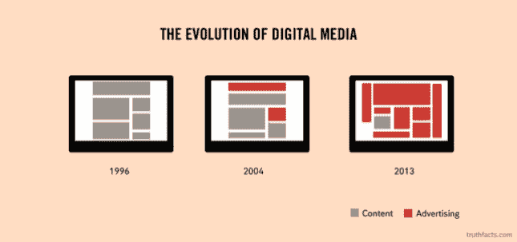
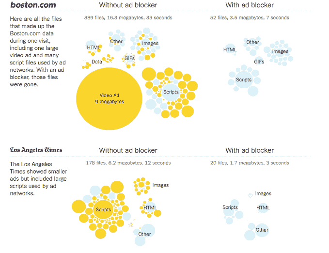
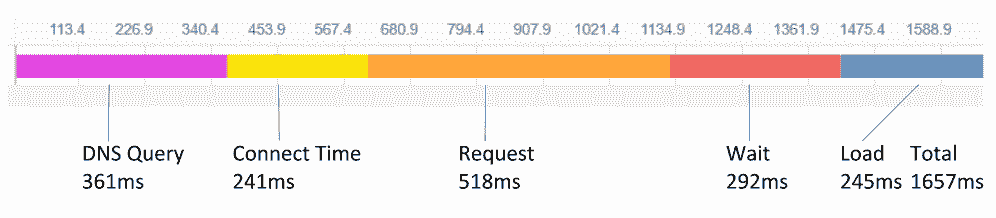
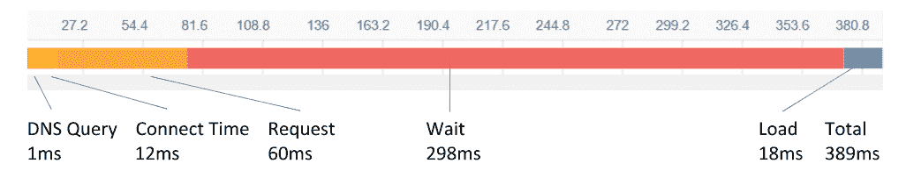

# 如何对抗延迟:应用程序的黑仔

> 原文：<https://thenewstack.io/fight-latency-killer-apps/>

 [戴夫·金斯伯格

戴夫·金斯伯格是 Teridion 的首席营销官，他在公司和产品营销、产品管理、数字营销和营销自动化方面拥有超过 25 年的经验。此前，金斯伯格曾在 Pluribus、Extreme、Riverstone、Nortel 和 Cisco 工作。](https://www.teridion.com/) 

对于任何基于云的应用程序提供商来说，时间就是金钱，对于用户来说，额外的时间会产生挫折感，降低体验质量。在全球互联网中，越来越多的服务通过公共云进行远程交付，而交互的延迟会决定财务的成败。

众所周知，TCP 性能会随着延迟的增加而下降，任何数据包丢失，无论多小，都会加剧这种情况。例如，仅仅 0 . 1%的数据包丢失就会将吞吐量从 50 毫秒时的约 6 Mbps 降低到 250 毫秒时的仅 2 Mbps。即使没有损失，当加载时间超过 4 秒时，网页废弃率也会大幅增加。

考虑到最小化延迟，并且通过关联，确定穿过全球互联网的具有最小分组丢失的路径仍然是关键的，我们如何能够实现这一点？以 200 亿美元的实时广告服务市场为例，我们首先来看看不同的组件，然后介绍一种减少延迟的方法。

更低的延迟意味着更快的渲染、转换和最终的收入。但这些解决方案适用于任何具有许多相同特征的垂直行业，包括金融、游戏、实时通信，甚至社交网络。

毫不奇怪，广告服务占据了越来越多的典型网页，今天，在提供广告的人和试图阻止广告的人之间，这是一场猫捉老鼠的游戏。难怪会这样，[看一些典型网站的构成](http://www.nytimes.com/interactive/2015/10/01/business/cost-of-mobile-ads.html)。

与内容(视频、图像等)分开。)服务，仅广告服务的底层机制每天就产生超过半 Pb 的请求数据。这包括广告商、需求方平台(DSP)、销售方平台(SSP)、出版商以及最终消费者之间的一系列复杂的互动。每一步都会带来潜在的延迟，并在广域网上造成数据包丢失。当然，实际的服务器也会引入延迟。

> 理想情况下，该解决方案将主动监控从用户到服务器的所有可能路径，实时选择最佳路径。

作为深度链接的一部分，只关注销售端的客户流[，考虑一个在印度的终端用户访问加州的广告发布商。虽然乍一看，人们可以尝试跨多个地理位置复制足迹，但在许多情况下，由于成本、应用程序架构或其他原因，这是不切实际的。全球各地的用户都集中在一个位置。在公共互联网上，这种交换需要 1.6 秒，由以下部分组成:](http://www.mediapost.com/publications/article/271872/deep-linking-is-the-sleeping-giant-of-mobile-marke.html)

在上图中，

**DNS** (毫秒):是 Catchpoint 的合成节点解析基本 URL 的 DNS 所用的时间。
**Connect** (毫秒):是与基础 URL 的服务器建立连接所花费的时间。
**Wait** (ms):是建立与服务器的连接与接收基本 URL 响应的第一个字节之间的时间
**Load** (ms):是下载基本 URL 的整个响应所用的时间。也称为接收时间。
**响应**(毫秒):从发出请求到收到基本 URL 的最后一个字节所用的时间。

除了可以针对第一个示例进行优化的 DNS 查询之外，连接、请求和加载阶段对端到端延迟非常敏感，可以进行优化。优化的路径现在不到 400 毫秒:

那么，我们如何做到这一点呢？为了真正有效，这既需要监测，也需要采取行动的能力。虽然有多种 RUM(真实用户监控)平台可用，但在几乎所有情况下，它们要么只报告问题，要么向管理员提出采取什么行动的建议。一个没有另一个只是解决方案的一半。

理想情况下，该解决方案将主动监控从用户到服务器的所有可能路径，实时选择最佳路径。

Teridion 是新堆栈的赞助商。

通过 Pixabay 的特征图像。

<svg xmlns:xlink="http://www.w3.org/1999/xlink" viewBox="0 0 68 31" version="1.1"><title>Group</title> <desc>Created with Sketch.</desc></svg>