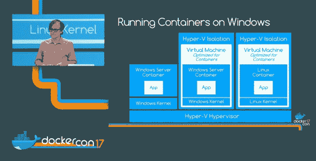

# 最后，Linux 容器可以通过 Docker 的 LinuxKit 在 Windows 上运行

> 原文：<https://thenewstack.io/finally-linux-containers-really-will-run-windows-linuxkit/>

自从两年前第一次展示 Windows 容器以来，Windows 容器还没有做过的一件事就是在 Windows 环境中，在围绕 Linux 构建的容器中运行为 Linux 构建的应用程序。实现这一壮举所必需的是所谓的 *Linux 子系统。*尽管[微软确实在一年前](https://blogs.msdn.microsoft.com/wsl/2016/04/22/windows-subsystem-for-linux-overview/)发布了这样一个东西，奇怪的是，它并没有解决容器可移植性的问题。

四月似乎是 Docker 和微软共同进步的月份。周二上午，在奥斯汀举行的 DockerCon 2017 大会上，Docker Inc .首席技术官 [Solomon Hykes](https://twitter.com/solomonstre) 宣布向开源发布一套用于构建 Linux 子系统的工具，由 Docker Inc .和微软在 Docker 的管理下共同开发。名为 [LinuxKit](https://github.com/linuxkit/linuxkit) ，它将在应用程序下面的*层提供足够的基于 Linux 的平台，让容器在任何操作系统平台上运行基于 Linux 的应用程序，包括 Mac OS 和 Windows 在任何主流云平台上，包括 AWS 或者，令人惊讶的是，在裸露的金属上。*

“Linux 显然是一个安全的操作系统，”Hykes 宣称。“它不需要我们的帮助。但是，事情是这样的:当你假设所有的东西都是一个容器时，那么你就可以将安全性提升到一个新的水平。你可以做很多假设。例如，您可以制作专门的补丁和配置，进一步强化系统。”

Hykes 花了一些时间来证实他的观点，但他的内容可能会将一些人的畏缩转化为瞪大的眼睛。当容器化在一个独立的世界中由其他主机运行时——比如另一个 Linux 操作系统，或者在第一代 VM 中——所有最严重的潜在漏洞都与发生在主机和客户机之间的事务有关。

在所有系统都容器化的环境中，不存在这样的界限。因此，任何专门解决容器安全性和真实性问题的组件—例如， [Docker 公证人](https://docs.docker.com/notary/getting_started/) —也可以用作底层系统的安全网关。想象一下对包含 Linux 子系统的容器进行基于角色的访问，您就明白了。

“我们认为 Docker 不应该负责保护你的 Linux 子系统，”Hykes 承认。“事实上，我们不认为任何一家公司应该对此承担全部责任。Linux 太大了，太重要了。因此，您所依赖的安全流程必须是开放的、由社区驱动的，这一点非常非常重要。在过去的几年里，Linux 社区已经做了很多非常好的工作来构建它。我们从第一天起就加入并参与到这些开放的过程中，而不是在我们的小角落里做所有的事情。”

这不仅是对“开放”的回归，也是对 Docker Inc .在 2015 年采用的*邀请*精神的回归，但去年当[公司将 Docker Swarm](https://thenewstack.io/dockers-plan-dominate-enterprise-data-center/) 融入其企业级平台时，它似乎放弃了这种精神。事实上，Hykes 再次将容器生态系统描述为一个组件社区，Docker Inc .对其贡献有限，没有任何一个组件构成了其他组件的轴心。

该公司的明确战略是限制 Kubernetes 或任何其他人对整个容器生态系统的主张。任何人都不会忘记，站在 Docker 旁边的是微软。

“如你所知，Docker 最初是一个针对 Linux 的项目，”代表微软 Azure 核心开发团队的[约翰·戈斯曼](https://twitter.com/gossmanster?lang=en)说。“Docker 将一些复杂的内核特性结合到一个我们都喜爱的简单易用的开发体验中。Windows 团队希望为 Windows 开发人员提供同样的开发体验。”

戈斯曼讲述了我们都知道的微软为什么开发 Windows 容器(现在称为 [Windows 服务器容器](https://docs.microsoft.com/en-us/virtualization/windowscontainers/quick-start/quick-start-windows-server)和 [Hyper-V 容器](https://thenewstack.io/microsoft-secures-the-windows-docker-container/))作为两种独立格式的故事。前者共享 Windows 内核，就像基于 Linux 的 Docker 容器共享 Linux 内核一样，而 Hyper-V 容器使来宾操作系统能够通过虚拟机在不同的主机平台上运行本机应用程序。因此，对于 Windows Server 2016，微软为基于 Windows 的 Hyper-V 容器创建了一种隔离，最大限度地减少了虚拟机的占用空间。

Gossman 说，通过合并 LinuxKit，这种隔离正在扩展到基于 Linux 的容器。

Gossman 的演示充分证明了 Windows 平台上的开发人员使用 Windows 工具在 Windows 平台上的 Hyper-V 隔离包装内的 Linux 容器映像中开发、构建、汇编和运行 Linux 应用程序的理论能力。他的演示包括一个嵌入 Linux 容器的 BusyBox 的图像，Gossman 证明了它的 Linux 内核是活跃的，并且在他的 Windows 笔记本电脑上运行。它还展示了*任何*Linux——不仅仅是企业级的，不仅仅是像 CoreOS 这样的最小化内核——都可以作为应用程序的主机。

当然，观众中肯定有不少开发者考虑过[将 SELinux 作为独立内核](https://thenewstack.io/docker-calls-out-red-hat/)运行的可能性。

Docker Inc .的 Hykes 指出，“你的平台的安全性取决于它最薄弱的部分”，这样做完全颠覆了 Docker 将安全责任转嫁给 Linux 的论点。

“你必须担心那里的每一层，”他继续说道。“Docker 有很多组件。我们一直在担心所有东西的安全性，以及它们是如何组合在一起的。”

在主题演讲的早些时候，Hykes 认为 Docker 的整个发展是“投诉驱动的”。开发者抱怨，工程师组装修改，平台改进。两年前，开发者确实大声抱怨过。如果历史要证明 Hykes 是正确的，Docker Inc .将需要记住它对这一投诉的反应。

<svg xmlns:xlink="http://www.w3.org/1999/xlink" viewBox="0 0 68 31" version="1.1"><title>Group</title> <desc>Created with Sketch.</desc></svg>